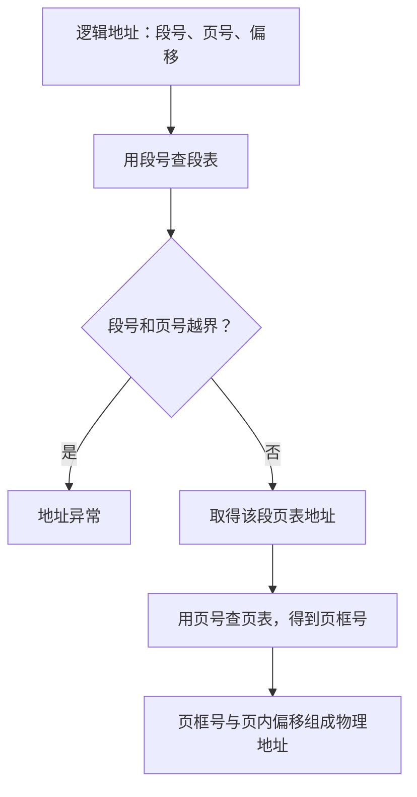

# 段页式：先按逻辑分段，再在段内分页

> [!summary] 快速复习卡片
> **作用/定位**：段页式先按逻辑意义分段，再把每一段继续分页，兼顾分段的逻辑管理和分页的非连续分配。
> **核心结论**：地址通常按“段号 → 段内页号 → 页内偏移”解释；先查段表找到该段对应的页表，再查页表找到页框。
> **经典题型怎么做**：先用段号定位该段页表 → 用段内页号查页框 → 保留页内偏移得到物理位置；题目若给段长，还要先检查地址是否合法。
> **易错点 / 考试重点**：段页式不是“分页和分段任选其一”，而是两级管理，因此表结构和地址转换步骤都比单独分页更复杂。

## 为什么组合两种方式

- [[分段管理]] 按代码、数据、栈等逻辑单位组织，便于保护和共享；
- [[分页基本概念]] 把固定大小的页离散装入页框，避免要求整个段连续存放。

段页式把程序先分段，再把每一段切成等长页。逻辑地址通常由：

> **段号 + 段内页号 + 页内偏移**

组成。

## 地址如何转换

1. 段号查段表，检查段的边界并取得该段页表的位置；
2. 段内页号查页表，得到物理页框号；
3. 页框号与页内偏移组合成物理地址。

段页式并不是“段表直接得到物理地址”。若没有 TLB 等加速，管理结构和访存次数都比单纯分页更复杂。

## 三种方式对比

| 方式 | 逻辑组织 | 物理放置 | 典型碎片 |
| --- | --- | --- | --- |
| 分页 | 固定大小页，逻辑意义弱 | 页可离散放置 | 可能有内部碎片 |
| 分段 | 按逻辑意义划段 | 每段通常需连续 | 可能有外部碎片 |
| 段页式 | 先分段，段内再分页 | 页可离散放置 | 保留逻辑分段，但结构更复杂 |

## 一句话记住

> **段页式先查段表定位该段页表，再查页表找页框；逻辑地址是段号、页号、页内偏移。**

## 上一站

- [[分段管理]]

## 下一站

- [[虚拟存储的基本概念]]
