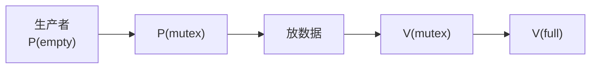

# 生产者—消费者：为什么一道题里同时需要“同步”和“互斥”

## 先定位：这是 PV 两种用途叠在一起的经典模型

假设有一个容量为 $N$ 的缓冲区：

- 生产者不断往里放数据；
- 消费者不断从里取数据。

这里同时有三种约束：

1. 缓冲区满了，生产者不能再放；
2. 缓冲区空了，消费者不能再取；
3. 两边修改缓冲区内部共享结构时不能互相踩。

所以要同时解决：

> **同步 + 互斥。**

## 三个典型信号量

| 信号量 | 初值 | 表示什么 |
| --- | ---: | --- |
| $empty$ | $N$ | 还剩多少空位置 |
| $full$ | $0$ | 已经有多少份可取数据 |
| $mutex$ | $1$ | 缓冲区关键操作的独占许可 |

## 生产者在做什么

顺序要理解成：

1. P(empty)：先确认有空位；
2. P(mutex)：再拿缓冲区的锁；
3. 放入数据；
4. V(mutex)：释放锁；
5. V(full)：告诉消费者“多了一份数据”。

## 消费者在做什么

1. P(full)：先确认有数据；
2. P(mutex)：拿缓冲区的锁；
3. 取出数据；
4. V(mutex)：释放锁；
5. V(empty)：告诉生产者“多了一个空位”。

## 为什么不能只留 mutex

如果只有互斥锁，它只能保证：

> “别同时修改缓冲区。”

但不能阻止：

- 缓冲区已经满了还继续生产；
- 缓冲区已经空了还继续消费。

因此：

> **empty/full 管条件同步，mutex 管临界区互斥。**

## 一句话记住

> **生产者消费者 = empty/full 管“能不能做”，mutex 管“能不能同时做”。**

## 下一站

- 上一站：[[PV操作实现同步]]
- 下一站：[[死锁的基本概念与四个必要条件]]
