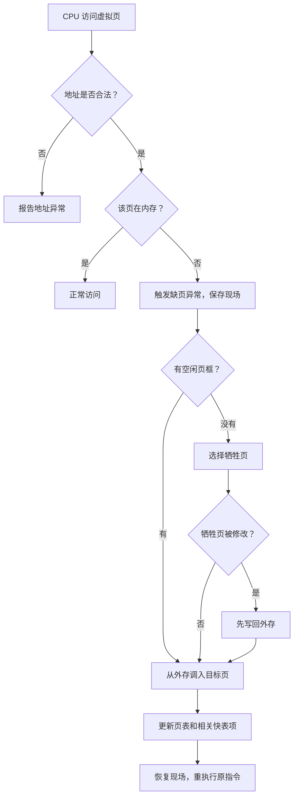

# 缺页处理：访问的页不在内存时发生什么

> [!summary] 快速复习卡片
> **作用/定位**：缺页处理解决“CPU 访问的虚拟页当前不在内存里，系统怎样把它补进来并继续执行”。
> **核心结论**：缺页会陷入操作系统；有空闲页框就直接装入，没有空闲页框才需要页面置换，若被换出页已修改通常还要先写回外存。
> **经典题型怎么做**：发现页不在内存 → 触发缺页异常 → 找空闲页框或选牺牲页 → 必要时写回 → 调入所需页 → 更新页表等映射信息 → 重新执行被中断的访存指令。
> **易错点 / 考试重点**：缺页本身不等于“必须置换”；只有没有空闲页框时才需要选择牺牲页。

## 先辨析术语

页表有效位表明目标页当前不在物理内存时，CPU 会因这条访存指令触发**同步异常（page fault）**。中文教材和试题常称“缺页中断”，但它不是由键盘、网卡等外部设备异步发出的外中断。

> **缺页是当前指令引起的异常；I/O 完成通知才是外部中断。**

## 完整处理流程

## 三个判断不要混

1. **地址是否合法**：越界或权限错误不能靠“调页”解决；
2. **页面是否驻留**：合法但不在内存，才是缺页；
3. **是否有空闲页框**：只有“缺页且无空框”才需要页面置换。

若牺牲页的修改位为 1，内存副本比外存副本新，换出前要写回；未修改的干净页通常可直接覆盖。

## 为什么最后要重执行

引发缺页的访存尚未完成。页面调入、页表更新后，系统恢复进程现场，再重新执行那条指令；程序通常无需自己改写业务逻辑。

## 一句话记住

> **先判地址合法，再判是否缺页；无空框才置换，脏页先写回，更新映射后重执行原指令。**
