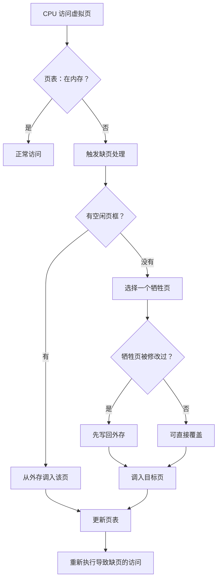

# 缺页：CPU 访问的页不在内存时，系统到底做了什么

## 先定位：缺页不是“程序文件坏了”

[[虚拟存储的基本概念]] 允许一部分虚拟页暂时只存在外存。

因此 CPU 访问某个虚拟页时，页表可能告诉它：

> **这个页当前不在物理内存。**

这就触发缺页处理。

## 先看完整流程

## 页面置换到底什么时候才出现

注意这个判断：

> **缺页 + 没有空闲页框 → 才需要选择牺牲页。**

如果还有空闲页框：

> 直接把目标页装进去即可，不需要“换谁”。

因此：

- 缺页：发现需要的页没在内存；
- 页面置换：内存满了以后决定牺牲谁。

## 为什么要关心修改位

如果被淘汰的页进入内存后已经被修改：

> 外存中的旧副本已经过期。

因此换出前通常要先写回。

如果没有修改，外存原本就有正确副本：

> 可以直接丢弃内存副本。

## 一句话记住

> **缺页先找空框；没空框才置换；脏页换出前要写回；最后更新页表并重新执行访问。**

## 下一站

- 上一站：[[虚拟存储的基本概念]]
- 下一站：[[OPT页面置换算法]]
