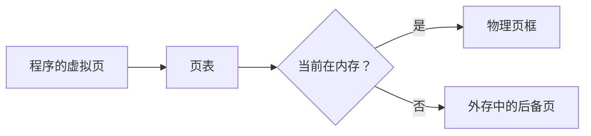

# 虚拟存储：程序比物理内存大，为什么仍然可以运行

## 先定位：分页解决“怎么放”，但还没解决“是不是必须全部放进去”

[[分页基本概念]] 让一个进程的不同页可以分散在不同物理页框中。

但如果程序有 100 个页，系统当前只愿意给它 10 个页框：

> **是不是必须等到 100 个页都能装入内存，程序才可以运行？**

虚拟存储的关键答案是：

> **不用。当前只把需要的一部分页放在物理内存，其余页先留在外存，需要时再调入。**

## 为什么这样居然能工作

程序在短时间内通常只会集中访问一部分代码和数据。

这就是**局部性原理**：

- 时间局部性：刚访问过的数据，近期可能还会访问；
- 空间局部性：访问一个位置后，附近位置也可能很快被访问。

因此系统没必要把整个程序一直放在内存。

## “虚拟”到底虚拟了什么

程序看到的是一个完整、连续的**虚拟地址空间**。

但真实物理内存中：

- 有些虚拟页当前已经驻留；
- 有些虚拟页还在外存；
- 页表帮助 CPU 判断并完成映射。

## 和“页面置换”不要提前混

虚拟存储首先只建立一个能力：

> **允许页面不全部驻留内存。**

真正访问到一个不在内存的页时，发生什么，是下一张 [[缺页处理过程]]。

只有缺页而且内存页框又已经满了，才需要页面置换算法。

## 一句话记住

> **虚拟存储 = 可以不把程序全部装入内存；用到哪页，再把哪页调进来。**

## 下一站

- 上一站：[[段页式存储管理]]
- 下一站：[[缺页处理过程]]
