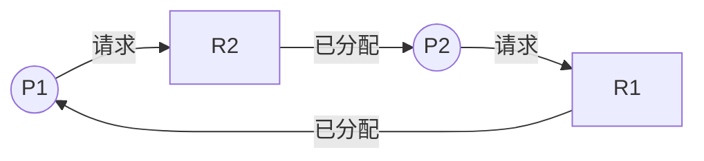

# 资源分配图：箭头到底表示“请求”还是“已经拿到”

> [!summary] 快速复习卡片
> **作用/定位**：资源分配图把“谁在申请谁、谁占有谁”画出来，用于观察循环等待和判断死锁可能性。
> **核心结论**：进程→资源表示请求，资源→进程表示已分配；每类资源只有一个实例时，出现环可判死锁；有多个实例时，有环不能直接等同于死锁。
> **经典题型怎么做**：先按箭头方向找闭环 → 再看环中资源是否都是单实例 → 单实例可直接判死锁；多实例还要继续看是否存在可释放资源的进程。
> **易错点 / 考试重点**：多实例资源图中“有环”通常只是危险信号，不是充分条件。

## 先定位：死锁的文字描述很绕，先把占有和等待画出来

[[死锁的基本概念与四个必要条件]] 里的核心是：

> **谁已经占有什么，谁又正在等待什么。**

资源分配图就是把这两种关系画出来。

## 两种箭头怎么认

经典记法：

- **进程 → 资源**：进程正在请求这个资源；
- **资源 → 进程**：这个资源已经分配给进程。

例如：

顺着箭头看：

> P1 → R2 → P2 → R1 → P1

形成一个环。

## 有环就一定死锁吗

要看每类资源有几个实例。

### 每类资源只有一个实例

这时：

> **图中存在环 ⇔ 存在死锁。**

因为环上的每个资源都已经被唯一地占住，没有额外实例能打破等待。

### 某类资源有多个实例

这时：

> **有环不一定已经死锁。**

可能还有额外实例让某个进程先得到资源、完成并释放已有资源，从而把环打破。

但：

> **没有环时，可以排除经典资源分配图中的死锁。**

## 一句话记住

> **P→R 是请求，R→P 是分配；单实例有环就死锁，多实例有环只是危险信号。**

## 自测

1. R1 → P1 表示什么？
2. P1 → R2 表示什么？
3. 多实例资源为什么不能只看“有没有环”就下结论？

## 下一站

- 上一站：[[死锁的基本概念与四个必要条件]]
- 下一站：[[死锁的处理策略]]
