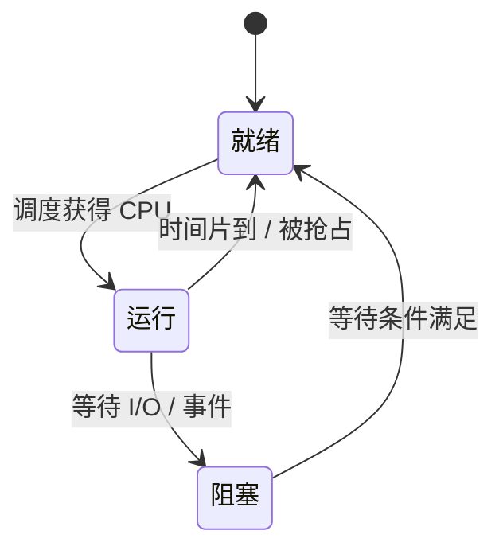

# 进程三态：为什么“没在运行”还要区分就绪和阻塞

## 先定位：CPU 数量有限，进程不可能一直运行

多个进程并发时，某个进程暂时没占 CPU，并不代表原因都一样。

最关键的区别是：

> **给它 CPU，它现在能不能立刻继续？**

因此形成三个经典状态。

## 三个状态分别是什么

| 状态 | 人话 | 给 CPU 能立刻跑吗 |
| --- | --- | --- |
| 运行 | 正在占用 CPU 执行 | 已经在跑 |
| 就绪 | 其他条件都满足，只差 CPU | 能 |
| 阻塞 | 正在等 I/O、事件或资源 | 不能 |

最容易混的是：

> **就绪 = 想跑而且能跑，只是没轮到 CPU；阻塞 = 就算现在给 CPU，也还缺条件。**

## 状态为什么会转换

注意：

> **阻塞状态通常不是直接变成运行。**

I/O 完成以后，它只是重新具备运行条件，因此先回到**就绪**，再等待调度器分配 CPU。

## 和进程调度怎么接

这张卡只解释“状态为什么变”。

下一站 [[进程调度]] 才回答：

> **就绪队列里这么多能运行的进程，CPU 下一次到底选谁？**

## 一句话记住

> **运行正在用 CPU；就绪只差 CPU；阻塞除了 CPU 还在等别的条件。**

## 自测

1. 等磁盘读取完成的进程属于哪一态？
2. I/O 完成后为什么通常先进入就绪态？
3. 时间片用完但进程仍可继续执行，会从运行态转到哪一态？

## 下一站

- 上一站：[[进程控制块PCB]]
- 下一站：[[进程调度]]
