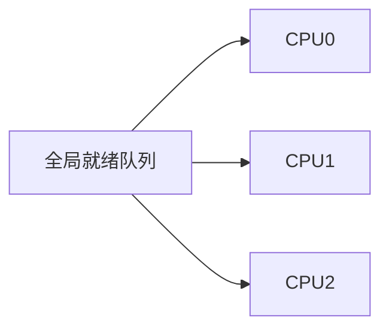
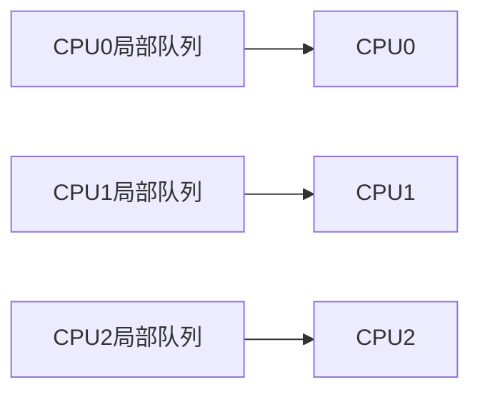

# 进程调度：就绪进程中谁先获得 CPU

> [!summary] 快速复习卡片
> **作用/定位**：进程调度解决“多个就绪进程都想用 CPU 时，下一步让谁运行”。
> **核心结论**：FCFS 看先来后到；短作业优先看预计运行时间；时间片轮转按时间片轮流；优先级调度按优先级选择。做题前必须先判断题目是**抢占式还是非抢占式**。
> **抢占式核心**：当前进程还没运行完，也可能被换下 CPU；来了“更符合当前调度规则”的进程时，可能发生抢占。
> **非抢占式核心**：当前进程一旦获得 CPU，通常要运行到完成或主动阻塞后，CPU 才会交给其他进程。
> **多核队列核心**：多处理器系统可以让多个 CPU **共享一个全局就绪队列**，也可以让**每个 CPU 维护自己的局部就绪队列**。全局队列更容易统一分配负载，但共享队列可能产生竞争；局部队列更利于减少竞争和保持 CPU 缓存局部性，但需要额外做负载均衡和任务迁移。
> **经典题型怎么做**：先按“到达时刻 + 调度规则 + 是否抢占”画出 CPU 执行顺序，再逐个记完成时刻；周转时间就是“从到达到完成”的总时间。看到“多核、共享队列、每个 CPU 自己的队列、负载迁移”时，再判断题目考的是全局队列还是局部队列。
> **易错点 / 考试重点**：未到达的进程不能提前参与选择；SJF 的抢占版本是 SRTF；优先级调度既可能抢占也可能非抢占；看到“低优先级长期得不到运行”要联想到**饥饿 → 老化**；**全局/局部队列**不要和**多级反馈队列**混为一谈。

## 调度要优化什么

调度程序从就绪队列选择进程运行。不同场景目标不同，因此没有“任何情况下都最优”的算法。

| 指标 | 含义 |
| --- | --- |
| 周转时间 | 完成时间 − 到达时间 |
| 等待时间 | 周转时间 − 实际运行时间（无 I/O 的简化题） |
| 响应时间 | 第一次获得 CPU 的时间 − 到达时间 |
| 吞吐量 | 单位时间完成的作业数 |

批处理更关注吞吐量和周转时间；交互系统还重视响应与公平。

## 多核 CPU 下：就绪进程放在哪个队列里

前面只说“调度程序从就绪队列里选进程”，在单 CPU 场景下这样理解就够了。但如果机器有多个 CPU 或多个处理器核，还会多出一个问题：

> **所有 CPU 是不是从同一个就绪队列里拿任务，还是每个 CPU 各管一个队列？**

这就对应两种经典组织方式：**全局队列**和**局部队列**。

### 全局队列：所有 CPU 共用一个就绪队列

全局队列（Global Queue）的直觉非常简单：所有可以运行的进程或线程先进入同一个共享就绪队列，哪个 CPU 空闲，就从这个队列里取一个任务执行。

这种方式的优点是**任务集中在一起，系统容易统一分配给空闲 CPU**，因此从整体上看负载比较容易摊开。

但问题也很直接：多个 CPU 都要访问同一个共享队列，如果访问需要同步保护，就可能出现**共享数据竞争、加锁与同步开销**。CPU 越多，这种共享点越可能成为调度开销来源之一。

### 局部队列：每个 CPU 维护自己的就绪队列

局部队列（Local Queue，也常理解为 Per-CPU Run Queue）则是给每个 CPU 准备自己的可运行任务队列。CPU 优先从自己的队列里选择任务。

这样做的直接好处是：不同 CPU 大多数时候访问自己的队列，**共享竞争更少**；同时，一个任务如果经常留在同一个 CPU 上运行，更有机会继续利用该 CPU 已经缓存过的数据，这与**处理器亲和性（Processor Affinity）**有关。

但局部队列会产生新的问题：

- CPU0 的队列可能排了很多任务；
- CPU1 的队列可能已经空了；
- 如果什么都不做，就会出现“一个 CPU 很忙、另一个 CPU 很闲”的**负载不均衡**。

因此局部队列通常还需要配合**负载均衡（Load Balancing）**：当不同 CPU 的队列负载差距较大时，把部分任务迁移到较空闲的 CPU 上执行。

### 两种方式到底怎么区分

| 对比点 | 全局队列 | 局部队列 |
| --- | --- | --- |
| 队列数量 | 多个 CPU 共享一个 | 通常每个 CPU 一个 |
| CPU 从哪里取任务 | 同一个共享队列 | 优先从自己的队列 |
| 主要优点 | 统一调度，整体负载容易集中观察和分配 | 减少共享竞争，有利于保持 CPU 局部性 |
| 主要问题 | 多 CPU 同时访问共享队列时可能有同步竞争 | 各 CPU 队列可能忙闲不均 |
| 常见配套机制 | 共享队列同步保护 | 负载均衡、任务迁移、处理器亲和性 |

> [!tip] 考试识别
> 看到“**所有处理器从同一个就绪队列选任务**”，优先想到**全局队列**。
>
> 看到“**每个处理器有自己的就绪队列**”，优先想到**局部队列**；如果继续问“某些 CPU 忙、某些 CPU 闲怎么办”，就想到**负载均衡 / 任务迁移**。

### 处理器亲和性为什么会和局部队列一起出现

一个进程或线程在某个 CPU 上运行过后，这个 CPU 的缓存里可能已经留下了它近期使用的数据。如果下一次仍然在同一个 CPU 上运行，就可能继续利用这些缓存内容。

所以调度器往往不会毫无代价地频繁迁移任务，而是在**负载均衡**与**处理器亲和性**之间做权衡：

- 负载严重不均时，迁移任务可以让多个 CPU 都忙起来；
- 负载差距不大时，尽量少迁移，有利于保留缓存局部性并减少迁移开销。

这里要记住的是**权衡关系**，不要理解成“局部队列中的任务绝对不能换 CPU”。

### 不要和多级反馈队列混淆

这是最容易混的一点。

| 概念 | 它在解决什么问题 |
| --- | --- |
| 全局队列 / 局部队列 | **多核 CPU 场景下，就绪任务的队列放在哪里、由哪些 CPU 使用** |
| 多级反馈队列 | **按照任务行为、优先级和时间片，把任务放到不同优先级队列中，决定谁先获得 CPU** |

所以两者虽然都出现“队列”，但研究的维度不同：

- **全局 / 局部**关注的是“队列归哪个 CPU 管”；
- **多级反馈**关注的是“任务处在哪个调度级别”。

## 抢占式与非抢占式

这是进程调度计算题里必须先判断的条件。

### 非抢占式是什么

一个进程已经获得 CPU 后，其他进程即使后来到达，通常也不能把 CPU 直接抢走。当前进程一般要等到：

- 自己运行完成；或
- 因等待 I/O、资源等原因主动进入阻塞状态；

CPU 才会重新调度给其他进程。

**考试理解：一旦开始跑，通常先让它跑完这一段。**

典型代表：

- FCFS 通常是非抢占式；
- SJF 通常指非抢占短作业优先；
- 优先级调度如果题目明确“非抢占”，高优先级进程后来到达也要等待当前进程释放 CPU。

### 抢占式是什么

当前进程还没有运行完，操作系统也可以把 CPU 收回来，再交给另一个进程。

但“谁能抢”不是固定看优先级，而是取决于**当前采用的调度规则**：

| 调度方式 | 什么时候可能抢占当前进程 |
| --- | --- |
| 抢占式优先级调度 | 新到达进程的优先级更高 |
| SRTF 最短剩余时间优先 | 新到达进程的剩余运行时间更短 |
| RR 时间片轮转 | 当前进程的时间片用完 |

> [!tip] 一句话判断
> **抢占式 = 当前进程没跑完，也可能被换下来。**
>
> **非抢占式 = 当前进程拿到 CPU 后，通常运行到完成或主动阻塞。**

### 为什么抢占与非抢占会直接改变答案

例如：

| 进程 | 到达时间 | 运行时间 |
| --- | ---: | ---: |
| P1 | 0 | 5 |
| P2 | 1 | 2 |

**如果采用非抢占 SJF：**

P1 在 t=0 时是唯一已经到达的进程，因此先运行。即使 P2 在 t=1 到达且更短，也不能抢走 CPU。

执行过程：**P1 0–5 → P2 5–7**。

**如果采用 SRTF（抢占式 SJF）：**

P1 运行到 t=1 时还剩 4 个时间单位；此时 P2 到达，只需要 2 个时间单位，所以 P2 更短，可以抢占 P1。

执行过程：**P1 0–1 → P2 1–3 → P1 3–7**。

因此同一组进程，只要题目把“非抢占”改成“抢占”，执行顺序和完成时间就可能不同。

## SJF 与 SRTF 的关系

这是考试中最容易混淆的一组概念。

- **SJF（Shortest Job First，短作业优先）**：通常按已经到达的进程中“总运行时间最短”者优先，经典形式是**非抢占式**。
- **SRTF（Shortest Remaining Time First，最短剩余时间优先）**：是 SJF 的**抢占式版本**，比较的是当前各进程“还剩多少时间没运行”。

> [!warning] 高频陷阱
> SRTF 不是每次都比较原始运行时间，而是比较**剩余运行时间**。
>
> 未到达的进程无论多短，都不能提前参与调度。

## 常见算法

| 算法 | 选择规则 | 抢占性 | 优点 | 风险/边界 |
| --- | --- | --- | --- | --- |
| FCFS 先来先服务 | 按到达先后 | 通常非抢占 | 简单，通常不会饥饿 | 长作业在前会让短作业久等 |
| SJF 短作业优先 | 已到达进程中选预计运行时间最短者 | 通常非抢占 | 经典前提下平均等待/周转时间较小 | 长作业可能饥饿；运行时间难精确预知 |
| SRTF 最短剩余时间优先 | 已到达进程中选剩余时间最短者 | 抢占式 | 有利于短任务 | 长任务仍可能饥饿，切换更多 |
| 优先级调度 | 选择优先级最高者 | 可抢占，也可非抢占 | 可体现任务紧急程度 | 低优先级可能饥饿；可用老化缓解 |
| RR 时间片轮转 | 每个进程运行一个时间片后轮换 | 抢占式 | 公平，交互响应较好 | 片太大趋近 FCFS；片太小切换开销大 |
| 多级反馈队列 | 多队列、不同时间片，按行为调整级别 | 通常包含抢占机制 | 无需预知准确运行时间，兼顾多类任务 | 规则复杂；无提升/老化时低级队列仍可能饥饿 |

### 优先级调度中的饥饿与老化（Aging）

优先级调度有一个典型问题：如果高优先级进程不断进入就绪队列，某个低优先级进程可能一直排不上 CPU。这个现象叫**饥饿（Starvation）**。

**老化（Aging）**的思路很简单：**一个进程等得越久，就逐步提高它的调度优先级。** 这样原本优先级较低的进程，在等待足够长时间后也有机会被选中，从而缓解长期饥饿。

举例：题目规定“优先级数值越小越高”。P1 初始优先级为 10，如果每等待 5 个时间单位就把优先级数值减 1，那么它会逐渐变成 9、8、7……也就是等待越久，实际调度优先级越高。

> [!tip] 考试直接配对
> **优先级调度 → 低优先级进程可能饥饿 → 用老化（Aging）缓解。**
>
> **增大时间片不是解决饥饿的方法。** 时间片大小主要影响 RR 时间片轮转中的响应速度和进程切换开销，解决不了“优先级一直太低”这个原因。

> [!warning] 不要把饥饿和死锁混在一起
> **饥饿**：某个进程一直竞争不过别人，长期得不到 CPU 或资源；系统中的其他进程仍然可以继续运行。
> **死锁**：多个进程互相等待对方占有的资源，相关进程都无法继续推进。

## 计算题怎么做

做调度题时不要一上来就套公式，按下面顺序处理：

1. 先看每个进程什么时候到达；
2. 判断当前时刻哪些进程已经进入就绪队列；
3. 确认算法以及是否允许抢占；
4. 如果是抢占式，每次有新进程到达或时间片结束时重新判断；
5. 画出 CPU 的执行时间线；
6. 根据时间线得到完成时间，再求周转、等待或响应时间。

### 非抢占 SJF 示例

3 个进程同时到达，运行时间分别为 P1=3、P2=2、P3=1。

| 顺序 | 进程 | 运行区间 | 完成时间 | 周转时间 |
| ---: | --- | --- | ---: | ---: |
| 1 | P3 | 0–1 | 1 | 1 |
| 2 | P2 | 1–3 | 3 | 3 |
| 3 | P1 | 3–6 | 6 | 6 |

平均周转时间就是三个周转时间相加后除以 3，即 10/3。

## 高频易错点

- **做题第一步不是选最短，而是先看“谁已经到达”。**
- 抢占式不等于“只看优先级”；不同算法有不同抢占条件；
- SJF 通常是非抢占式，SRTF 是它的抢占版本；
- SRTF 比较的是**剩余运行时间**，不是最初运行时间；
- FCFS 的“公平”是按到达顺序，不代表平均等待时间最小；
- RR 在时间片结束时，当前进程会被换下 CPU，因此属于抢占式调度；
- RR 时间片太大时会逐渐接近 FCFS；
- 优先级调度既可能抢占，也可能非抢占，必须以题目说明为准；
- 优先级数值大小与高低没有统一约定，必须看题设；
- 优先级调度可能出现饥饿，经典处理方法是老化（Aging）；
- 全局队列是“多个 CPU 共用一个就绪队列”，局部队列是“每个 CPU 维护自己的就绪队列”；
- 局部队列减少共享竞争，但可能出现 CPU 间忙闲不均，因此要理解负载均衡和任务迁移；
- 处理器亲和性强调尽量让任务继续在原 CPU 上运行以保持局部性，但不是“绝对不能迁移”；
- **全局/局部队列 ≠ 多级反馈队列**：前者讨论队列归哪个 CPU 使用，后者讨论任务处于哪个调度级别；
- “饥饿”不等于“死锁”：前者是长期得不到调度，后者是相关进程因资源互相等待而无法推进；
- 调度解决“谁用 CPU”，共享数据安全要看 [[信号量与PV基本概念]]。

## 一句话记住

> **先看谁已经到达，再看调度规则，最后看是否允许抢占；多核时再看任务是进入一个共享的全局队列，还是进入各 CPU 的局部队列；局部队列出现忙闲不均时，要想到负载均衡与任务迁移。**

## 上一站

- [[进程三态与状态转换]]

## 下一站

- [[前趋图与进程先后关系]]
