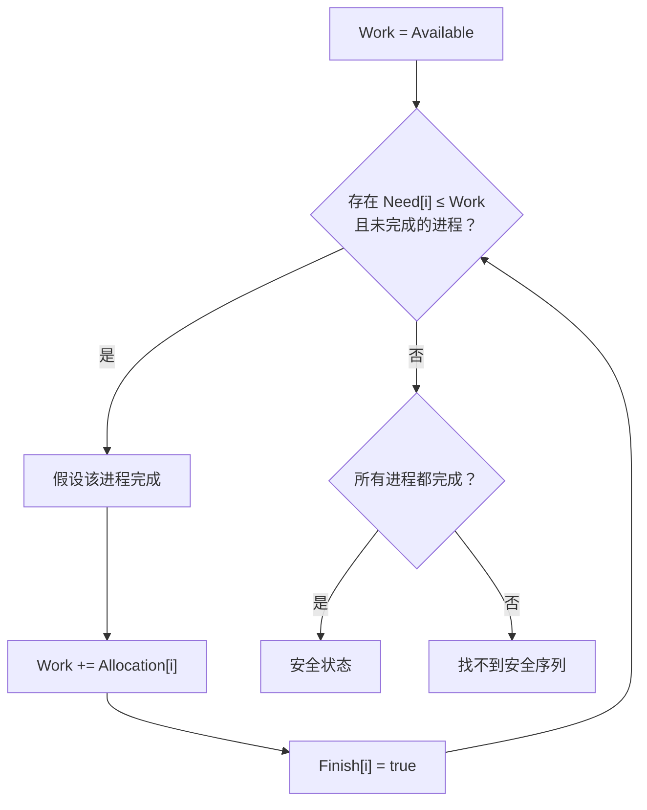

# 银行家安全性检查：Work 为什么越算越大

> [!summary] 快速复习卡片
> **作用/定位**：安全性检查验证当前分配状态是否仍能找到一条让所有进程依次完成的安全序列。
> **核心结论**：当前可用资源先作为“工作资源”；每完成一个可满足的进程，就把它已经占有的资源全部归还，再继续扫描。
> **经典题型怎么做**：先算 Need → 找 Need 不超过当前工作资源的进程 → 记入安全序列 → 把该进程 Allocation 加回工作资源 → 重复；全部进程都能被选中才安全。
> **易错点 / 考试重点**：完成后归还的是该进程“已经分配的 Allocation”，不是 Need；一次找不到某进程可以先看别的进程，不要立即判不安全。

## 先定位：现在不是“真的调度”，而是在脑中做一次资源演练

[[银行家算法基本数据]] 已经有 Available、Need、Allocation。

安全性检查要做的是：

> **从当前剩余资源出发，能不能假设一个进程完成、收回资源，再让下一个完成，直到所有进程都完成。**

## 第一步：建立模拟资源池

令：

$$
Work=Available
$$

Work 只是算法中的临时变量。

> **Available 是现实当前剩余资源；Work 是安全性模拟手中的资源池。**

## 第二步：找一个当前能完成的进程

寻找尚未完成、并满足：

$$
Need[i]\le Work
$$

的进程。

这个比较必须对每一种资源逐项成立。

## 第三步：假设它完成

如果 P1 可以完成，就把它标记为完成：

> Finish[P1] = true

随后它会释放自己原来已经占有的资源：

$$
Work=Work+Allocation[P1]
$$

## 为什么只加 Allocation，不是先减 Need 再加回来

在安全性模拟里，可以想成：

1. Work 先补给它剩余 Need；
2. 进程完成；
3. 它把“刚补的 Need + 原来占有的 Allocation”全部归还。

Need 一减一加正好抵消。

所以净效果只剩：

> **Work 增加它原先占有的 Allocation。**

## 第四步：重复

## 一句话记住

> **当前资源够谁 → 假设谁完成 → 收回它原来占的资源 → 再找下一个。**

## 下一站

- 上一站：[[银行家算法基本数据]]
- 下一站：[[银行家算法资源请求]]
