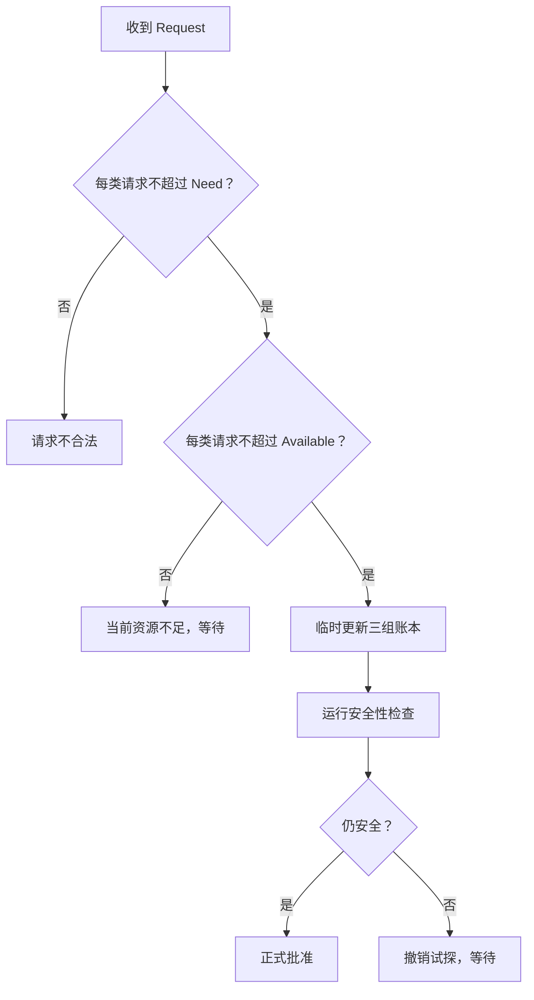

# 银行家资源请求：资源明明够，为什么还不能马上批准

> [!summary] 快速复习卡片
> **作用/定位**：资源请求算法判断“某进程现在提出的新请求，系统能不能立刻批准而不破坏安全性”。
> **核心结论**：先检查请求没有超过该进程的剩余 Need，也没有超过当前 Available；通过后只能先“试分配”，再做一次安全性检查。
> **经典题型怎么做**：请求≤Need？→ 请求≤Available？→ 临时扣减 Available、增加该进程 Allocation、减少 Need → 做安全性检查 → 仍安全才正式批准。
> **易错点 / 考试重点**：资源当前“够给”不代表一定能批；如果试分配后找不到安全序列，就必须让该请求等待。

## 先定位：资源数量够，只说明“现在能给”，不说明“给完仍然安全”

假设进程 Pi 提出一组资源请求 Request。

银行家算法不会只看 Available。

它要连续过三关。

## 第一关：不能超过自己还需要的量

先检查：Request 的每一类资源都不能超过该进程的 Need。

如果超过，说明进程申请量已经超出此前声明的最大需求范围。

## 第二关：当前系统必须真的有这么多资源

再检查：Request 的每一类资源都不能超过当前 Available。

如果当前不足，只能等待。

## 第三关：先试探性分配，再做安全性检查

前两关都通过后，不要立刻宣布批准，而是先在临时账本中模拟“给出去”：

- 从 Available 中扣除 Request；
- 把 Request 加到该进程的 Allocation；
- 从该进程的 Need 中扣除 Request。

这三个更新只影响假想状态；然后以新状态进入 [[银行家算法安全性检查]]。如果仍能找到安全序列，才正式批准；否则撤销试探性分配，让请求等待。

> **试探性分配的目的，是检查“给出去以后”是否仍有全员完成的退路。**

## 沿同一份账本判断请求

沿用 [[银行家算法安全性检查]] 的教学数据：`Available=(1,1)`；P0 的 `Allocation=(0,1)、Need=(2,1)`；P1 的 `Allocation=(1,0)、Need=(1,1)`。下面的数字只是演示，不是真题数据。

### 请求 P1 的 `(1,0)`：试分配后仍安全

1. **请求不超过 Need**：`(1,0) ≤ (1,1)`，成立。
2. **当前 Available 够给**：`(1,0) ≤ (1,1)`，成立。
3. **先试分配**：新 Available 为 `(0,1)`；P1 的 Allocation 变为 `(2,0)`，Need 变为 `(0,1)`。
4. **重新做安全性检查**：Work 从 `(0,1)` 开始，P1 的 Need `(0,1)` 满足，完成后归还 `(2,0)`，Work 变为 `(2,1)`；此时 P0 的 Need `(2,1)` 也满足。因此安全序列 `P1 → P0` 存在，可以正式批准。

### 换成请求 P0 的 `(1,0)`：资源够给，但试分配后不安全

前两关也都成立：请求 `(1,0)` 不超过 P0 的 Need `(2,1)`，也不超过 Available `(1,1)`。试分配后 Available 为 `(0,1)`，P0 的 Need 变成 `(1,1)`；P1 的 Need 仍是 `(1,1)`。从 Work `(0,1)` 开始，两个进程都至少还需要 1 个 A，但系统没有可用 A，因此找不到第一个可完成的进程。试分配后的状态不安全，必须撤销临时更新，让 P0 等待。

这里的“撤销”是恢复试算前的三项账本：Available 回到 `(1,1)`，P0 Allocation 回到 `(0,1)`，P0 Need 回到 `(2,1)`。等待请求不代表系统已经死锁；它只表示当前不能安全地批准这笔请求。

## 为什么这叫“银行家”

直觉类似银行放贷：

> 手里有钱，不代表每一笔贷款都应该立刻放出去；还要确保放完以后整体仍有能力满足后续承诺。

## 一句话记住

> **银行家批准请求 = 请求合法 + 当前够给 + 假装给完以后仍然安全。**

## 上一站

- [[银行家算法安全性检查]]

## 下一站

- [[分区管理与内存碎片]]
