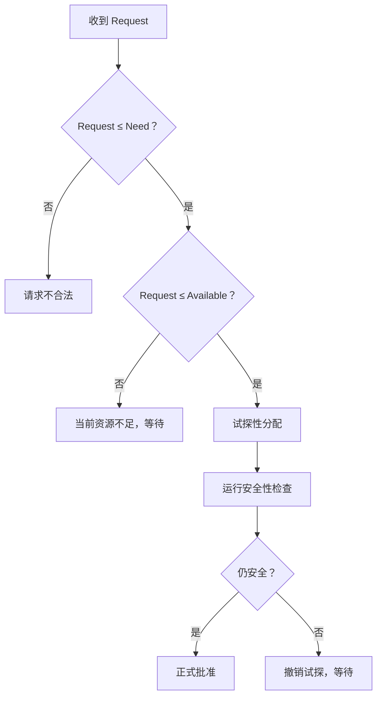

# 银行家资源请求：资源明明够，为什么还不能马上批准

## 先定位：资源数量够，只说明“现在能给”，不说明“给完仍然安全”

假设进程 $P_i$ 提出资源请求 $Request_i$。

银行家算法不会只看 Available。

它要连续过三关。

## 第一关：不能超过自己还需要的量

$$
Request_i\le Need_i
$$

如果超过，说明进程申请量已经超出此前声明的最大需求范围。

## 第二关：当前系统必须真的有这么多资源

$$
Request_i\le Available
$$

如果当前不足，只能等待。

## 第三关：先试探性分配，再做安全性检查

前两关满足以后，先**假装给出去**：

$$
Available'=Available-Request_i
$$

$$
Allocation_i'=Allocation_i+Request_i
$$

$$
Need_i'=Need_i-Request_i
$$

注意撇号表示：

> **“如果批准以后，系统会变成的假想状态。”**

然后以这个新状态进入 [[银行家算法安全性检查]]。

## 为什么这叫“银行家”

直觉类似银行放贷：

> 手里有钱，不代表每一笔贷款都应该立刻放出去；还要确保放完以后整体仍有能力满足后续承诺。

## 一句话记住

> **银行家批准请求 = 请求合法 + 当前够给 + 假装给完以后仍然安全。**

## 下一站

- 上一站：[[银行家算法安全性检查]]
- 下一站：[[存储管理]]
