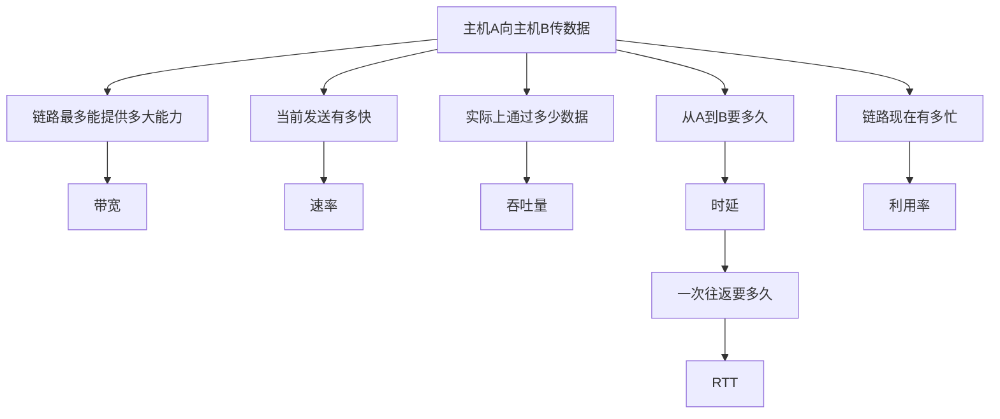
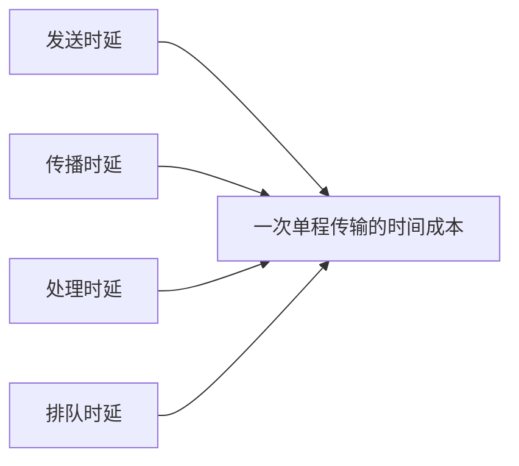
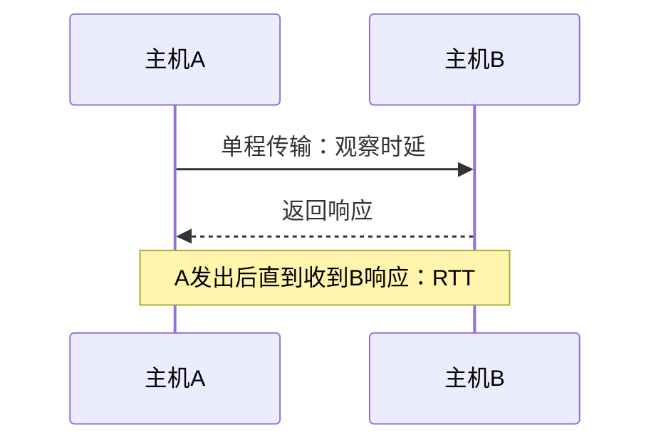
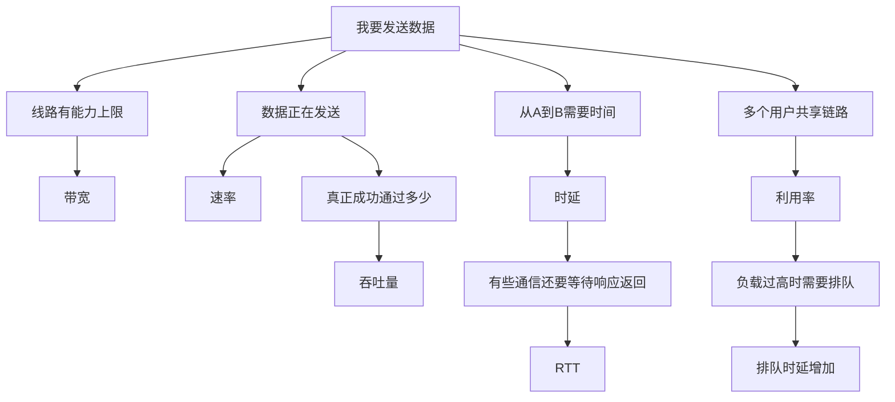

# 网络性能指标：网络“快不快”到底是在问什么

> [!summary] 快速复习卡片
> **作用/定位**：把前面学过的信道、共享和分组交换过程，转换成“能力有多大、实际有多快、要等多久、链路有多忙”这些可以判断和计算的指标。
> **核心结论**：六个指标不是六个孤立名词。**带宽**看能力上限，**速率**看发送有多快，**吞吐量**看实际通过多少；**时延**看传输的时间成本，**RTT**看一次往返要多久，**利用率**看链路有多忙。
> **最容易混淆的点**：**RTT 本来就是时间/时延类指标。**这张卡讨论“时延”时主要从单程传输及其组成理解；RTT 把观察范围扩展成一次往返，所以两者很像，但不能无条件写成 `RTT = 2 × 单程时延`。
> **经典题型怎么认**：给数据量和 bit/s → 发送时延；给距离和传播速度 → 传播时延；问能力上限 → 带宽；问实际通过量 → 吞吐量；问一次来回 → RTT；问忙碌程度 → 利用率。
> **易错点**：`1 Byte = 8 bit`；提高链路速率能降低发送时延，但不能消除由距离产生的传播时延。

## 先别背六个名词：它们是从一次真实传输里自然长出来的

上一站 [[电路报文与分组交换]] 已经回答：数据为什么要经过中间节点，以及分组怎样共享链路逐跳转发。

现在假设主机 A 要给主机 B 发送数据，我们自然会继续问：

- 这条链路**最多能提供多大传输能力**？
- A **当前发送得有多快**？
- 数据**实际上通过了多少**？
- 从 A 到 B **到底要花多长时间**？
- 如果 A 还要等 B 回应，**一个来回要多久**？
- 大家都在共享链路时，这条链路**现在有多忙**？

这六类问题分别对应六个指标：

所以不要把六个指标平铺着死记。先记住它们回答的是三类大问题：

| 大问题 | 对应指标 |
| --- | --- |
| 能力和实际传输效果怎么样 | 速率、带宽、吞吐量 |
| 通信要花多少时间 | 时延、RTT |
| 链路负载有多高 | 利用率 |

## 第一组：速率、带宽、吞吐量到底差在哪

### 速率：现在发送得有多快

速率强调的是：**单位时间发送多少 bit**，常用单位是 `bit/s`、`Mbit/s`、`Gbit/s`。

例如某设备当前以 `400 Mbit/s` 向链路发送数据，这里的 `400 Mbit/s` 就是在描述发送速率。

### 带宽：这条链路最多能提供多大能力

在这张网络性能指标卡里，可以先把带宽理解成：

> **链路能够提供的数据传输能力上限。**

例如一条 `1 Gbit/s` 链路，可以把 `1 Gbit/s` 看成它的能力上限语境。

> [!note] “带宽”还有另一个语境
> 在前面的信号、信道和 [[香农公式与信道容量]] 中，带宽还可能表示以 `Hz` 为单位的**频带宽度**。这里讨论网络性能时，重点是以 `bit/s` 描述的数据传输能力。看到题目先判断语境，不要把两种“带宽”混成同一个量。

### 吞吐量：实际上成功通过了多少

吞吐量强调的是：**实际单位时间通过某网络、链路或接口的数据量。**

例如：

| 指标 | 示例 |
| --- | --- |
| 链路带宽 | `1 Gbit/s` |
| 当前发送速率 | `400 Mbit/s` |
| 实际吞吐量 | `350 Mbit/s` |

这三者不是同一个概念。

最重要的判断是：

> **带宽看“最多能跑多快”，吞吐量看“实际跑了多快”；速率则描述当前发送动作本身有多快。**

## 第二组：时延到底是怎么产生的

“网络很快”不只是在说每秒能传多少数据，还要问：**一份数据从 A 到 B 到底要多久？**

这就是时延问题。

一次单程传输的时间通常可以从四部分理解：

### 1. 发送时延：把数据全部推上链路要多久

数据不是一瞬间全部进入链路，而是按链路发送速率逐 bit 推出去。

$$
发送时延 = \frac{数据量}{发送速率}
$$

例如 `8 Mbit` 数据通过 `10 Mbit/s` 链路发送：

$$
发送时延 = \frac{8\ Mbit}{10\ Mbit/s} = 0.8\ s
$$

所以：

> **发送时延看数据量和发送速率。**

数据越大，发送越久；速率越高，发送时延越小。

### 2. 传播时延：信号在介质里跑到对端要多久

第一个 bit 已经进入链路以后，它仍然需要沿铜缆、光纤或无线介质传播到目的端。

$$
传播时延 = \frac{距离}{传播速度}
$$

例如距离为 `1000 km`，传播速度约为 `2×10^8 m/s`：

$$
传播时延 = \frac{1\times10^6\ m}{2\times10^8\ m/s}=5\ ms
$$

所以：

> **传播时延看距离和介质传播速度。**

这也解释了一个常见易错点：**把链路从 100 Mbit/s 升到 1 Gbit/s，可以明显降低发送时延，但不会因此把两地之间的传播距离缩短。**

### 3. 处理时延：设备检查和决定怎么转发要时间

分组到达路由器或其他网络设备后，需要进行首部检查、地址解析、查表和转发决策等处理，这些操作要消耗时间。

### 4. 排队时延：出口忙时，分组必须等前面的分组

这一项直接来自上一站学过的**分组交换和共享链路**。

多个用户的分组同时到达同一个出口，而出口链路一次只能按自己的速率发送，后到的分组只能先排队。

所以网络负载越高，排队时延通常越值得关注。

> **一句话区分：发送看“数据有多少、口子有多快”；传播看“路有多远、信号跑多快”。**

## RTT 为什么和时延这么像

因为它们本来就属于同一类“时间成本”问题。

这张卡里为了便于学习，可以先这样区分观察范围：

### 时延

讨论网络时延时，我们通常先观察：

> **数据从 A 到 B 的单程传输要花多少时间，以及这些时间由发送、传播、处理、排队中的哪些部分构成。**

### RTT

RTT（Round Trip Time，往返时间）观察的是：

> **A 发出数据或请求以后，直到 A 收到对端响应，整个往返过程花了多久。**

因此你的直觉是对的：

> **RTT 并不是和“时延”毫无关系的另一个东西，它只是把观察范围从单程扩展成了一次往返。**

### 为什么不能直接死记 `RTT = 2 × 单程时延`

在非常简化、去程回程条件完全对称、对端处理时间可以忽略的题目里，可以近似按两倍理解。

但现实网络中：

- 去程和回程可能走不同路径；
- 两个方向排队情况可能不同；
- 对端生成响应也可能需要处理时间。

所以必须看题目给出的条件，不能无条件套两倍关系。

> [!tip] Ping 里的时间
> 日常 `ping` 显示的 `time` 一般是在观察一次 ICMP Echo Request 发出到 Echo Reply 返回的**往返时间 RTT**，不是单纯的去程时间。

## 第三组：利用率为什么也属于性能指标

前面的分组交换让多个用户共享链路，于是除了“快不快”和“多久到”，还必须问：

> **这条链路现在到底有多忙？**

利用率可以先理解成链路或网络资源被使用的程度。

- 利用率低：大量时间处于空闲；
- 利用率高：资源被充分使用；
- 利用率过高：大量新到分组可能需要排队，排队时延明显增加。

因此：

> **利用率不是越接近 100% 就一定越好。**

它和排队时延之间存在重要联系：网络越接近满负荷，等待往往越明显。

## 把六个指标放回同一张表

| 指标 | 它真正回答的问题 | 最关键区别 |
| --- | --- | --- |
| 速率 | 当前发送有多快 | 描述发送动作，单位常为 bit/s |
| 带宽 | 链路最多能提供多大能力 | 看能力上限语境 |
| 吞吐量 | 实际通过了多少数据 | 看实际结果 |
| 时延 | 数据传输要花多少时间 | 重点理解发送、传播、处理、排队 |
| RTT | 一次往返要多久 | 是往返时间观察，不是独立于时延的陌生概念 |
| 利用率 | 链路有多忙 | 过高时可能带来明显排队 |

## 做题固定顺序

1. **先判断题目问哪类问题**：能力上限、当前发送、实际通过、单程时间、往返时间还是忙碌程度。
2. **统一单位**：特别注意 `1 Byte = 8 bit`，以及 `s/ms`、`km/m`。
3. **如果问时延，先判断是哪一种**：发送、传播、处理还是排队，不要看到“时延”就直接套公式。
4. **发送时延**看数据量和发送速率；**传播时延**看距离和传播速度。
5. **如果问 RTT**，先看题目是否明确假设去回程对称、是否计入响应处理时间，再决定能否近似按两倍单程处理。

## 把整篇压成一条因果链

## 一句话总结

**带宽看上限，速率看发送，吞吐看实际；时延看传输的时间成本，RTT 看一次来回，利用率看忙闲。**

## 下一站

**上一站：[[电路报文与分组交换]]**  
**完整学习路线下一站：[[以太网技术]]**

为什么继续学它：到这里已经知道数据怎样通过信道和交换网络，也知道怎样评价它“能跑多快、实际多快、多久到、忙不忙”；下一步把这些抽象概念落到最典型的有线局域网技术——以太网。

### P3 可选补充
- [[非性能性指标]]：网络除了速度与时延，还可以从费用、可靠性、可扩展性和可维护性等维度评价。
