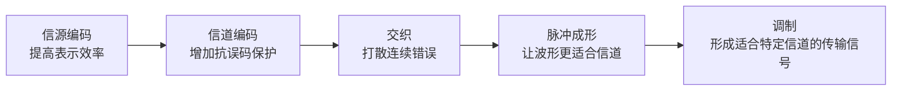

# 信号变换处理链：发信机为什么不能把原始信息直接丢进信道

> [!summary] 快速复习卡片
> **作用/定位**：承接数据通信基本模型，把“发信机负责加工信息”展开成一条具体处理链。
> **核心结论**：教材发送侧可概括为 **信源编码 → 信道编码 → 交织 → 脉冲成形 → 调制**，每一步解决的问题不同。
> **经典题型怎么做 / 题干怎么认**：去掉不必要冗余 → 信源编码；增加保护信息便于检错纠错 → 信道编码；打散连续误码 → 交织；让发送波形更适合信道 → 脉冲成形；把信息变成适合某类信道传输的已调信号 → 调制。
> **易错点 / 考试重点**：这里只记“每一步干什么”，不背具体编码算法、滤波器参数或无线物理层细节。

## 先直接回答：为什么不能直接传原始信息

上一站 [[数据通信基本模型与信道]] 里，发信机的任务被压成了一句话：

> **把原始信息加工成适合传输的信号。**

这里的“加工”**不是修改你真正想发送的内容**，而是为了让这些内容在传输时更省、更稳，而且能真正变成网线、光纤或无线信道可以传的信号。

可以先把它想成“寄快递”：东西还是原来的东西，但正式运输前通常要压缩体积、加保护、重新整理，再装进适合运输的包装。

通信里的几种“加工”也是同一个道理：

- **先省一点**：原始表示可能有不必要的冗余，可以用更高效的方式表示，少传一些不必要的比特；
- **再加一点保护**：信号在传输途中可能出错，所以人为加入一些校验、纠错所需的保护信息；
- **把连续错误打散**：如果一小段信号连续受干扰，可能一下错很多相邻数据，先重新排列后再传，接收端恢复顺序时这些错误会被分散，更容易处理；
- **把 0、1 变成真正能在线路里跑的波形**：计算机里的 0 和 1 只是数据含义，最终必须表现为实际的电信号、光信号或无线信号；
- **必要时再把信号搬到适合信道传输的形式上**：例如无线、带通信道通常需要调制，才能让信息借助适合传播的信号传出去。

所以这里真正要理解的不是“为什么要把数据改掉”，而是：

> **内容不变，但为了顺利运输，要把它换成更适合传输的表示和信号形式。**

于是发送端才有下面这条处理链。

## 发送端五步分别解决什么问题

### 1. 信源编码：先让信息表示得更省

假设同样一句话，原来的表示方法要传 100 个比特，而更高效的表示只需要 70 个比特，那么当然希望少传那 30 个没有必要的冗余。

所以信源编码可以先理解成：**尽量用更少、更合适的比特表示同样的信息。**

这里先记：**为了效率。**

### 2. 信道编码：故意多带一点“保险”

这一步看起来和上一步相反：刚刚才想办法少传一点，现在为什么又主动增加数据？

因为增加的不是“废话”，而是专门用于发现或纠正传输错误的保护信息。

可以把它理解成快递里的“物品清单和保护措施”：真正的货物没有增加，但多出来的东西能帮助你判断运输过程中有没有出问题。

这里先记：**为了可靠。**

### 3. 交织：别让一次干扰连续毁掉一大片

假设某段信号连续受到干扰，如果相邻的数据也按原顺序挨在一起传，那么可能一次就连续损坏很多相邻数据，纠错会比较困难。

交织会先把数据顺序有规律地打散后再发送。接收端再把顺序恢复回来时，原本连续发生的错误也会被分散到不同位置。

它本身**不是纠错算法**，只是让后面的纠错更容易处理。

这里先记：**为了把连续错误打散。**

### 4. 脉冲成形：把数据整理成适合线路传的实际波形

计算机里说的 0 和 1，只是在描述“数据是什么”，它们不会以字符 `0`、`1` 的样子沿着网线或光纤跑。

真正进入信道的必须是实际的电、光或无线波形。脉冲成形就是进一步整理这些实际发送波形，让它们更符合信道的带宽和传输要求。

这里先记：**把要发送的符号整理成更适合信道的波形。**考试掌握作用即可。

### 5. 调制：让信息搭上适合这个信道的“运输工具”

有些信道不能直接使用原来的低频/基带信号形式，例如典型的无线、带通信道，需要把信息映射到更适合该信道传播的信号上再发送。

可以先把它理解成：**信息本身不变，但换一种适合当前信道传播的信号形式。**

这里先建立直觉即可；“调制到底和编码差在哪”留到下一站专门拆开。

## 接收端在做什么

接收端总体上是在**反向恢复**：先从收到的信号里取回信息，再逐步撤掉发送端加入的处理，最终恢复原始数据。

当前不用额外背一串新的接收端术语，否则会在还没理解发送链时增加负担。

## 一句话总结

**发送端加工数据不是为了改变内容，而是为了让它更省、更抗干扰，并最终变成信道真正能够传输的信号。**

再压缩成五步就是：**先省 → 加保护 → 打散错误 → 整理波形 → 适配信道。**

## 下一站

**上一站：[[数据通信基本模型与信道]]**  
**主下一站：[[编码调制与解调译码]]**

为什么继续学它：这张卡先让你知道完整处理链，下一站只解决一个最容易混淆的问题——编码、调制、解调、译码分别是什么动作。
