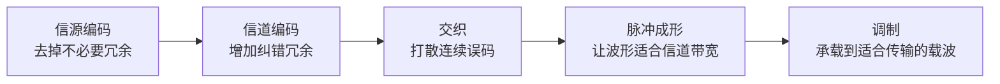

# 信号变换处理链：一份信息在发射前为什么要经过这么多步骤

> [!summary] 快速复习卡片
> **作用/定位**：承接数据通信基本模型，把“发信机加工信号”展开成具体步骤。
> **核心结论**：教材发送侧为 **信源编码 → 信道编码 → 交织 → 脉冲成形 → 调制**，接收侧再反向恢复。
> **经典题型怎么做 / 题干怎么认**：压缩/去冗余 → 信源编码；加冗余以检错纠错 → 信道编码；把连续误码打散 → 交织；让波形适合带宽 → 脉冲成形；把信息承载到载波 → 调制。
> **易错点 / 考试重点**：这里只学“作用”，不背具体编码算法、滤波器参数或 5G 物理层实现。

## 为什么从“数据通信基本模型”来到这里

上一站 [[数据通信基本模型与信道]] 只把通信过程分成：

**信源 → 发信机 → 信道 → 收信机 → 信宿。**

其中最容易产生疑问的是“发信机加工成信号”这几个字：到底加工了什么？

这张卡就是把这一步展开，让你先看见完整流程，再学习其中的具体术语。

## 发送端五步

看起来“信源编码去冗余”和“信道编码加冗余”相反，其实目标不同：

- 信源编码为了**提高表示效率**；
- 信道编码为了**提高抗误码能力**。

交织本身不负责纠错，它只是把一串集中错误打散，让后续信道译码更容易处理。

## 接收端做相反动作

接收侧大致按：

**解调 → 采样判决 → 去交织 → 信道译码 → 信源译码**

理解成“先把信号还原，再把通信保护层一层层拆掉，最后恢复原始信息”即可。

## 为什么下一站单独学“编码、调制、解调、译码”

现在你已经知道这些步骤处在什么位置，但“编码”和“调制”很容易被混为一谈。

因此下一站不再增加新流程，而是把几个术语拆清楚：

- 编码到底是在改什么；
- 调制为什么不是编码；
- 解调和译码分别对应谁。

## 一句话总结

**先压缩表示，再加纠错保护，再打散连续错误，再整形，最后调制上信道。**

## 下一站

**上一站：[[数据通信基本模型与信道]]**  
**主下一站：[[编码调制与解调译码]]**

为什么继续学它：本卡先看完整流水线，下一站再专门解决“编码、调制、解调、译码到底有什么区别”。

### 后续相关知识

- 共享信道：[[复用与多址]]。
