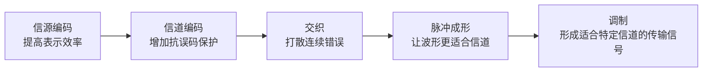

# 信号变换处理链：发信机为什么不能把原始信息直接丢进信道

> [!summary] 快速复习卡片
> **作用/定位**：承接数据通信基本模型，把“发信机负责加工信息”展开成一条具体处理链。
> **核心结论**：教材发送侧可概括为 **信源编码 → 信道编码 → 交织 → 脉冲成形 → 调制**，每一步解决的问题不同。
> **经典题型怎么做 / 题干怎么认**：去掉不必要冗余 → 信源编码；增加保护信息便于检错纠错 → 信道编码；打散连续误码 → 交织；让发送波形更适合信道 → 脉冲成形；把信息变成适合某类信道传输的已调信号 → 调制。
> **易错点 / 考试重点**：这里只记“每一步干什么”，不背具体编码算法、滤波器参数或无线物理层细节。

## 先直接回答：为什么不能直接传原始信息

上一站 [[数据通信基本模型与信道]] 里，发信机的任务被压成了一句话：

> **把原始信息加工成适合传输的信号。**

为什么还要“加工”？因为原始数据直接拿去传，可能同时遇到几个问题：

- 表示方式不够高效，带着很多不必要冗余；
- 信道可能产生误码，需要增加一定保护；
- 错误可能连续出现，不利于纠错；
- 原始波形未必适合信道的带宽和传输特性；
- 某些信道（尤其无线、带通信道）需要把信息变成更适合该信道传输的波形。

所以才会有下面这条处理链。

## 发送端五步分别解决什么问题

### 1. 信源编码：先让信息表示得更高效

它的目标是减少不必要冗余，让同样的信息用更合适的表示方式传输。

这里先记：**为了效率。**

### 2. 信道编码：再增加“有用的冗余”保护数据

这一步看起来和上一步相反：前面去冗余，这里反而加冗余。

原因是目标不同：信道编码加入的是**为了检错、纠错而设计的保护信息**。

这里先记：**为了可靠。**

### 3. 交织：把连续错误打散

如果信道一次连续影响很多相邻数据，纠错会更困难。交织会先调整数据排列，使连续错误在还原后分散开来。

它本身不是纠错算法，只是在帮后面的纠错处理创造更好的条件。

### 4. 脉冲成形：让实际发送波形更适合信道

数字数据最终不能以“0 和 1 字符”在介质里跑，而要表现成实际的电、光或无线波形。

脉冲成形负责把波形处理得更适合信道带宽和传输要求。考试到“知道作用”即可。

### 5. 调制：让信息适合某类信道传输

例如无线通信通常不能把计算机里的原始比特直接向空气中“发送”，需要把信息映射到适合无线传播的信号上。

这里先建立直觉即可；“调制到底和编码差在哪”留到下一站专门拆开。

## 接收端在做什么

接收端总体上是在**反向恢复**：先从收到的信号里取回信息，再逐步撤掉发送端加入的处理，最终恢复原始数据。

当前不用额外背一串新的接收端术语，否则会在还没理解发送链时增加负担。

## 一句话总结

**先提高表示效率，再增加抗误码保护，打散连续错误，整理发送波形，最后让信息适合信道传输。**

## 下一站

**上一站：[[数据通信基本模型与信道]]**  
**主下一站：[[编码调制与解调译码]]**

为什么继续学它：这张卡先让你知道完整处理链，下一站只解决一个最容易混淆的问题——编码、调制、解调、译码分别是什么动作。
