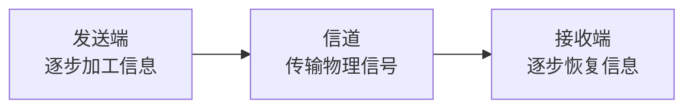

# 信号变换处理链：发送端怎样加工，接收端又怎样恢复

> [!summary] 快速复习卡片
> **作用/定位**：把数据通信基本模型里的“发信机加工、信道传输、收信机恢复”展开成一条完整链。
> **核心结论**：按本教材口径，发送侧可概括为 **信源编码 → 信道编码 → 交织 → 脉冲成形 → 调制**；接收侧总体上按相反方向恢复。
> **题干怎么认**：提高表示效率 → 信源编码；增加抗误码保护 → 信道编码；打散连续误码 → 交织；控带宽、减小码间干扰 → 脉冲成形；载波/频段映射 → 调制；接收端再解调、判决、解交织、译码。
> **易错点 / 考试重点**：脉冲成形和调制不是一回事；“编码”也不是单指信道编码。

## 先建立完整坐标：不是只有发送端五步

上一站 [[数据通信基本模型与信道]] 里已经有三个角色：

**发送端 → 信道 → 接收端。**

所以这里不能只看到发送端五步。完整逻辑是：

发送端负责把原始信息加工成能够传输的信号；信号经过信道后，接收端再把收到的物理信号逐步还原成原来的信息。

因此先记总框架：

> **发送端加工 → 信道传输 → 接收端反向恢复。**

---

## 发送端五步：每一步解决一个不同问题

按本教材的概念链，发送侧可概括为：

**信源编码 → 信道编码 → 交织 → 脉冲成形 → 调制**

| 步骤 | 它主要解决什么问题 | 最短记忆 |
| --- | --- | --- |
| 信源编码 | 同样的信息怎样表示得更高效 | **省** |
| 信道编码 | 传输出错后怎样更容易发现/纠正 | **加保护** |
| 交织 | 怎样避免一次突发干扰连续毁掉相邻数据 | **打散错误** |
| 脉冲成形 | 怎样控制每个符号的发送波形，限制占用带宽并减小码间干扰 | **管波形形状** |
| 调制 | 怎样把信息放到适合某类信道的载波/频段上传输 | **管载波/频段** |

这五步不是五种重复的“适配信道”，而是依次解决：

> **表示效率 → 可靠性 → 抗突发错误 → 波形质量 → 信道承载方式。**

其中前三步主要还在处理**信息/比特的表示和排列**；后两步已经进入**实际发送信号怎样形成**。

> [!note] 学习口径
> 这里按教材给出的概念链建立认识即可，不要把它背成“所有现实通信系统都必须严格按同一套工程实现顺序执行”的定律。

---

## “波形”到底是什么

`0`、`1` 是信息含义，不会以字符 `0`、`1` 的样子在介质里跑。

真正进入物理介质的是某个**随时间变化的物理量**，例如：

- 双绞线里的电压/电流变化；
- 光纤里的光信号变化；
- 无线中的电磁信号变化。

把“这个物理量随时间怎样变化”画出来，就是**波形**。

所以可以先记：

> **波形 = 信号随时间变化的样子。**

这不是光纤特有概念；有线、光纤、无线通信都会涉及实际波形。

---

## 最容易混：脉冲成形和调制到底差在哪

如果把两者都记成“让信号适合信道”，它们看起来当然会重复。真正区别在于它们管的东西不同。

### 脉冲成形：管“每个符号的波形长什么样”

连续发送数字符号时，如果理想波形边缘过于陡峭，会包含较多高频成分；现实信道带宽有限，传输后还可能产生拖尾，影响后一个符号的判断。

前一个符号的影响延伸到后一个符号的判决时刻，叫**码间干扰（ISI）**。

所以脉冲成形关注的是：

> **控制符号对应脉冲的时间波形和频谱，使占用带宽受控，并尽量减小相邻符号之间的干扰。**

软考这里不需要展开具体滤波器。只记：

> **脉冲成形 = 管波形形状，重点是控带宽、减小码间干扰。**

### 调制：管“信息怎样借助载波/频段传播”

有些信道，尤其是无线或其他带通信道，需要把信息映射到适合该信道的传输信号上。

常见思路是让载波的**幅度、频率或相位**随信息变化。

所以调制关注的是：

> **信息怎样放到合适的载波或频段上传输。**

两者压成一句：

- **脉冲成形**：管这个符号的波形形状；
- **调制**：管这些信息怎样使用载波/频段去传。

---

## 接收端也有对应的恢复链

数据经过信道以后，不是直接就变回原始数据。接收端还要逐步撤掉发送端施加的处理。

按当前学习深度，可以建立下面的对应关系：

| 发送端 | 接收端对应动作 | 恢复什么 |
| --- | --- | --- |
| 调制 | 解调 | 从收到的已调信号中取回承载的信息 |
| 脉冲成形相关处理 | 接收滤波、采样/判决等 | 从连续波形中恢复出符号 |
| 交织 | 解交织 | 恢复原来的数据排列 |
| 信道编码 | 信道译码 | 利用保护信息检错/纠错并恢复数据 |
| 信源编码 | 信源译码/恢复 | 恢复原始信息表示 |

所以完整心智模型是：

> **原始信息 → 发送端逐步加工 → 物理信号经过信道 → 接收端逐步恢复 → 原始信息。**

这里不用再背接收机滤波器、采样算法等工程细节，知道“接收端不是凭空得到数据，而是在做反向恢复”就够了。

---

## 为什么下一站要讲“编码、调制、解调、译码”

现在已经知道完整链条，但还有四个词特别容易混：

- **编码**：是一个大类动作，当前发送链里的信源编码、信道编码都属于编码；
- **调制**：是发送端把信息映射到适合传播的载波/频段上的动作；
- **解调**：是接收端和调制相反的恢复动作；
- **译码**：是接收端按照对应编码规则恢复数据的动作。

所以下一站 [[编码调制与解调译码]] **不是再增加四个新步骤**，而是把这四个已经出现在发送/接收链里的动作单独拿出来辨析。

## 一句话总结

> **发送端：省表示 → 加保护 → 打散错误 → 控制波形 → 适配载波/频段。**
>
> **经过信道后，接收端再反向恢复。**

尤其记住：

> **脉冲成形管波形形状和码间干扰；调制管载波/频段；编码属于发送端表示加工，译码/解调属于接收端恢复。**

## 下一站

**上一站：[[数据通信基本模型与信道]]**  
**主下一站：[[编码调制与解调译码]]**

为什么继续学它：完整发送—信道—接收链已经建立，下一站只解决四个动作的边界——编码和调制为什么不同，解调和译码又分别在恢复什么。
