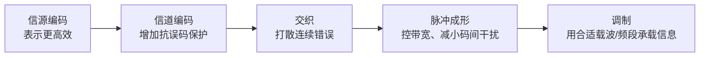

# 信号变换处理链：发信机为什么不能把原始信息直接丢进信道

> [!summary] 快速复习卡片
> **作用/定位**：承接数据通信基本模型，只建立“发送端怎样把原始信息加工成可传输信号”的整体链条。
> **核心结论**：按本教材口径，发送侧可概括为 **信源编码 → 信道编码 → 交织 → 脉冲成形 → 调制**。
> **题干怎么认**：提高表示效率 → 信源编码；增加抗误码保护 → 信道编码；打散连续误码 → 交织；限制波形占用带宽、减小码间干扰 → 脉冲成形；载波/频段/幅度频率相位映射 → 调制。
> **易错点 / 考试重点**：脉冲成形和调制不是一回事；本卡只记五步各自解决什么，不背滤波器、调制算法和工程参数。

## 先直接回答：这五步到底在干什么

上一站 [[数据通信基本模型与信道]] 已经说过，发信机负责：

> **把原始信息加工成适合传输的信号。**

这里的“加工”不是把你真正想发送的内容改掉，而是逐步解决五类不同问题：

1. 原始表示可能不够高效；
2. 传输过程中可能出错；
3. 一次干扰可能造成一串连续错误；
4. 每个发送符号形成的波形如果太生硬，可能占用过宽频带并互相干扰；
5. 某些信道还要求把信息放到合适的载波或频段上传输。

因此这五步不是五种“重复加工”，而是沿着 **表示效率 → 可靠性 → 抗突发错误 → 波形质量 → 信道承载方式** 一路解决不同问题。

> [!note] 学习口径
> 下面按教材给出的概念链理解即可，不要把它背成“所有现实通信系统都必须按完全相同顺序实现”的工程定律。

## 一张图先看完整发送链

五步只需要抓住下面这张表，不再重复展开五遍：

| 步骤 | 它主要解决什么问题 | 最短记忆 |
| --- | --- | --- |
| 信源编码 | 同样的信息怎样表示得更高效 | **省** |
| 信道编码 | 传输出错后怎样更容易发现/纠正 | **加保护** |
| 交织 | 怎样避免一次突发干扰连续毁掉相邻数据 | **打散错误** |
| 脉冲成形 | 怎样控制每个符号的发送波形，限制占用带宽并减小码间干扰 | **管波形形状** |
| 调制 | 怎样把信息放到适合某类信道的载波/频段上传输 | **管载波/频段** |

其中前三步主要还在处理**信息/比特的表示和排列**；后两步已经进入**实际发送信号怎样形成**的问题。

## 最容易混：脉冲成形和调制到底差在哪

你如果把两者都记成“让信号适合信道”，一定会觉得重复。更准确的区别是：

### 脉冲成形：管“每个符号长什么样”

假设要连续发送很多个数字符号。最粗暴的理想方波边缘非常陡，会包含较多高频成分；现实信道的带宽有限，经过信道后波形还可能拖尾，影响后一个符号的判断。

前一个符号的波形拖到后一个符号的判决时刻，造成彼此干扰，叫**码间干扰（ISI）**。

所以脉冲成形的核心不是“选择载波”，而是：

> **控制符号对应脉冲的时间波形和频谱，让占用带宽受控，并尽量减小相邻符号之间的干扰。**

软考这里不用学具体滤波器，只记：

> **脉冲成形 = 管波形形状，重点是控带宽、减小码间干扰。**

### 调制：管“信息搭什么载波、放到哪个频段传”

有些信道，尤其是无线或其他带通信道，不能直接把原来的基带信号形式拿去传播，需要把信息映射到适合该信道的传输信号上。

常见思路是让载波的**幅度、频率或相位**随信息变化。

所以调制关注的是：

> **信息怎样借助适合当前信道的载波/频带传播。**

因此两者不要再都记成“适合信道”：

- **脉冲成形**：这个符号的波形应该长什么样；
- **调制**：这些信息怎样放到合适的载波/频段上传输。

下一站 [[编码调制与解调译码]] 会专门继续拆“编码”和“调制”的区别，本卡不重复展开。

## 接收端是不是也有一条反向处理链

有。接收端的总目标就是：

> **从收到的物理信号中逐步恢复出发送端原来的信息。**

可以先建立对应关系：

- 发送端调制，接收端要**解调**；
- 发送端为了形成合适波形做了处理，接收端要把收到的波形恢复、判决成符号；
- 发送端交织，接收端要**解交织**；
- 发送端信道编码，接收端要做相应的**信道译码**；
- 发送端信源编码，接收端最终做相应的**信源译码/恢复**。

这里不要求再背一套复杂的接收机算法。对当前考试范围，理解成：

**发送端逐步加工 → 信道传输 → 接收端反向恢复。**

## 这张卡真正要带走什么

不要把五步背成五段相似定义，压成一条职责链即可：

> **省表示 → 加保护 → 打散错误 → 控制波形 → 适配载波/频段。**

尤其注意最后两步：

> **脉冲成形管波形形状和码间干扰；调制管载波/频段和信息映射。**

## 下一站

**上一站：[[数据通信基本模型与信道]]**  
**主下一站：[[编码调制与解调译码]]**

为什么继续学它：本卡只建立完整处理链；下一站专门解决最容易混淆的“编码、调制、解调、译码分别是什么动作”。
