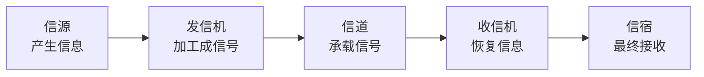

# 数据通信基本模型：信息从产生到被接收要经过哪些角色

> [!summary] 快速复习卡片
> **作用/定位**：给“信息怎样穿过通信线路”建立最底层动作链，是编码、调制、信道容量等知识的父概念。
> **核心结论**：经典模型是 **信源 → 发信机 → 信道 → 收信机 → 信宿**。
> **经典题型怎么做 / 题干怎么认**：产生原始信息 → 信源；把信息加工成可传信号 → 发信机；承载信号 → 信道；恢复信号/信息 → 收信机；最终接收者 → 信宿。
> **易错点 / 考试重点**：物理信道是实际介质/传输资源，逻辑信道是基于物理资源组织出的逻辑通路；P2，不背设备实现细节。

## 五个角色为什么要分开

一条通信链路不是“两台机器加一根线”这么简单。原始信息先要被加工成介质能够承载的信号，信号穿过信道后，再被恢复成信息。

| 角色 | 一句话 |
| --- | --- |
| 信源 | 信息从哪里来 |
| 发信机 | 把信息变成适合传输的信号 |
| 信道 | 信号真正经过的通路 |
| 收信机 | 从收到的信号中恢复信息 |
| 信宿 | 信息最终交给谁 |

## 为什么下一步会学编码和调制

信源产生的比特、声音、图像并不能自动适合每一种介质。发信机还要解决“信息怎样表示”“是否需要搭载到载波上”等问题，这就是 [[编码调制与解调译码]]。

## 一句话总结

**谁产生、谁加工、从哪传、谁恢复、交给谁：信源—发信机—信道—收信机—信宿。**

## 下一站

- 下一站：[[编码调制与解调译码]]。
