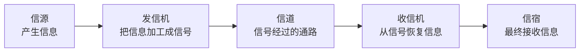

# 数据通信基本模型：一次信息传递到底需要哪些角色

> [!summary] 快速复习卡片
> **作用/定位**：从“网络有哪些类型”进入“信息到底怎样传”，是后续编码、调制、信道容量等知识的起点。
> **核心结论**：经典模型是 **信源 → 发信机 → 信道 → 收信机 → 信宿**。
> **经典题型怎么做 / 题干怎么认**：谁产生信息 → 信源；谁把信息加工成可传信号 → 发信机；信号经过哪里 → 信道；谁把收到的信号恢复 → 收信机；最后交给谁 → 信宿。
> **易错点 / 考试重点**：这些词描述的是“通信过程中的角色”，不一定每个角色都对应一台独立设备。

## 先直接回答：为什么一次通信要分成五个角色

上一站 [[网络类型与广域网技术]] 只是告诉你：网络可能是 LAN、WAN、WLAN 等不同类型。

现在不管网络类型，假设 **计算机 A 要把一张图片发给计算机 B**。

这件事至少要经历：

1. A 产生要发送的信息；
2. 把信息加工成线路或无线介质能够传输的信号；
3. 信号沿某种传输通路前进；
4. B 这一侧把收到的信号恢复成信息；
5. 最后把信息交给目标程序或用户。

教材把这五个角色叫作：

**信源 → 发信机 → 信道 → 收信机 → 信宿。**

## 五个词分别是什么意思

| 角色 | 人话 |
| --- | --- |
| 信源 | 信息从哪里产生 |
| 发信机 | 把原始信息加工成适合传输的信号 |
| 信道 | 信号经过的传输通路或资源 |
| 收信机 | 把收到的信号恢复成可用信息 |
| 信宿 | 信息最终交给谁 |

注意，“发信机、收信机”是**功能角色**。在现实设备里，这些功能可能集成在网卡、无线模块、调制解调设备等部件中，不要误以为一定有一台单独叫“发信机”的机器。

## 为什么不能直接说“A 把数据发给 B”就结束

因为后续很多知识都藏在“加工”和“传输”这两个词里：

- 数据怎样表示得更适合传输？
- 为什么有时要增加纠错信息？
- 无线信号为什么需要调制？
- 一条信道最多能传多少数据？

如果没有先建立这五个角色，后面的“编码、调制、信道容量”就会像突然冒出来的孤立名词。

## 为什么下一站是“信号变换处理链”

本卡只把“发信机负责加工信息”说到这里，但还没有回答：**到底加工了哪几步？**

下一站就把这个黑盒打开。

## 一句话总结

**信息从哪里来、谁加工、从哪传、谁恢复、交给谁：信源—发信机—信道—收信机—信宿。**

## 下一站

**上一站：[[网络类型与广域网技术]]**  
**主下一站：[[信号变换处理链]]**

为什么继续学它：你已经知道“发信机要把信息加工成可传信号”，下一站就具体看这种加工到底分成哪些步骤。
