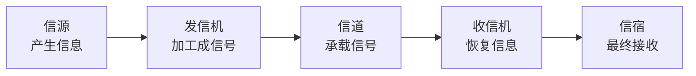

# 数据通信基本模型：信息从产生到被接收要经过哪些角色

> [!summary] 快速复习卡片
> **作用/定位**：从“网络有哪些类型”正式进入“信息到底怎样传”，是编码、调制、信道容量等知识的父概念。
> **核心结论**：经典模型是 **信源 → 发信机 → 信道 → 收信机 → 信宿**。
> **经典题型怎么做 / 题干怎么认**：产生原始信息 → 信源；把信息加工成可传信号 → 发信机；承载信号 → 信道；恢复信号/信息 → 收信机；最终接收者 → 信宿。
> **易错点 / 考试重点**：物理信道是实际介质/传输资源，逻辑信道是基于物理资源组织出的逻辑通路；P2，不背设备实现细节。

## 为什么从“网络类型”来到这里

上一站 [[网络类型与广域网技术]] 解决的是：**LAN、MAN、WAN、WLAN、移动通信网分别是什么场景。**

但不管是哪一种网络，一次通信都至少要回答：

- 信息从哪里产生；
- 怎样变成可传输的信号；
- 经过什么通路；
- 接收端怎样恢复；
- 最后交给谁。

所以从这里开始，不再讨论“网络属于哪一类”，而是进入所有网络共同的**通信过程**。

## 五个角色为什么要分开

一条通信链路不是“两台机器加一根线”这么简单。原始信息先要被加工成介质能够承载的信号，信号穿过信道后，再被恢复成信息。

| 角色 | 一句话 |
| --- | --- |
| 信源 | 信息从哪里来 |
| 发信机 | 把信息变成适合传输的信号 |
| 信道 | 信号真正经过的通路 |
| 收信机 | 从收到的信号中恢复信息 |
| 信宿 | 信息最终交给谁 |

## 为什么下一步要看“信号变换处理链”

现在只知道“发信机负责加工信号”，但还不知道它具体做了什么。

真实发送过程中，信息往往要经历：

**信源编码 → 信道编码 → 交织 → 脉冲成形 → 调制。**

所以下一站先把这些步骤放回一条完整链里，再单独理解“编码/调制”这些术语，顺序会更自然。

## 一句话总结

**谁产生、谁加工、从哪传、谁恢复、交给谁：信源—发信机—信道—收信机—信宿。**

## 下一站

**上一站：[[网络类型与广域网技术]]**  
**主下一站：[[信号变换处理链]]**

为什么继续学它：本卡只告诉你“发信机要加工信号”，下一站才展开“加工到底分几步，每一步解决什么问题”。
