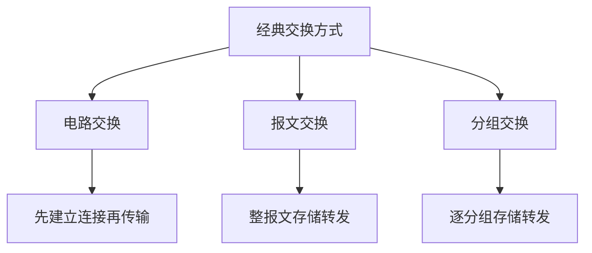
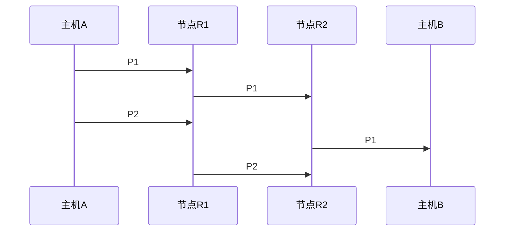

# 电路、报文、分组交换：数据经过中间网络时怎样转发

> [!summary] 快速复习卡片
> **作用/定位**：解释发送方和接收方之间隔着多个中间节点时，网络用什么方式组织通信和转发。
> **核心结论**：三种经典交换方式是**电路交换、报文交换、分组交换**。电路交换先建立连接并保留相应通信资源；报文交换以**整个报文**为单位存储转发；分组交换把报文拆成较小分组，以**分组**为单位存储转发。
> **最容易混淆的点**：**存储转发不是第四种交换方式。报文交换和分组交换都采用存储转发思想，区别主要在存储、转发的单位不同。**
> **经典题型怎么认**：通信前先建立连接、预留资源 → 电路交换；整个报文收完再转 → 报文交换；拆成分组、逐分组转发、共享链路 → 分组交换。

## 先从问题出发：为什么需要“交换”

上一站 [[复用与多址]] 解决的是：**有限的通信资源怎样让多路信号或多个用户共享。**

现在继续往前走。主机 A 和主机 B 往往不是用一根专线直接相连，而是要经过若干中间交换节点。于是网络还要解决另一个问题：

> **A 要把数据送到 B，中间网络到底怎样组织这次通信？**

经典上有三种基本思路：

1. **电路交换**：先把通信连接建立好，再传数据；
2. **报文交换**：不先占一条端到端通路，而是让整个报文一站一站存储转发；
3. **分组交换**：先把大报文拆成较小分组，再逐分组存储转发。

这三种方式解决的是**同一个问题**，不要把“存储转发”再当成第四种并列方式。

## 电路交换：先把连接建立好，再连续通信

### 传统电话是最直观的例子

假设 A 给 B 打传统固定电话，中间要经过多个交换节点。

A 拨号后，网络不是让每一小段语音都临时决定下一步往哪里走，而是先为这次通信建立端到端的连接，并在沿途为它分配、保留相应的通信资源。连接建立完成后，双方才持续传输语音；挂断后再释放资源。

因此电路交换有三个阶段：

> [!important] “先占路”只是帮助记忆
> 电路交换并不是说网络真的临时拉出一根新的物理电线，而是**先建立一条端到端的通信连接，并为这次连接保留相应资源**。

### 为什么它传起来比较稳定

连接一旦建立：

- 通信所需的路径和资源已经安排好；
- 后续数据沿已建立的连接持续传输；
- 不需要每个数据块都重新进行一次独立的路径选择；
- 因此连续通信时，传输时延通常比较稳定。

### 它的问题在哪里

假设两个人打电话时沉默了 10 秒。这 10 秒虽然没有有效语音数据，但连接仍然存在，已经为这次通信保留的资源也可能处于空闲状态。

所以电路交换的典型矛盾是：

> **连续通信比较稳定，但突发式计算机数据通信中，预留资源可能被闲置，利用率不够灵活。**

这就引出了另一种思路：不提前长期占住端到端资源，而是有数据时再逐站转发。

## 报文交换：整个报文收完，再转给下一站

先理解“报文”：这里可以把它看成发送方准备发送的**一整份消息**。

假设 A 要发送一个较大的报文，中间经过节点 R1、R2。报文交换中，R1 的处理过程是：

也就是说，R1 要先把**整个报文接收完整**，再把它继续发给下一站。R2 收到后也做类似处理。

这就是典型的**存储转发**：

> **先完整接收当前转发单位并暂时保存，再根据地址等信息决定如何继续转发。**

### 为什么整报文转发不够灵活

如果报文很大，中间节点就会面临两个明显问题：

- 要准备足够空间暂存整个报文；
- 必须等整个报文都收完，下一跳才开始转发，等待时间可能较长。

于是自然会想到：**能不能不要等整份大报文，把它拆小以后边收边往后转？**

这就是分组交换。

## 分组交换：把大报文拆小，逐分组存储转发

分组交换先把一个较大的报文划分为多个较小的**分组**。例如一份报文被拆成 P1、P2、P3。

中间节点收到 P1 后，不需要等待 P2、P3 全部到齐，就可以处理 P1：

随后 P2 到达，再处理 P2；P3 到达，再处理 P3。

所以分组交换**同样有“存储、判断、转发”**。区别只是：

- 报文交换存储、判断、转发的是**整个报文**；
- 分组交换存储、判断、转发的是**一个分组**。

> [!warning] 关键易错点
> ❌ 报文交换 = 存储转发，分组交换 = 不存储转发。  
> ✅ **报文交换和分组交换都采用存储转发思想；区别主要在转发单位不同。**

## 为什么分组交换比报文交换更适合计算机网络

### 1. 不必等整个大报文到齐

报文交换必须等一整份报文全部到达中间节点后，才能继续往下一站发送。

分组交换则是：**一个分组完整到达后，就可以先转发这个分组。**

因此多段链路可以形成类似流水线的效果：当前面的 P1 已经从 R1 发往 R2 时，发送方还可以继续把 P2 发给 R1。

### 2. 多个用户可以共享链路

计算机通信往往是突发式的：请求发一阵、等待一阵、再继续发送。如果每次通信都像电路交换一样长期为某个用户预留资源，会造成不少空闲浪费。

分组交换让不同通信的分组共享网络链路。谁当前有数据，谁就把分组送入网络，因此资源利用更灵活。

这也是 Internet 采用分组交换思想的重要原因。

### 3. 代价是可能排队、拥塞和丢包

共享链路并不是没有代价。多个用户同时发送大量分组时，某个路由器的输出链路可能来不及发送，于是分组先进入缓存排队。

如果排队越来越长，就会增加**排队时延**；缓存不够时还可能**丢包**。

所以分组交换的特点不是“永远更快”，而是：

> **用共享资源提高利用率和灵活性，但时延可能变化，网络繁忙时还会出现拥塞和丢包。**

这正好连接到下一站 [[网络性能指标]]。

## 三种交换方式放在一起比较

| 方式 | 通信前是否先建立端到端连接 | 存储转发单位 | 资源特点 | 典型判断词 |
| --- | --- | --- | --- | --- |
| 电路交换 | 是 | 不以报文/分组逐跳存储转发为核心 | 为连接保留相应资源 | 先建立、再通信、最后释放 |
| 报文交换 | 否 | 整个报文 | 不长期独占端到端线路，但中间节点要缓存整报文 | 整份收完再转 |
| 分组交换 | 通常不按电路交换方式独占端到端资源 | 一个分组 | 多通信共享链路，利用更灵活 | 拆小包、逐包转发 |

一句话压缩：

> **电路交换：先占路再传；报文交换：整份存、整份转；分组交换：拆小包、逐包存、逐包转。**

## 分组交换内部：数据报与虚电路

理解完“三种经典交换方式”以后，再看分组交换内部的两种组织方式会容易很多。

- **数据报方式**：每个分组都携带足够的目的信息，可以独立进行转发决策；不同分组**可能**经过不同路径。
- **虚电路方式**：发送数据前先建立一条**逻辑上的转发关系**，后续分组依据这条逻辑关系转发。

> [!warning] 不要把两个“电路”混为一谈
> **虚电路不是电路交换。**虚电路建立的是逻辑转发关系，并不意味着像传统电路交换那样为一次通信独占一整条物理线路。

还有一个常见误区：

> **分组交换不等于“每个分组一定走不同路线”。**

数据报方式只是允许各分组独立进行转发决策，它们完全可能恰好经过相同路径。

## 考试看到题干怎么判断

### 看到这些词，优先想到电路交换

- 通信前先建立连接；
- 通信过程中保留通信资源；
- 通信结束后释放连接；
- 传统电话网络。

### 看到这些词，优先想到报文交换

- 整个报文作为转发单位；
- 中间节点必须完整接收整份报文；
- 整报文存储后再转发。

### 看到这些词，优先想到分组交换

- 报文被划分为多个分组；
- 以分组为单位存储转发；
- 多个通信共享链路；
- 可能产生排队、拥塞和丢包。

## 快速复习卡片

1. **经典交换方式有哪三种？**  
   电路交换、报文交换、分组交换。

2. **电路交换的三个阶段？**  
   建立连接 → 数据传输 → 释放连接。

3. **“存储转发”是不是第四种交换方式？**  
   不是。它是中间节点的一种转发思想，报文交换和分组交换都使用。

4. **报文交换和分组交换最关键的区别？**  
   报文交换以整个报文为存储转发单位；分组交换以一个分组为单位。

5. **为什么分组交换不用等整个报文？**  
   因为一个分组完整到达中间节点后，就可以先处理并转发这个分组。

6. **分组交换为什么适合计算机网络？**  
   多个用户可以共享链路，突发式通信时资源利用更灵活。

7. **分组交换的代价是什么？**  
   共享链路可能带来排队时延、拥塞和丢包。

8. **数据报方式是不是每个分组一定走不同路线？**  
   不是。每个分组可以独立进行转发决策，但实际路径完全可能相同。

9. **虚电路是不是电路交换？**  
   不是。虚电路是分组交换中的逻辑转发关系，不等于独占物理线路。

## 为什么下一站是网络性能指标

到这里已经知道，分组交换让多个用户共享链路，因此分组可能在路由器里排队。于是下一个自然问题就是：

> **一个分组从发送方到接收方到底要多久？链路到底能传多快？为什么网络一忙时延就会上升？**

这正是 [[网络性能指标]] 要解决的问题。

## 下一站

**上一站：[[复用与多址]]**  
**完整学习路线下一站：[[网络性能指标]]**

为什么继续学它：先理解“网络怎样转发”，再计算“转发到底有多快、要等多久”，主线才是连续的。性能专题学完后，再回到 [[以太网技术]] 继续局域网主线。
