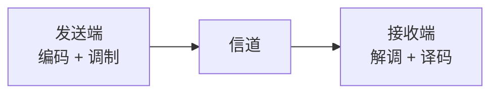

# 编码、调制、解调、译码：它们分别发生在哪一端

> [!summary] 快速复习卡片
> **作用/定位**：承接 [[信号变换处理链]]，不是新增四个步骤，而是辨清发送端加工与接收端恢复中的四类动作。
> **核心结论**：编码、调制主要属于发送端；解调、译码主要属于接收端。当前链里的**信源编码、信道编码都属于“编码”**。
> **题干怎么认**：提高表示效率/增加纠错保护 → 编码；载波、频段、幅度/频率/相位变化 → 调制；从已调信号取回信息 → 解调；按编码规则恢复数据 → 译码。
> **易错点 / 考试重点**：编码 ≠ 加密；调制 ≠ 编码；解调 ≠ 译码；这四个词不是完整通信流程的全部步骤。

## 先放回整条通信链里看

上一站已经建立完整框架：

> **发送端加工 → 信道传输 → 接收端反向恢复。**

这四个词分别落在两端：

但要特别注意：这张图只是为了给四个词定位，**不是说发送端只有“编码、调制”两步，接收端也只有“解调、译码”两步**。

上一篇已经讲过更完整的发送链：

**信源编码 → 信道编码 → 交织 → 脉冲成形 → 调制**

接收端则还会经历波形恢复/判决、解交织等动作，再逐步译码恢复原始信息。

所以这篇只回答一个问题：

> **编码、调制、解调、译码这四个词到底分别是什么动作，为什么不能混。**

---

## “编码”是不是指信源编码、信道编码

**在我们当前这条发送链里，是的：信源编码和信道编码都属于“编码”这个大类。**

“编码”不是一个只对应某一步的专有名字，而是一个更大的动作概念：

> **按照某种规则改变信息的表示方式。**

当前最需要区分的是两种目的：

| 编码 | 主要目的 |
| --- | --- |
| 信源编码 | 让同样的信息表示得更高效，减少不必要冗余 |
| 信道编码 | 主动加入保护信息，提高检错/纠错能力 |

所以：

- 信源编码是在“省”；
- 信道编码是在“加保护”；
- 两者都属于编码，但目的相反，不能因为都叫编码就认为是一回事。

更广的通信知识里还可能出现其他“编码”概念，但当前软考学习主线不需要扩展算法家族。

---

## 调制：也是发送端加工流程的一部分

对。**调制就是上一篇发送端加工链里的最后一个概念步骤。**

它解决的问题不是“信息怎么表示”，而是：

> **这些信息怎样借助适合信道的载波/频段传播。**

有些信道，尤其无线或其他带通信道，通常要把信息映射到载波上，例如让载波的：

- 幅度；
- 频率；
- 相位；

随信息发生变化。

所以可以这样分：

> **编码管“信息怎样表示”；调制管“信息怎样借助传输信号传播”。**

上一篇已经专门区分过脉冲成形和调制：脉冲成形管波形形状、带宽和码间干扰；调制管载波/频段。这里不再重复展开。

---

## 解调：接收端先把承载的信息取回来

信号经过信道到达接收端以后，接收端收到的是**物理信号**，不是已经恢复好的原始数据。

如果发送端做过调制，接收端就要执行相反方向的动作：

> **从收到的已调信号中提取出它所承载的信息。**

这就是**解调**。

所以：

> **调制 ↔ 解调**

它们是一对发送端—接收端的对应动作。

---

## 译码：接收端按编码规则恢复数据

解调之后得到的信息通常还不是最初的原始信息，因为发送端之前还做过编码、交织等处理。

如果发送端做了：

- 信道编码，接收端需要相应的**信道译码**；
- 信源编码，接收端最终还要做相应的**信源译码/恢复**。

所以“译码”可以先理解为：

> **按照发送端采用的编码规则，把数据逐步恢复回来。**

因此：

> **编码 ↔ 译码**

也是一对对应动作。

---

## 四个词放在一起到底是什么关系

| 动作 | 主要发生在哪一端 | 它主要干什么 | 对应动作 |
| --- | --- | --- | --- |
| 编码 | 发送端 | 改变信息表示，用于效率、可靠性等目的 | 译码 |
| 调制 | 发送端 | 把信息映射到适合传播的载波/频段 | 解调 |
| 解调 | 接收端 | 从收到的已调信号中取回承载的信息 | 调制 |
| 译码 | 接收端 | 按编码规则恢复数据 | 编码 |

最短记忆：

> **发送：编码 + 调制。**  
> **接收：解调 + 译码。**

但这只是在辨析四个词，不能反过来把完整通信流程压成只有四步。

---

## 为什么不是所有通信都必须做“载波调制”

关键看信道和传输方式。

- **基带传输**：经过合适的线路处理后，可以直接在某些有线介质上传输；
- **带通传输**：通常需要把信息放到适合该频段的载波上，无线通信就是典型场景。

所以不要机械背成：

> “任何数据都一定先编码，再调制。”

当前学习重点是认清动作边界，而不是把一种教材概念链套到所有工程实现。

---

## 一句话总结

> **编码是大类：当前链里的信源编码、信道编码都属于编码。**
>
> **调制也是发送端加工步骤；解调和译码则属于接收端的反向恢复。**

对应关系只记两组：

> **编码 ↔ 译码**  
> **调制 ↔ 解调**

## 下一站

**上一站：[[信号变换处理链]]**  
**主下一站：[[香农公式与信道容量]]**

为什么继续学它：发送端怎样加工、接收端怎样恢复已经建立；下一步开始问信道本身——它最多能传多少，带宽和噪声怎样限制传输能力。
