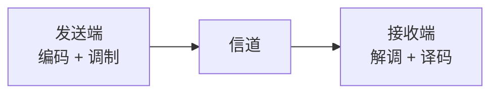

# 编码、调制、解调、译码：它们到底在发送和接收时做什么

> [!summary] 快速复习卡片
> **作用/定位**：承接 [[信号变换处理链]]，把发送端和接收端最容易混的四类动作讲清。
> **核心结论**：当前链里的信源编码、信道编码都属于“编码”；**调制不是选网线/光纤/Wi-Fi，而是让载波的变化携带信息**；接收端再解调、译码。
> **题干怎么认**：改信息表示 → 编码；载波的幅度/频率/相位随信息变化 → 调制；从已调信号中取回信息 → 解调；按编码规则恢复数据 → 译码。
> **易错点 / 考试重点**：介质 ≠ 载波；调制 ≠ 选传输路径；编码 ≠ 加密；不是所有通信都必须使用载波调制。

## 先放回整条通信链里看

上一站已经建立：

> **发送端加工 → 信道传输 → 接收端反向恢复。**

这四个词只是从完整通信链里抽出来辨析，不是说通信总共只有四步：

上一篇更完整的发送链仍然是：

**信源编码 → 信道编码 → 交织 → 脉冲成形 → 调制**

接收端还会做波形恢复/判决、解交织等动作，再逐步把信息恢复回来。

这张卡只回答一个主问题：

> **编码、调制、解调、译码分别在改变什么，为什么不是一回事？**

---

## 先把“物理层、介质、信号”分开

要理解调制，先别急着看“幅度、频率、相位”。先分清三个对象。

假设电脑要发送 `1 0 1`。

- `1 0 1` 是**信息/数据**；
- 网线、光纤、空气是**传输介质**，也就是信号通过的物理环境；
- 真正沿着介质传播的是**物理信号**，例如电信号、光信号或无线电磁信号。

所以：

> **物理层负责把抽象的数据变成真实可传播的物理信号；网线、光纤、空气只是这些信号传播所依赖的介质。**

因此，“选网线还是光纤”“用 Wi-Fi 还是有线”是在确定**介质/接入方式**，并不等于调制。

---

## 为什么会出现“载波”

有些场景，尤其是无线或其他带通信道，不能直接把原来的低频/基带信号形式拿去传播，需要先有一个适合该频段传播的周期性物理波。

这个用来**承载信息的基础波**，就叫**载波**。

零基础可以先这样想：

> **载波 = 一辆还没装货的车。**  
> **数据 = 要运输的货物。**

但要马上补一句准确边界：载波不是网线、光纤或空气，它本身仍然是**信号**；网线、光纤、空气才是介质。

因此：

- 网线 / 光纤 / 空气：**路**；
- 载波：**在路上跑的基础信号**；
- 数据：**要让这个信号带走的信息**。

---

## 调制到底是什么意思

现在问题变成：

> **我已经有了一个可以传播的载波，怎样让它带上 `0`、`1` 等信息？**

答案就是**调制**。

可以先把它理解成：

> **调制 = 把信息“装到载波上”。**

不过这只是直觉。严格一点说，并不是把一个东西真的塞进另一个东西，而是：

> **让载波的某个特征按照要发送的信息发生变化，于是接收端可以从这种变化中判断原来的信息。**

例如只为了建立直觉，假设我们人为规定：

- 要发送 `1` 时，让载波的振幅大一些；
- 要发送 `0` 时，让载波的振幅小一些。

那么接收端只要观察载波的这种变化，就能重新判断出 `1` 和 `0`。

这就是调制的基本思想。

除了振幅，也可以利用载波的：

- **频率**变化；
- **相位**变化；

来携带信息。

当前软考学习只需要知道这个动作，不需要展开 ASK、FSK、PSK 等具体算法家族。

所以调制最值得记的一句话是：

> **载波是“空白的传播波”，调制是“让载波的变化携带信息”。**

---

## 调制不是“找到一条适合的传输路径”

这是最容易出现的误解。

假设现在有三个选择：

- 双绞线；
- 光纤；
- Wi-Fi 无线。

选择其中哪一种，是在决定**通信介质/接入方式**。

而调制发生在更具体的一层：

> **介质和物理传输体系已经基本确定后，信息怎样体现在实际传输信号上。**

以无线为例：

**确定使用无线**
→ 使用相应频段的物理信号
→ **通过调制让载波的变化携带数据**
→ 电磁信号在空气中传播

因此不要记成：

> 调制 = 选择 Wi-Fi / 光纤 / 网线。

应该记成：

> **调制 = 数据怎样“搭上”实际传播的载波。**

---

## 那“编码”又是什么，为什么它不是调制

在我们当前发送链里，**信源编码和信道编码都属于编码这个大类**。

编码关注的是：

> **信息按照什么规则表示。**

例如：

| 编码 | 主要目的 |
| --- | --- |
| 信源编码 | 让同样的信息表示得更高效，减少不必要冗余 |
| 信道编码 | 主动加入保护信息，让传输出错后更容易检错/纠错 |

所以可以这样区分：

> **编码：改信息的表示。**  
> **调制：让载波的变化携带已经准备好的信息。**

一个是在处理“信息怎么表示”，另一个是在处理“信息怎么搭上实际传输信号”。

---

## 解调：接收端把“货物”从载波变化里认出来

发送端做完调制，载波就已经携带了信息。

信号经过信道到达接收端后，接收端首先面对的仍然是收到的物理信号，不是已经恢复好的原始数据。

因此接收端要做和调制相反的动作：

> **观察收到的载波变化，把它承载的信息提取出来。**

这就是**解调**。

用刚才的直觉继续想：

- 调制：把货装上车；
- 解调：从车的变化中把货物信息取回来。

所以：

> **调制 ↔ 解调**

是一对发送端—接收端动作。

---

## 译码：为什么解调之后还没结束

因为发送端在调制之前，通常已经对数据做过编码。

解调只是把“载波携带的信息”取回来，并不等于已经恢复成最开始的原始信息。

如果发送端之前做了：

- 信道编码，接收端还要做对应的**信道译码**；
- 信源编码，接收端最终还要做对应的**信源译码/恢复**。

所以译码关注的是：

> **按照发送端的编码规则，把编码后的数据恢复回来。**

因此：

> **编码 ↔ 译码**

是另一对对应动作。

---

## 用一次完整发送把四个词串起来

假设现在要通过一种需要载波调制的通信方式发送数据。

发送端：

1. **编码**：先把信息按需要重新表示，例如压缩冗余或增加纠错保护；
2. 经过交织、脉冲成形等处理；
3. **调制**：让载波的变化携带这些信息；
4. 物理信号进入信道传播。

接收端：

1. 收到物理信号；
2. **解调**：从载波变化中取回所承载的信息；
3. 再经过判决、解交织等恢复；
4. **译码**：按发送端的编码规则恢复数据；
5. 最终得到原始信息。

因此四个词的最短坐标是：

| 动作 | 哪一端 | 一句话理解 |
| --- | --- | --- |
| 编码 | 发送端 | 改信息表示 |
| 调制 | 发送端 | 让载波变化携带信息 |
| 解调 | 接收端 | 从载波变化中取回信息 |
| 译码 | 接收端 | 按编码规则恢复数据 |

---

## 为什么不是所有通信都必须有“载波调制”

这里要留一个边界，避免以后越学越乱。

某些**基带传输**可以经过线路编码、波形成形等处理后，直接通过相应有线介质传输，并不一定需要再搬到一个高频载波上。

而无线等典型**带通传输**场景，载波调制就非常常见。

所以考试和学习时不要机械背：

> “所有数据传输都必须先调制。”

当前真正需要掌握的是：

> **一旦题目出现载波、幅度/频率/相位随信息变化，就应该想到调制；反向从已调信号中取信息，就是解调。**

---

## 最容易混的四句话

- **网线/光纤/空气是介质，不是载波。**
- **选择介质不是调制。**
- **编码改信息表示，调制让载波携带信息。**
- **解调取回载波中的信息，译码再按编码规则恢复数据。**

## 自测

1. “从网线、光纤、Wi-Fi 中选一种”属于调制吗？为什么？
2. 载波和传输介质有什么区别？
3. 接收端为什么做了解调以后还可能需要译码？

## 一句话总结

> **载波是用来承载信息的基础物理波；调制就是让载波的变化携带数据。**
>
> **编码在发送端改信息表示，译码在接收端恢复表示；调制把信息放到载波变化里，解调再把它取回来。**

## 下一站

**上一站：[[信号变换处理链]]**  
**主下一站：[[香农公式与信道容量]]**

为什么继续学它：现在已经知道信息怎样被加工并真正进入物理信号；下一步就可以问一个新的问题——这样的信道到底最多能传多快，带宽和噪声为什么会形成上限。
