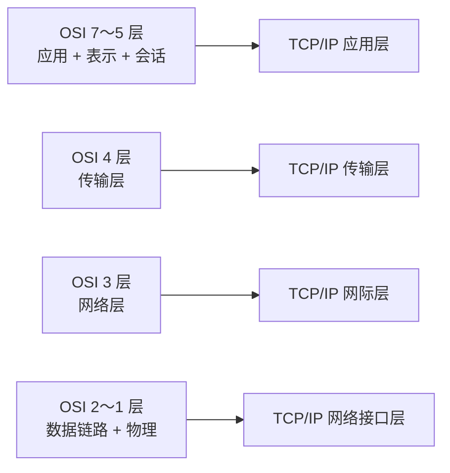

# OSI 与 TCP/IP：为什么七层和四层都要学

> [!summary] 快速复习卡片
> **作用/定位**：把刚学的 OSI 七层职责映射到互联网实际广泛使用的 TCP/IP 四层体系。
> **核心结论**：OSI 更适合做七层职责参考；TCP/IP 四层通常是**网络接口层、网际层、传输层、应用层**。常见“应用/传输/网络/链路/物理”是教学用五层模型，不要和 TCP/IP 四层混成一套。
> **经典题型怎么做 / 题干怎么认**：TCP/UDP → 传输层；IP/ICMP → 网际层；HTTP/FTP/SMTP/DNS → 应用层；以太网等 → 网络接口层。
> **易错点 / 考试重点**：OSI 的会话层、表示层在 TCP/IP 四层模型中通常并入应用层；数据链路层和物理层通常归入网络接口层。

## 先直接回答：为什么学完 OSI 还要学 TCP/IP

上一站 [[网络协议与OSI七层]] 用七层帮你建立了一个很清楚的**职责坐标系**：哪一类问题应该由哪一层负责。

但现实互联网并不是按照完整 OSI 七层协议栈普遍运行。Internet 形成和发展过程中实际广泛使用的是 **TCP/IP 协议体系**，通常把相近职责合并成四层。

所以两者不是“背两套重复知识”：

- **OSI 七层**：帮助你理解职责怎样划分；
- **TCP/IP 四层**：帮助你认识现实互联网协议通常怎样组织。

考试之所以两者都考，是因为经常先借 OSI 问“职责在哪一层”，再借 TCP/IP 问“某个实际协议属于哪一层”。

## 先看图：七层到底怎样压成四层

这张图真正要记的只有两次“合并”：

- 上面三层合并：**应用 + 表示 + 会话 → 应用层**；
- 下面两层合并：**数据链路 + 物理 → 网络接口层**。

中间的传输层、网络层基本保持一一对应，只是 TCP/IP 常把网络层叫作**网际层**。

## 七层怎样映射成四层

<<<<<<< HEAD
| OSI 七层 | TCP/IP 四层 | 常见协议/技术 |
| --- | --- | --- |
| 应用层 | 应用层 | HTTP、FTP、SMTP、DNS、SNMP 等 |
| 表示层 | 应用层 | 表示功能通常由应用/协议自己处理 |
| 会话层 | 应用层 | 会话功能通常由应用/协议实现 |
| 传输层 | 传输层 | TCP、UDP |
| 网络层 | 网际层 | IP、ICMP 等 |
| 数据链路层 | 网络接口层 | Ethernet 等 |
| 物理层 | 网络接口层 | 介质、接口、比特传输等具体实现 |
=======
| OSI 七层 | TCP/IP 四层    | 常见协议/技术                  |
| ------ | ------------ | ------------------------ |
| 应用层    | 应用层          | HTTP、FTP、SMTP、DNS、SNMP 等 |
| 表示层    | 应用层          | 表示功能通常由应用/协议自己处理         |
| 会话层    | 应用层          | 会话功能通常由应用/协议实现           |
| 传输层    | 传输层          | TCP、UDP                  |
| 网络层    | 网际层          | IP、ICMP 等                |
| 数据链路层  | 网络接口层        | Ethernet 等               |
| 物理层    | 网络接口层/具体网络硬件 | 介质、接口、比特传输               |
>>>>>>> 79b2607 (2026-09-06 09:39:51: ...)

## 那“应用、传输、网络、链路、物理”五层又是什么

你在教材、课程或题解里还可能看到：

> **应用层 → 传输层 → 网络层 → 数据链路层 → 物理层**

这是为了教学方便，把 OSI 上三层合并成应用层，但仍把底部的“数据链路层、物理层”分开，于是得到**五层教学模型**。

它和 TCP/IP 四层最明显的区别就在底部：

- TCP/IP 四层：数据链路 + 物理 → **网络接口层**；
- 五层教学模型：仍然分成**数据链路层 + 物理层**。

> [!warning] 做题口径
> 题目明确说“TCP/IP 四层”时，按 **应用层、传输层、网际层、网络接口层**回答；题目画的是五层模型时，就按应用、传输、网络、链路、物理五层判断。不要因为名称相似把四层和五层混在一起。

## 协议集要背到什么程度

大纲写了“OSI 协议集、TCP/IP 协议集”，但这不等于要背大量历史协议名。

当前边界：

- 会说 OSI 七层各自负责什么；
- 会把 TCP/IP 常见协议放回四层；
- 会做 OSI ↔ TCP/IP 层次映射；
- 遇到五层教学模型时知道它只是另一种教学抽象，不和四层重复背。

`TP0～TP4`、CLNP 等旧 OSI 协议不扩成独立记忆任务。

## 为什么下一站是网络互联设备

分层模型目前还是抽象职责。下一步要把“物理层、链路层、网络层”落到真实设备：

- 哪些设备只处理信号；
- 哪些设备看 MAC；
- 哪些设备根据 IP 和路由表转发；
- 防火墙和网关在基础题里怎样定位。

把层次落到设备以后，再看这些设备服务于什么范围和形态的现实网络。

## 一句话总结

**OSI 用七层讲职责；TCP/IP 四层把上三层和下两层分别合并；常见五层模型只是把底部链路层和物理层重新拆开来教学。**

## 下一站

**上一站：[[网络协议与OSI七层]]**  
**主下一站：[[网络互联设备]]**

为什么继续学它：分层职责已经建立，下一步把抽象的层次落到中继器、交换机、路由器等真实设备。
