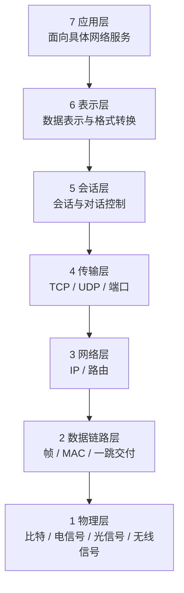
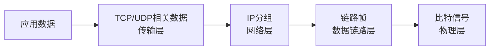

# 网络协议与 OSI 七层：一份数据为什么要分层处理

> [!summary] 快速复习卡片
> **作用/定位**：给整个计算机网络建立“每一层负责什么”的坐标系，后面的交换机、路由器、TCP/UDP、HTTP 都挂在这里。
> **核心结论**：物理层传比特；数据链路层管帧、MAC 和一跳交付；网络层管 IP 与路由；传输层管端到端进程通信；应用层面向具体网络服务。
> **经典题型怎么做 / 题干怎么认**：比特/电平 → 物理层；帧/MAC/交换机 → 链路层；IP/路由器/路由选择 → 网络层；TCP/UDP/端口 → 传输层；HTTP/DNS/SMTP → 应用层。
> **易错点 / 考试重点**：路由选择不是数据链路层功能；OSI 是职责参考模型，TCP/IP 四层对应关系见下一站。

## 先直接回答：为什么网络通信要“分层”

上一站 [[计算机网络发展四阶段]] 已经看到：网络从少量终端和主机一路发展到大量不同计算机、不同网络互联。

规模一扩大，最先暴露的问题就是：**大家如果各用各的规则，就无法互相理解。** 因此通信双方需要共同的网络协议。

但协议越来越多以后，一次完整通信又至少同时要解决：

- 信号怎样在介质上传；
- 当前这一段链路怎样把数据交给下一台设备；
- 目标不在本地时怎样跨网络寻找路径；
- 到达目标主机后交给哪个程序；
- 应用双方怎样理解具体业务数据。

如果把这些规则全部揉成一大套协议，任何一处技术变化都可能影响其他部分，也很难让不同厂商的设备互相配合。

所以网络采用**分层思想**：

> **把复杂通信拆成若干职责相对独立的层，每一层只重点解决一类问题，并通过清楚的接口向相邻层提供服务。**

这样做的价值是：职责更清楚、不同层可以相对独立演进，也便于不同系统按照共同标准互联。

## “协议”又是什么

网络里说的**协议**，可以先理解为：

> **通信双方为了正确交换信息而共同遵守的规则。**

例如双方需要约定数据格式、字段含义、什么时候发送、收到后怎样响应等。

OSI 则进一步把这些通信职责整理成七个层次，让你知道“哪一类规则应该放在哪一层”。

## 先用一张图把七层放到脑子里

先不要急着背协议名，先形成“从应用一直落到物理信号”的纵向坐标：

这张图最重要的不是“7、6、5、4、3、2、1”本身，而是形成三个稳定锚点：

> **MAC 在链路层，IP 在网络层，端口在传输层。**

后面遇到交换机、路由器、TCP/UDP，本质上都是把具体机制重新挂回这张分层地图。

## 七层分别负责什么

| 层次 | 主要任务 | 典型识别词 |
| --- | --- | --- |
| 应用层 | 为具体应用提供网络服务 | HTTP、DNS、FTP、SMTP |
| 表示层 | 处理数据表示、格式转换、编码等 | 格式、表示 |
| 会话层 | 建立和管理应用间会话 | 会话、对话控制 |
| 传输层 | 负责端到端的进程通信 | TCP、UDP、端口 |
| 网络层 | 逻辑寻址、路由与分组转发 | IP、路由器、路由选择 |
| 数据链路层 | 把网络层数据组织成帧，在一段链路中交付 | 帧、MAC、交换机 |
| 物理层 | 把比特变成实际可传输的物理信号 | 电平、接口、介质、比特 |

考试最常考的不是“从上到下背七个名字”，而是**看到动作或设备，判断它属于哪一层**。

## 一份数据发送时怎样经过这些层

先抓考试最常用的四层动作即可：

发送端逐层把上层交下来的内容当作自己的**载荷**，再补上本层完成职责所需的控制信息，这个过程叫**封装**；接收端再反方向逐层拆开，叫**解封装**。

这里有一个很容易误解的点：

> **数据链路层不是一个“专门放数据的盒子”，也不是只在原数据前面随便加一个头。**

网络层交下来的 **IP 分组会成为链路帧的数据部分**；数据链路层再加入帧头，很多链路技术还会加入帧尾（例如以太网 FCS），形成完整的帧。到物理层时，整帧再被表示成可传输的比特/信号。

所以从内到外可以理解成：

> **应用数据 → 传输层数据 → IP 分组 → 链路帧 → 比特/信号。**

现在只需要建立三个地址/标识的定位：

- **MAC**：当前链路这一跳交给谁；
- **IP**：跨网络最终要去往哪台主机/哪个网络；
- **端口**：到达主机后交给哪个程序或服务。

后面会分别展开，不要求在这里一次学完。

## 近年题真正考什么

近年的稳定考法仍是“**职责/设备 → 层次**”：例如路由器和路由选择落在网络层，帧与 MAC 落在数据链路层。

所以本卡第一目标不是背冷门协议，而是形成判断入口：

> **帧/MAC → 链路层；IP/路由 → 网络层；TCP/UDP/端口 → 传输层；HTTP/DNS → 应用层。**

## 为什么还有 TCP/IP 四层

OSI 给你的是七层职责参考框架，但现实互联网广泛使用的是 TCP/IP 协议体系，它通常按四层组织。

因此下一站不是重新背一套新知识，而是把刚学的七层职责映射到现实常见的四层体系。

## 一句话总结

**网络规模扩大后先需要统一协议；协议复杂后再用分层把职责拆开。做题时先认职责：帧/MAC 看链路，IP/路由看网络，TCP/UDP/端口看传输，HTTP/DNS 看应用。**

## 自测

1. 网络通信为什么要分层？分层主要带来什么好处？

> [!answer]- 第 1 题答案与解析
> **答案**：把复杂通信拆成若干职责相对独立的层，每层只重点解决一类问题，并通过清楚的接口向相邻层提供服务；好处是职责更清楚、不同层可以相对独立演进，也便于不同系统按照共同标准互联。
> **解析**：不分层时，任何一处技术变化都可能影响其他部分，不同厂商的设备也很难互相配合。

2. MAC、IP、端口三个标识分别解决什么问题，各属于哪一层？

> [!answer]- 第 2 题答案与解析
> **答案**：MAC 解决当前链路这一跳交给谁，属于数据链路层；IP 解决跨网络最终去往哪台主机或哪个网络，属于网络层；端口解决到达主机后交给哪个程序或服务，属于传输层。
> **解析**：这就是“MAC 在链路层，IP 在网络层，端口在传输层”三个锚点，也是“设备/职责判断层次”题的第一步。

3. 发送端把 IP 分组交给数据链路层后，IP 分组和链路帧是什么关系？

> [!answer]- 第 3 题答案与解析
> **答案**：网络层交下来的 IP 分组会成为链路帧的数据部分；数据链路层再加入帧头，很多链路技术还会加入帧尾（例如以太网 FCS），形成完整的帧，到物理层后整帧再被表示成可传输的比特/信号。
> **解析**：数据链路层不是“专门放数据的盒子”，也不是只在原数据前面随便加一个头；它把上层交下来的内容当作载荷，再补上本层完成职责所需的控制信息。

## 下一站

**上一站：[[计算机网络发展四阶段]]**  
**主下一站：[[OSI与TCP-IP协议体系对比]]**

为什么继续学它：OSI 已经建立七层职责坐标，下一步只需看现实互联网常用的 TCP/IP 四层怎样把这些职责重新归并。

### 相关知识（不是当前主线下一站）
- 数据如何分组交换：[[电路报文与分组交换]]。
- 设备与层次对应：[[网络互联设备]]。
