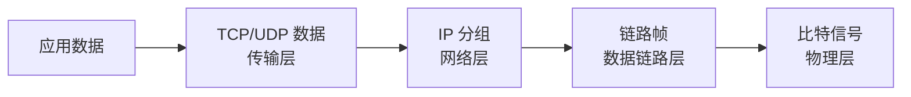

# 网络协议与 OSI 七层：一份数据为什么要分层处理

> [!summary] 快速复习卡片
> **作用/定位**：给整个计算机网络建立“每一层负责什么”的坐标系，后面的交换机、路由器、TCP/UDP、HTTP 都挂在这里。
> **核心结论**：物理层传比特；数据链路层管帧、MAC、差错检测；网络层管 IP 与路由；传输层管 TCP/UDP、端口和端到端传输；上三层服务应用数据与会话。
> **经典题型怎么做 / 题干怎么认**：比特/电平 → 物理层；帧/MAC/交换机 → 链路层；IP/路由器/路由选择 → 网络层；TCP/UDP/端口 → 传输层；HTTP/DNS/SMTP → 应用层。
> **易错点 / 考试重点**：路由选择不是数据链路层功能；OSI 是职责参考模型，TCP/IP 四层对应关系单独见 [[OSI与TCP-IP协议体系对比]]。

## 七层职责

| 层次 | 主要任务 | 典型识别词 |
| --- | --- | --- |
| 应用层 | 为应用提供网络服务 | HTTP、DNS、FTP、SMTP |
| 表示层 | 数据表示、编码、压缩等 | 格式、表示 |
| 会话层 | 会话建立与管理 | 会话、对话控制 |
| 传输层 | 端到端进程通信 | TCP、UDP、端口 |
| 网络层 | 逻辑寻址、路由与分组转发 | IP、路由器、路由选择 |
| 数据链路层 | 成帧、MAC、差错检测、介质访问 | 帧、MAC、交换机 |
| 物理层 | 传输比特信号 | 电平、接口、介质、比特 |

考试不是只考顺序，而是根据职责判断层次。

## 发送数据时怎样向下走

接收端再反向解封装。

最重要的定位：

- **MAC**：当前链路怎样交付帧；
- **IP**：跨网络最终去往哪台主机；
- **端口**：到达主机后交给哪个服务。

## 一句话总结

**帧/MAC 看链路层，IP/路由看网络层，TCP/UDP/端口看传输层，HTTP/DNS 看应用层。**

## 下一站

- 四层对应：[[OSI与TCP-IP协议体系对比]]。
- 设备落地：[[网络互联设备]]。
