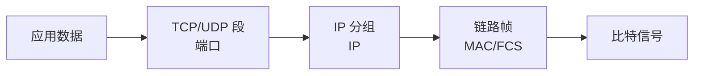

# 网络协议与 OSI 七层：一份数据为什么要分层处理

> [!summary] 快速复习卡片
> **作用/定位**：给整个计算机网络建立“每一层负责什么”的坐标系，后面的交换机、路由器、TCP/UDP、HTTP 都挂在这里。
> **核心结论**：物理层传比特；数据链路层管帧、MAC、差错检测；网络层管 IP 与路由；传输层管 TCP/UDP、端口和端到端传输；应用层直接服务应用。
> **经典题型怎么做 / 题干怎么认**：比特/电平 → 物理层；帧/MAC/交换机 → 链路层；IP/路由器/路由选择 → 网络层；TCP/UDP/端口 → 传输层；HTTP/DNS/SMTP → 应用层。
> **易错点 / 考试重点**：2025H2 回忆题直接考“路由选择不是数据链路层功能”；OSI 是参考模型，不要把现实协议机械塞进七层名称。

## 先定位：OSI 是“职责地图”，不是一个具体协议

一次网络通信同时要解决信号、成帧、寻址、路由、端到端传输和应用服务。OSI（Open Systems Interconnection）把这些功能拆成七层，方便描述职责和定位问题。

互联网现实中主要使用 TCP/IP 协议体系，但软考非常喜欢用 OSI 来问“某功能/设备属于哪一层”。

## 七层怎么认

| 层次 | 主要任务 | 典型识别词 |
| --- | --- | --- |
| 应用层 | 为应用提供网络服务 | HTTP、DNS、FTP、SMTP |
| 表示层 | 数据表示、编码、压缩等 | 格式、表示 |
| 会话层 | 会话建立、管理 | 会话、对话控制 |
| 传输层 | 端到端进程通信 | TCP、UDP、端口 |
| 网络层 | 逻辑寻址、路由与分组转发 | IP、路由器、路由选择 |
| 数据链路层 | 成帧、MAC、差错检测、介质访问 | 帧、MAC、交换机 |
| 物理层 | 传输比特信号 | 电平、接口、介质、比特 |

顺序可以记“物、链、网、传、会、表、应”，但考试真正决定选项的是**职责**。

## 数据发送时发生什么

应用数据向下走时逐层增加控制信息：

接收端反过来逐层解封装。

最重要的一组定位：

- **MAC**：这一跳把帧交给哪个接口/下一跳；
- **IP**：跨网络最终送往哪个目标；
- **端口**：到达主机后交给哪个通信端点。

## 近年怎么考

- **2024**：直接问路由器工作在哪一层 → 网络层。
- **2025H2 已核验回忆题**：问哪项不是数据链路层功能 → “路由选择”应归网络层。

这类题不需要背长篇定义。看到关键词，先放回对应层。

## 易错点

- 路由选择不是数据链路层职责。
- 普通二层交换机主要在数据链路层；现实存在三层交换机，不影响考试的基础层次定位。
- “加密”可作为表示层功能描述，但不能据此断言现实中的 TLS 就等于 OSI 表示层协议。
- TCP/IP 四层、五层画法只是模型口径不同，不等于其中一个必然错误。

## 一句话总结

**帧看链路，IP 路由看网络，TCP/UDP 端口看传输，HTTP/DNS 看应用。**

## 下一站

- 下一站：[[网络互联设备]]：把层次映射到具体设备。
- 关联：[[交换机]]、[[TCP与UDP对比]]、[[应用层常用协议]]。
