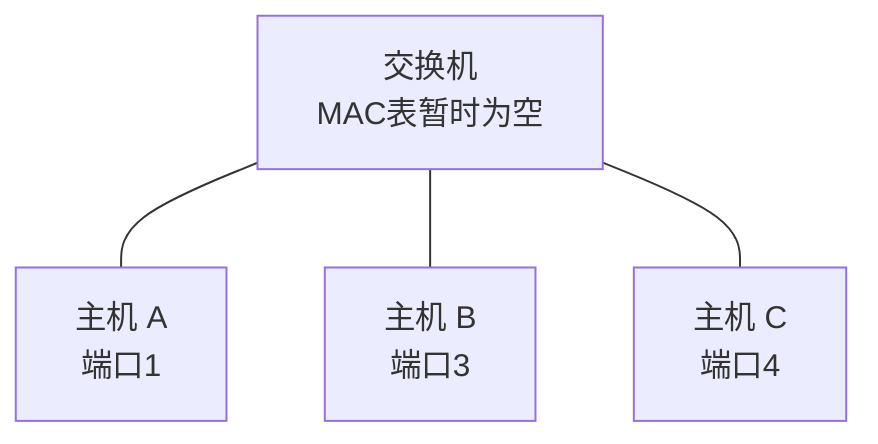

# MAC 地址与交换机转发表：交换机刚开机什么都不知道，它是怎么学会“谁在哪”的

> [!summary] 快速复习卡片
> **先记动作，不先背表格**：交换机收到一帧时，先根据**源 MAC**学习“谁从哪个端口来”，再根据**目的 MAC**决定帧往哪里走。
> **固定口诀**：**先学源，后查目的。**
> **目的已知**：定向转发；**目的未知**：除入端口外泛洪；**目的就在入端口**：过滤；**广播**：在当前 VLAN 内泛洪。
> **易错点**：交换机不是从目的 MAC 学位置；MAC 表记录的是 `MAC → 端口`，不是 `IP → 端口`。

## 继续上一站：那张 MAC 表到底从哪来的

上一站 [[交换机]] 留下了一个问题：

> 交换机为什么会知道“主机 B 在端口 3”？

答案是：**交换机主要不是提前知道，而是在通信过程中自己学出来。**

这篇不先背“学习、转发、泛洪”几个词，我们直接看一台刚开机、MAC 表完全为空的交换机，怎样观察 A 和 B 的第一次通信。

假设：

- 主机 A 接交换机端口 1；
- 主机 B 接端口 3；
- 主机 C 接端口 4；
- 交换机刚启动，表里什么都没有。

现在 A 第一次给 B 发帧。

## 第一个帧到来：交换机先知道了什么

帧从**端口 1**进入交换机，而且帧头里写着：

- 源 MAC = A；
- 目的 MAC = B。

交换机此时最有把握的信息是什么？

不是“B 在哪里”。

而是：

> **这个帧明明就是从端口 1 进来的，而且发送者写的是 A，所以 A 当前可以从端口 1 找到。**

于是交换机先学到：

| MAC | 端口 |
| --- | --- |
| A | 1 |

这就是为什么交换机学习的是**源 MAC**。

它不是猜测，而是在利用“谁从这个端口发来帧”这个已经发生的事实。

## 学完 A 以后，再处理目的 B

现在交换机才去查目的 MAC = B。

但 MAC 表里只有 A，没有 B。

交换机面对的问题是：

> 我知道帧要找 B，但我还不知道 B 接在哪个端口。

这时不能随便选一个端口，否则很可能发错。

所以交换机会把这个帧向除端口 1 之外的相关端口发送：

- 端口 3 收到一份；
- 端口 4 也收到一份。

这就是**未知单播泛洪**。

真正的 B 会接收属于自己的帧；C 发现目的 MAC 不是自己，就不会把它当成给自己的正常数据继续向上处理。

所以第一次通信可能显得“不聪明”，原因不是交换机不会定向转发，而是：

> **它现在还没有足够的信息。**

## B 一回复，交换机马上又学到一条

接下来 B 给 A 回一个帧。

这个帧从端口 3 进入，里面写着：

- 源 MAC = B；
- 目的 MAC = A。

交换机仍然执行同一套动作。

### 先看源 MAC

B 的帧从端口 3 进来，于是学到：

| MAC | 端口 |
| --- | --- |
| A | 1 |
| B | 3 |

### 再看目的 MAC

目的 MAC 是 A。

这次表里已经知道：A → 端口 1。

所以不需要再发给 C，只从端口 1 转发给 A。

到这里，你已经看到 MAC 表不是“预先配置出来的一张神秘表”，而是在通信中逐渐长出来的。

## 第二次 A → B 时发生了什么

现在 A 再给 B 发帧。

交换机：

1. 看到源 A 从端口 1 进来，确认/刷新 `A → 1`；
2. 查目的 B；
3. 找到 `B → 3`；
4. 只从端口 3 转发。

C 这次连这一份普通单播都不用收到。

整个过程可以压成一张动作图：

这就是交换机转发表题最核心的机制。

## 为什么有时还会“过滤”

假设交换机查目的 MAC 后发现：

> 目的 MAC 所在端口，恰好就是这个帧进来的端口。

这说明目的设备和发送设备在交换机看来都位于同一个方向后面，没有必要再把帧转到其他端口。

这种情况下可以过滤，不向别的端口转发。

考试里可以用这张表收口：

| 查目的 MAC 后发现 | 交换机动作 |
| --- | --- |
| 已知，在另一个端口 | 只向那个端口转发 |
| 已知，就在入端口方向 | 过滤 |
| 未知 | 除入端口外泛洪 |
| 广播地址 | 当前 VLAN 内除入端口外泛洪 |

## 为什么 MAC 表还会老化

电脑可能换端口、断开、移动，网络拓扑也可能变化。

如果交换机永远把第一次学到的位置永久保存，就可能把后来的帧送到旧端口。

所以动态学习到的表项通常会在一段时间没有被刷新后老化删除，后续再通过新的通信重新学习。

这里掌握“**表会动态学习和老化**”即可，不需要背具体厂商的老化时间。

## MAC 地址和 IP 地址为什么不能混

在这一篇里，交换机的表是：

> **MAC → 交换机端口**

这是在解决：

> 当前二层局域网里，帧往哪个方向送？

IP 地址以后解决的是另一个范围的问题：

> 目标跨出当前局域网以后，最终应该去哪个网络/主机，路由下一步往哪里走？

所以不要记成：

- 交换机查 IP 找端口；
- MAC 和 IP 是两种写法不同的同一种地址。

它们处在不同的职责层次。

## 这一篇解决了什么，还剩什么没解决

现在普通单播已经越来越高效：

- 交换机先学源 MAC；
- 再查目的 MAC；
- 学会以后就能定向转发。

但你应该马上发现：**广播帧并没有因为 MAC 表越来越完整就消失。**

假设一台大交换网络里接了研发部、财务部、访客设备，某个广播在同一个二层范围里扩散时，很多本来无关的设备仍可能收到。

于是下一个问题自然出现：

> 能不能仍然使用同一套交换设备，但把不同部门在二层逻辑上分开，让广播不要跨过这个边界？

这就是下一站 [[VLAN与广播域]]。

## 一句话总结

**交换机刚开机并不知道所有主机的位置，它靠收到帧时“先学源 MAC → 入端口，再查目的 MAC”逐步建立转发表；已知目的就定向发，未知才泛洪。**

## 下一站

**上一站：[[交换机]]**  
**主下一站：[[VLAN与广播域]]**

为什么继续：单播的端口定位已经解决，但**广播仍可能在整个二层范围扩散**。下一站开始给广播划逻辑边界。

### 相关知识（后面再回看）
- 跨网络寻址：[[IPv4地址结构与特殊地址]]
