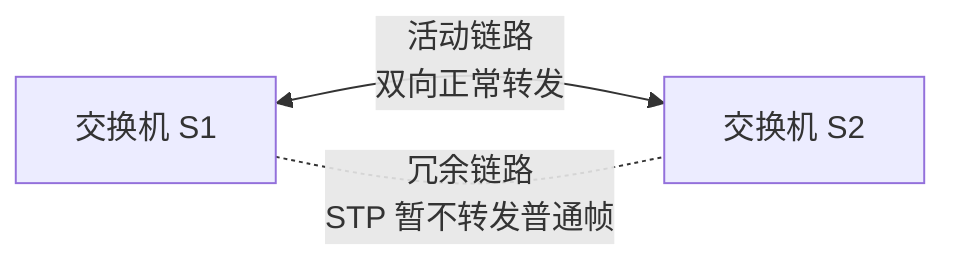
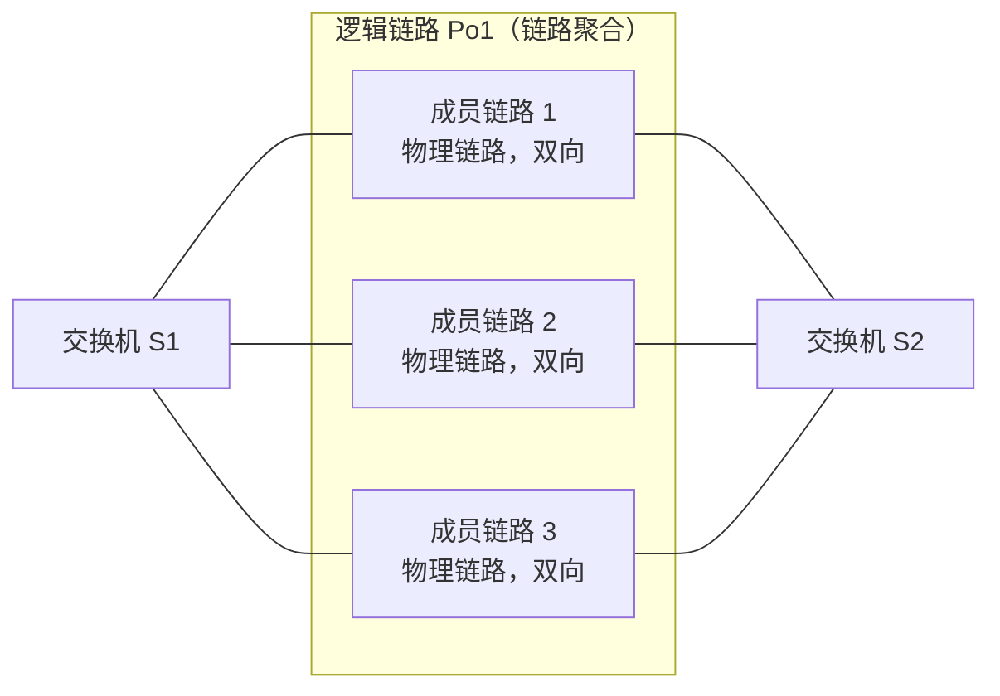

# STP 与链路聚合：两台交换机多接几根线，为什么不能直接都用上

> [!summary] 快速复习卡片
> **先记矛盾**：二层网络需要备用链路防故障，但普通冗余链路如果形成环路，广播和未知单播可能被反复泛洪。
> **STP**：物理上保留冗余，逻辑上让部分路径暂时不转发，形成无环的生成树；主路径故障后可重新选择备用路径。
> **链路聚合**：把多条兼容的物理链路组成一条逻辑链路，让多条线共同提供容量和冗余。
> **题眼**：广播风暴、二层环路、阻塞冗余端口 → STP；端口捆绑、多链路形成逻辑接口、带宽+冗余 → 链路聚合。

## 先从一个最自然的想法开始：怕断线，那就多接一根

上一站 [[VLAN与广播域]] 已经把二层广播范围划清了。

现在假设有两台交换机 S1、S2，它们之间只有一根链路。

这根线正常时没有问题，可一旦链路断掉，两边的设备就可能失去通信。

于是最直觉的高可用方案是：

> **再接一根线当备用。**

问题恰恰就从这里开始。

如果两根普通二层链路都同时参与转发，S1 和 S2 之间就出现了两条可用的二层路径：

这里的两根链路本身都可以双向传输。问题不在“方向”，而在于**同时存在多条二层转发路径时可能形成环路**。

物理上看，“多一条路”好像更安全；二层转发上看，却可能形成**环路**。

## 二层环路为什么这么麻烦

继续沿用前面的知识。

交换机碰到广播帧，或者目的 MAC 还不知道的未知单播，会向多个端口泛洪。

假设一个广播从 S1 发到 S2：

1. S2 收到后继续向相关端口泛洪；
2. 因为还有另一条链路，帧又可能回到 S1；
3. S1 再次看到这份广播，又继续泛洪；
4. 两台交换机不断收到同一类帧的副本。

二层以太网帧不像后面会学到的 IP 分组那样依靠 TTL 逐跳减小来限制这种循环。

于是同一批广播/未知帧可能不断复制、占用链路和设备处理能力，严重时形成**广播风暴**；同时交换机还可能反复从不同端口看到同一源 MAC，导致 MAC 表位置不断变化。

所以现在出现了一个真正的矛盾：

> **我需要备用链路，但又不能让备用链路在正常状态下形成二层转发环。**

这就是 STP 要解决的问题。

## STP 的思路：线不用拔，但正常时先让某些路“不参与转发”

STP（Spanning Tree Protocol，生成树协议）的核心思想不复杂：

> **物理上可以有多条冗余链路，但逻辑上只保留一套无环的转发结构。**

也就是说，线都可以插着，却让会造成环路的某些端口在正常情况下不参与普通数据帧转发。

这里最重要的是：

> **STP 保留下来的活动链路仍然是双向的。S1 可以通过它发给 S2，S2 也可以通过同一条链路发给 S1。**

STP 阻止的是“多条路径组成环”，不是把链路变成单向通信。

于是：

- 物理冗余还在；
- 正常转发时逻辑上没有闭环；
- 活动链路仍然可以双向传输；
- 主路径真的故障后，可以重新计算，让备用路径接替。

这就是经常说的：

> **物理有冗余，逻辑无环。**

## STP 内部到底做了哪些事

这一轮不做 BPDU 和选举计算，只要知道它大致要完成这些动作：

1. 在交换网络里选出一个参考根；
2. 比较到根的路径，决定哪些路径更合适；
3. 让需要的端口参与转发；
4. 让会形成环路的冗余端口暂时不参与普通帧转发；
5. 拓扑变化时重新计算，让备用路径有机会接替。

考试如果出现“根桥、根端口、指定端口”等词，先知道它们属于 STP 的生成树选择过程即可；当前 P2 深度不展开手算和厂商配置。

## 可是我有两根线，为什么一定要让一根闲着

这时又出现了另一个需求。

有时候两台交换机之间的多条链路并不是想做“普通独立路径，一条主、一条备”，而是希望：

> **把几条兼容的物理链路当成一条更大的逻辑链路来使用。**

这就是**链路聚合**。

例如 S1 和 S2 之间有三条物理成员链路。完成聚合后，**这三条物理链路共同组成一个逻辑接口 Po1**：

> [!important] 看图时只抓住“外框和里面”的关系
> **外框 Po1**：交换机二层逻辑看到的**一个逻辑接口 / 一条逻辑链路**。  
> **框内成员链路 1、2、3**：真正存在并可以工作的**三条物理链路**。

所以链路聚合不是“把三根线画成一根线以后，另外两根就不工作了”。实际上三条成员链路都可以承担流量，只是对交换机的二层转发逻辑来说，它们属于**同一个 Po1 接口**。

一个数据帧需要通过 Po1 发往 S2 时，逻辑过程是：

1. 交换机决定：这个帧需要从 **Po1** 发出去；
2. 聚合机制再从 Po1 的成员链路中选择一条来承载这个帧；
3. 例如本次选择“成员链路 2”，帧就通过成员链路 2 到达 S2。

因此不是：

> 同一个广播帧被当成“3 条独立二层路径”，分别沿成员链路 1、2、3 各转发一次。

而是：

> **二层逻辑只经过 Po1 这个接口一次，再由 Po1 内部选择具体成员链路承载。**

这也是为什么聚合组里的多条成员链路本身不会被 STP 当成多条独立路径来制造环路；对 STP 等二层逻辑而言，聚合接口通常作为一个逻辑端口参与拓扑处理。

这样可以得到两个主要好处：

- **容量**：不同流量可以分布到不同成员链路，整体可承载更多流量；
- **冗余**：其中一条成员链路故障时，其余成员仍可继续工作。

## 为什么“3 条 1G 聚合 = 一个下载一定跑 3G”不准确

链路聚合通常会根据某些流量特征把不同流分配到不同成员链路，而不是把一个数据流的每一个帧随意轮流扔到所有线里。

这样做的重要原因之一是避免同一流的数据因为走不同链路造成严重乱序。

所以可以理解成：

> **聚合后的总承载能力可以提高，但单个流不保证获得所有成员链路带宽的简单相加。**

考试第一轮只需要掌握这个边界，不需要研究具体哈希算法。

## STP 和链路聚合为什么不能混成一个东西

它们都和“多条线”有关，但解决的不是同一个问题。

| 技术 | 面对的问题 | 核心思路 |
| --- | --- | --- |
| STP | 多条普通二层路径形成环路 | 保留物理冗余，逻辑上阻塞部分路径防环 |
| 链路聚合 | 多条兼容链路想共同提供容量和冗余 | 多条物理链路组成一条逻辑链路 |

链路聚合不是“整个交换网络以后都不需要 STP”。

可以把它理解成：

- 聚合解决一组成员链路怎样作为一个逻辑连接使用；
- STP 仍负责更大二层拓扑中普通冗余路径的防环问题。

## 到这里，二层局域网这一阶段终于收口

从 [[以太网技术]] 开始，我们一直追着同一个问题：

> **一份数据在当前局域网这一跳到底怎样交付？**

现在已经得到一条完整链：

1. 以太网把上层数据封装成帧，并使用 MAC；
2. 交换机读取 MAC，决定端口转发；
3. MAC 表通过“先学源、后查目的”逐步建立；
4. VLAN 给二层广播划边界；
5. STP/链路聚合处理二层冗余链路的环路、容量和可靠性问题。

**到这里，“同一局域网里的二层交付”这一阶段已经基本解决。**

接下来不是 STP 自然“推导”出了 IPv4，而是我们要换一个更大的问题：

> **如果目标电脑根本不在当前局域网，MAC 只能解决当前这一跳，那怎样标识远处的目标，并让数据跨过一个又一个网络？**

这才是网络层和 IP 要解决的事。

所以下一站进入 [[IPv4地址结构与特殊地址]]。

## 一句话总结

**STP 解决“有备用链路但不能形成二层环”的矛盾；链路聚合解决“多条兼容物理链路怎样合成一条逻辑链路共同提供容量和冗余”。**

## 下一站

**上一站：[[VLAN与广播域]]**  
**主下一站：[[IPv4地址结构与特殊地址]]**

为什么继续：二层已经能完成当前局域网的帧交付，但**目标一旦不在当前局域网，仅靠 MAC 和交换机就不够了**。下一阶段开始解决跨网络寻址和路由。

### 相关知识（后面再回看）
- 工程中的冗余设计：[[层次化组网与冗余设计]]
