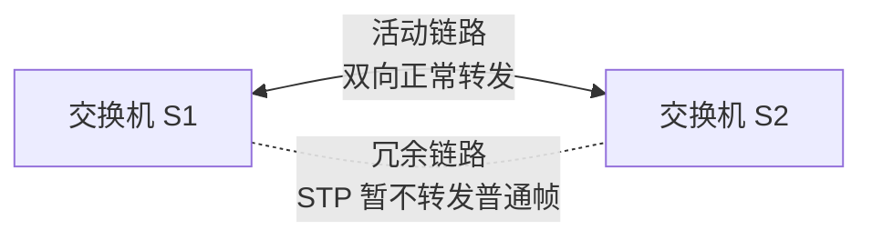
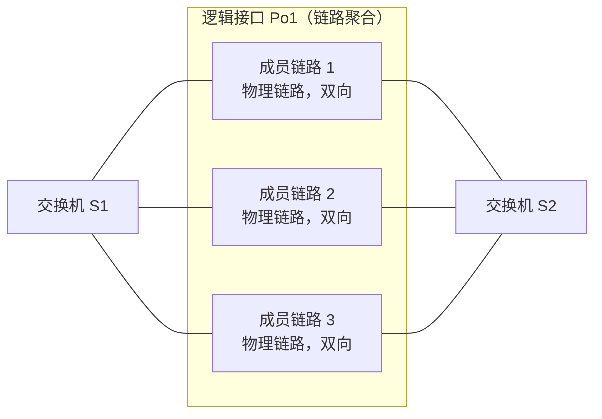

# STP 与链路聚合：多接几根线，为什么不能直接都当成独立链路使用

> [!summary] 快速复习卡片
> **STP**：多条独立二层路径可能成环，因此保留物理冗余，但让部分路径暂时不转发普通帧。
> **链路聚合**：把多条并行物理链路组成一个逻辑接口，让成员链路共同提供容量和冗余。
> **关键区别**：链路聚合只让“本聚合组成员”不再被当成多条独立二层路径；整个二层网络是否有环，仍由 STP 这类防环机制处理。
> **题眼**：广播风暴、阻塞冗余端口 → STP；端口捆绑、逻辑接口、带宽+冗余 → 链路聚合。

上一站 [[VLAN与广播域]] 已经解决了“广播应该限制在哪个范围”。现在继续看另一个问题：**交换机之间为了防断线多接几根线，会发生什么？**

## 两根普通链路为什么会出问题

假设 S1 和 S2 之间接两根普通二层链路，并且两根都独立参与转发：

两根链路本身都是**双向**的。问题不是方向，而是 S1 和 S2 之间出现了多条独立二层路径。

广播帧或未知单播被泛洪时，可能从一条链路到 S2，又从另一条链路回到 S1，再继续被泛洪。二层以太网帧没有像 IP TTL 那样的逐跳递减机制，因此可能不断循环、复制，严重时形成**广播风暴**，还可能造成 MAC 表反复变化。

所以需求变成：

> **既想保留备用链路，又不能让普通二层路径形成环。**

## STP：物理有冗余，逻辑无环

STP（Spanning Tree Protocol，生成树协议）的思路是：

> **线可以都接着，但让会形成环路的部分端口暂时不参与普通帧转发。**

注意：**活动链路仍然是双向的**。STP 阻止的是“多条独立路径组成环”，不是把链路变成单向。

当前只需要知道 STP 大致会：选出参考根、比较路径、让需要的端口转发、让会成环的冗余端口暂不转发；拓扑变化后再重新计算。根桥、根端口、指定端口属于这套选择过程，本轮不展开计算。

## 链路聚合：为什么多条线又可以一起工作

如果 S1 和 S2 之间的多条并行链路不是想做“几条独立路径”，而是希望它们**一起承担流量**，可以把它们组成一个链路聚合组。

例如三条物理链路共同组成逻辑接口 Po1：

看图只抓两层：

- **外框 Po1**：二层逻辑看到的一个逻辑接口；
- **框内 1、2、3**：实际存在并可以工作的三条物理成员链路。

一个帧需要从 S1 经过 Po1 发给 S2 时：

1. 二层转发先决定“从 Po1 发出去”；
2. 聚合机制再选择其中一条成员链路承载这个帧。

因此，成员链路不会被当成 3 条独立二层路径分别转发同一个帧。正确聚合后，对 STP 等二层逻辑来说，这一组成员通常以**一个逻辑端口**参与拓扑处理。

链路聚合带来两个主要好处：

- **容量**：不同流量可以分布到不同成员链路；
- **冗余**：某条成员链路故障，其余成员仍可继续工作。

但单个数据流通常不会简单获得“所有成员带宽之和”，因为设备一般会按流量特征选择成员链路，以避免同一流严重乱序。

## 链路聚合是不是也能防环

**能避免一个很局部的问题，但它不是整个网络的防环协议。**

正确聚合后，同一聚合组里的多条成员链路被当成一个逻辑接口，因此不会因为“成员 1、成员 2、成员 3 被当成三条独立二层路径”而形成并行环路。

但如果整个拓扑本身形成环，例如 S1—S2、S2—S3、S3—S1，即使每一段都是聚合链路，这三条**逻辑链路**仍然可以组成一个二层环。这个问题仍需要 STP 处理。

所以不要把链路聚合理解成 STP 的升级版：

| 技术 | 解决什么问题 | 对“环”的作用 |
| --- | --- | --- |
| STP | 整个二层拓扑存在多条独立路径 | 主动选择无环转发结构，阻塞会成环的路径 |
| 链路聚合 | 一组并行物理链路希望一起工作 | 让组内成员作为一个逻辑接口，不再被当成多条独立路径 |

一句话：

> **链路聚合管“这一捆线怎么一起用”；STP 管“整个二层网络最终有没有环”。**

## 到这里怎么串起来

这一阶段的二层主线已经是：

1. 以太网用帧和 MAC 完成当前链路的数据交付；
2. 交换机根据 MAC 表决定端口转发；
3. VLAN 给广播划边界；
4. STP 处理二层冗余路径形成的环；
5. 链路聚合让一组并行链路共同提供容量和冗余。

到这里，“同一局域网里的二层交付”基本收口。

接下来换一个更大的问题：**目标如果不在当前局域网，仅靠 MAC 和交换机怎样到达远处网络？** 这就进入网络层和 IP。

## 下一站

**上一站：[[VLAN与广播域]]**  
**主下一站：[[IPv4地址结构与特殊地址]]**

### 相关知识（后面再回看）
- [[层次化组网与冗余设计]]
