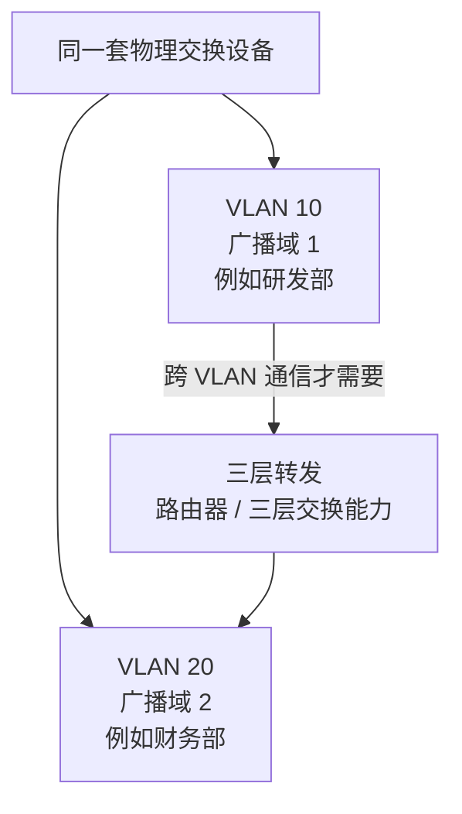

# VLAN 与广播域：为什么同一套交换网络还要逻辑分组

> [!summary] 快速复习卡片
> **作用/定位**：承接交换机转发，解决“二层广播范围太大”这个问题。
> **核心结论**：VLAN（虚拟局域网）可以在同一套交换设备上逻辑划分不同广播域；同一 VLAN 内可二层转发，不同 VLAN 之间需要三层转发。
> **经典题型怎么做 / 题干怎么认**：逻辑分组、划分广播域、部门隔离 → VLAN；跨 VLAN 通信 → 路由器或三层交换能力。
> **易错点 / 考试重点**：VLAN 不是把物理交换机真的切成几台；不要把 VLAN 和 IP 子网完全等同，但实际设计中常一 VLAN 对应一个 IP 子网。

## 先直接回答：MAC 表已经能定向转发，为什么还需要 VLAN

上一站 [[MAC地址与交换机转发表]] 解决了“已知目的 MAC 时，交换机怎样把帧送到正确端口”。

但局域网里还有一种数据不能只发给一个明确端口：**广播帧**。广播帧的目的就是让同一广播范围内的设备都能收到。

如果一个二层网络越来越大，所有广播都扩散到所有主机，会带来两个问题：

- 无关主机也要不断接收和处理广播；
- 不同部门/业务即使物理上接在同一套交换设备上，也缺少二层逻辑边界。

VLAN（Virtual LAN，虚拟局域网）就是为了把一个大的交换网络**逻辑划分成多个广播域**。

## 先看图：VLAN 真正“切”的是什么

图里最重要的是：**上面仍然可以是同一套物理交换设备，下面却被逻辑划成了两个广播域。**

因此 VLAN 的“虚拟”不是说设备不存在，而是说：

> **物理上可以接在一起，二层逻辑上却属于不同范围。**

## VLAN 到底改变了什么

假设同一台交换机上有两组主机：

- VLAN 10：研发部；
- VLAN 20：财务部。

虽然它们物理上仍接在同一台交换设备上，但属于不同 VLAN 后：

- VLAN 10 的二层广播不会直接扩散到 VLAN 20；
- 两组主机被放进了两个不同的二层广播域。

所以可以记：

> **交换机让帧按 MAC 定向转发；VLAN 再给广播划边界。**

## 为什么不同 VLAN 通信要经过三层

不同 VLAN 属于不同二层广播域，二层交换不会直接把普通通信跨过去。

如果 VLAN 10 的主机要访问 VLAN 20，就需要根据 IP 做网络层转发，因此通常要使用路由器或三层交换能力。

这里先知道“**跨 VLAN 要三层**”即可，具体 IP 和路由后面会系统学习。

## 学到哪里就停

当前只需要掌握：

- VLAN = 逻辑划分广播域；
- 同 VLAN 可以二层互通；
- 跨 VLAN 需要三层转发。

不进入交换机 CLI、802.1Q 标签字段、Native VLAN、QinQ 等工程配置。

## 为什么下一站是 STP 与链路聚合

VLAN 解决了广播范围，但交换网络为了高可用通常还会“多接几条备用链路”。

这又会带来新矛盾：**二层链路一旦形成环，广播和未知单播可能循环；但如果完全不留备用链路，任何单链路故障又会断网。**

所以下一站专门看二层冗余怎样既保留备用又避免成环。

## 一句话总结

**交换机隔离冲突域，VLAN 进一步逻辑划分广播域；跨 VLAN 要走三层。**

## 下一站

**上一站：[[MAC地址与交换机转发表]]**  
**主下一站：[[STP与链路聚合]]**

为什么继续学它：广播边界解决后，下一步处理二层网络为了冗余增加链路时产生的“环路 vs 备用”的矛盾。
