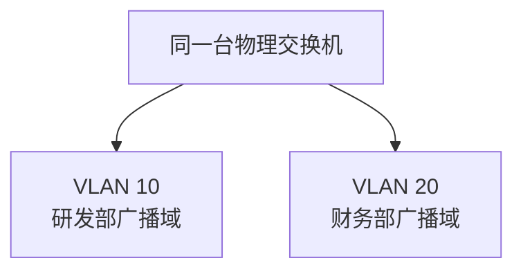

# VLAN 与广播域：交换机已经会定向转发了，为什么还要再“分组”

> [!summary] 快速复习卡片
> **先记结论**：MAC 表主要让普通单播帧能够定向转发，但广播仍会在同一个二层广播范围内扩散。VLAN（虚拟局域网）就是在同一套交换网络上**逻辑划分广播域**。
> **考试识别**：逻辑分组、部门隔离、划分广播域 → VLAN；不同 VLAN 要互通 → 需要三层转发能力。
> **易错点**：VLAN 不是把一台物理交换机真的拆成多台；VLAN 和 IP 子网不是同一个概念，虽然实际设计中常配合使用。

## 先继续上一站：普通单播已经聪明了，广播怎么办

上一站 [[MAC地址与交换机转发表]] 里，交换机已经学会：

- A 在端口 1；
- B 在端口 3；
- A 再给 B 发普通单播时，只需要把帧送到端口 3。

看起来已经很高效了。

但现在把网络扩大一点。

同一套交换设备上接了三类终端：

- 研发部；
- 财务部；
- 访客设备。

普通单播可以依靠 MAC 表定向发送，可是**广播帧的目的本来就是让同一广播范围里的设备都收到**。

如果所有设备都处于同一个二层广播范围，那么研发部产生的一次广播，财务部和访客设备也可能收到。

于是问题出现了：

> 我并不想把三组设备物理上彻底拆成三套交换机，但又不希望所有二层广播都混在一起，怎么办？

这才是 VLAN 出现的原因。

## VLAN 真正“切开”的不是交换机外壳，而是二层逻辑范围

假设还是同一台物理交换机，我们把部分端口归到 VLAN 10，另一部分归到 VLAN 20。

物理设备还是一台，但二层逻辑上已经像出现了两块彼此隔开的广播范围。

所以 VLAN 的“虚拟”可以先这样理解：

> **物理上可以接在同一套交换网络里，逻辑上却被划成不同的二层广播域。**

这就是 VLAN（Virtual LAN，虚拟局域网）的核心。

## 广播进入 VLAN 以后到底发生什么

假设：

- A、B 属于 VLAN 10；
- C、D 属于 VLAN 20。

A 发送一个二层广播帧。

交换机不会把这个广播无条件扩散到 VLAN 20，而只在 VLAN 10 的二层广播范围内传播。

因此：

- B 可以收到；
- C、D 不会仅因为接在同一台物理交换机上就收到 VLAN 10 的这个广播。

于是 VLAN 解决的是：

> **“哪些设备属于同一个二层广播范围”这个边界问题。**

可以把前面三篇连起来：

- 以太网：先有帧和 MAC；
- 交换机/MAC 表：普通单播尽量定向转发；
- VLAN：再给广播划逻辑边界。

## “一个 VLAN 是一个广播域”到底是什么意思

在当前考试模型里，可以这样理解：

> **同一个 VLAN 内的设备处于同一个二层广播域；不同 VLAN 是不同的二层广播域。**

所以题目如果问：

- “什么技术可以划分广播域？”
- “如何在交换网络里做逻辑隔离？”

第一反应通常就是 VLAN。

但注意，这里说的是**二层广播边界**，不是说 VLAN 自动解决所有安全隔离、访问控制、IP 路由问题。

## 为什么不同 VLAN 之间不能只靠普通二层交换直接通信

现在假设：

- A 在 VLAN 10；
- C 在 VLAN 20。

我们刚刚就是故意把它们划进两个不同的二层广播域。

如果交换机又像同 VLAN 一样直接把二层帧随意跨过去，那这个逻辑边界就失去意义了。

所以不同 VLAN 之间要真正通信，需要进入更高一层，根据 IP 等网络层信息做**三层转发**。

当前只记：

> **跨 VLAN 通信需要路由器或具备三层转发能力的设备。**

为什么 IP 能解决跨网络问题，后面进入网络层时再完整学习；这里不要提前把 IP 路由塞进来。

## VLAN 和 IP 子网为什么不能直接画等号

以后你会经常看到工程上：

> 一个 VLAN 配一个 IP 子网。

这种设计很常见，但两个概念解决的问题不同：

- VLAN：二层逻辑划分，重点是广播域；
- IP 子网：网络层地址范围和路由边界。

所以考试里不要把“VLAN = IP 子网”当定义背。

## 这一轮学到哪里就停

当前这张卡只需要解决三个问题：

1. 为什么 MAC 表解决了单播后还需要 VLAN？——因为广播范围仍可能太大。
2. VLAN 做什么？——逻辑划分二层广播域。
3. 不同 VLAN 怎么互通？——需要三层转发。

802.1Q 标签字段、Native VLAN、QinQ、交换机 CLI 等工程配置不在这一轮展开，避免把一个简单考点学成交换机配置课。

## 这一篇解决了什么，还剩什么没解决

现在不同部门的广播已经可以被划在不同 VLAN 里。

但真实网络还要考虑另一件事：**链路会坏。**

假设两台交换机之间只有一根线，这根线断了，通信就中断。

最直觉的办法是：

> 那我多接一根备用线不就行了吗？

问题是，在二层网络里，普通冗余链路如果直接形成环路，广播帧和未知单播可能被反复转发，造成严重问题。

于是新的矛盾出现：

> **既想多接线提高冗余，又不能让二层出现转发环路，怎么办？**

这就是下一站 [[STP与链路聚合]]。

## 一句话总结

**交换机的 MAC 表让普通单播尽量只去正确端口；VLAN 进一步把同一套交换网络逻辑切成多个广播域，让广播不再跨越不该跨越的二层边界。**

## 下一站

**上一站：[[MAC地址与交换机转发表]]**  
**主下一站：[[STP与链路聚合]]**

为什么继续：广播边界已经解决，但网络为了防止链路故障需要冗余；**“多接几根线”又可能制造二层环路**，下一站处理这个矛盾。
