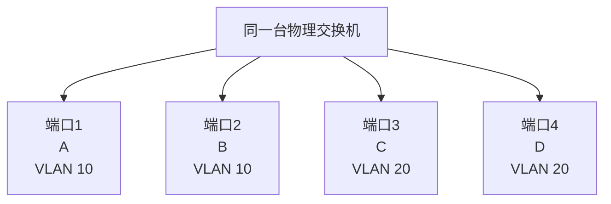
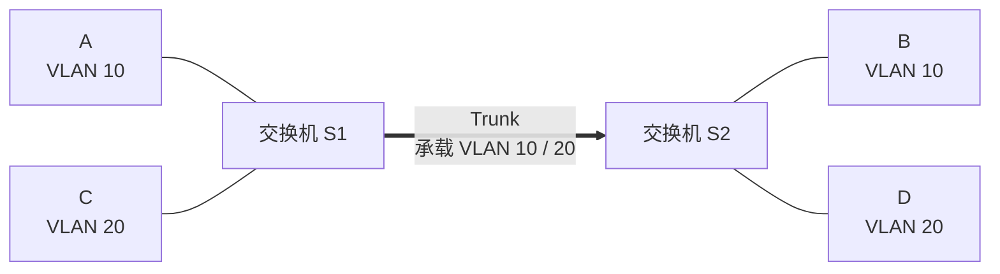

# VLAN 与广播域：一台交换机到底怎样被逻辑切成多个广播域

> [!summary] 快速复习卡片
> **作用/定位**：VLAN（Virtual LAN，虚拟局域网）主要用于把一个大的二层交换网络**逻辑划成多个广播域**。
> **核心结论**：最直观的划法是把交换机端口分别加入不同 VLAN；同 VLAN 可以二层转发，广播只在本 VLAN 内泛洪。
> **跨交换机**：Access 端口通常接终端、归属一个 VLAN；Trunk 链路可以同时承载多个 VLAN，通常用 **802.1Q 标签**标明帧属于哪个 VLAN。
> **题干怎么认**：划分广播域、逻辑分组、VLAN ID、Access、Trunk、802.1Q → VLAN。
> **易错点**：VLAN 不等于 IP 子网，也不等于完整的安全访问控制；不同 VLAN 要通信需要三层转发。

## 先继续上一站：普通单播已经聪明了，广播怎么办

上一站 [[MAC地址与交换机转发表]] 已经解决了普通单播的端口定位：

- 交换机知道 B 在哪个端口时，可以只把 A → B 的普通单播帧送到那个端口；
- 但是广播帧本来就要求同一广播范围里的设备都能收到，所以 MAC 表再完整，也不会让广播自动消失。

假设一台交换机同时接了研发部、财务部和访客设备。如果它们都处于同一个二层广播范围，那么其中一台设备发出的广播，其他组设备也可能收到。

于是现在的问题不是“交换机知不知道目的 MAC”，而是：

> **能不能仍然使用同一套交换设备，却人为规定哪些端口属于同一个广播范围？**

这就是 VLAN 要解决的问题。

## VLAN 的主要目的就是划分广播域吗

对当前学习阶段，可以先把它的**主要目的**记成：

> **在二层交换网络中进行逻辑分组，把一个大的广播域划成多个较小的广播域。**

这样会同时带来几个直接结果：

- 广播只在本 VLAN 范围内传播，缩小广播影响范围；
- 不同部门、业务或终端可以在二层逻辑上分开；
- 设备即使接在同一台物理交换机上，也不一定处于同一个二层网络中。

但不要把它扩大成：

> VLAN 本身就完成了所有安全控制。

VLAN 首先解决的是**二层逻辑划分和广播边界**。真正的访问控制还可能需要三层路由策略、ACL、防火墙等机制。

## VLAN 到底是怎么“划”出来的

最常见、也最适合入门理解的方式是：

> **把交换机的不同端口配置到不同 VLAN。**

假设一台交换机有 4 个接终端的端口：

| 交换机端口 | 连接设备 | 端口所属 VLAN |
| --- | --- | --- |
| 端口 1 | A | VLAN 10 |
| 端口 2 | B | VLAN 10 |
| 端口 3 | C | VLAN 20 |
| 端口 4 | D | VLAN 20 |

物理上还是一台交换机，但交换机内部已经记住：

- 端口 1、2 属于 VLAN 10；
- 端口 3、4 属于 VLAN 20。

因此逻辑上相当于形成了两个二层广播域：

- VLAN 10：A、B；
- VLAN 20：C、D。

这里的“划分”不是把交换机外壳真的切开，而是：

> **交换机在内部把不同端口归到不同 VLAN，并且转发帧时始终遵守这个 VLAN 边界。**

## A 发广播时，帧到底怎么流转

继续使用上面的端口划分。

现在 A 从端口 1 发出一个普通以太网广播帧。

在最常见的终端接入模型里，A 不需要自己先理解 VLAN；它只是正常发送以太网帧。

交换机收到以后按下面的过程处理：

1. 帧从**端口 1**进入；
2. 交换机知道端口 1 属于 **VLAN 10**，于是把这个帧归入 VLAN 10；
3. 因为这是广播帧，交换机需要泛洪；
4. 但它只向 **VLAN 10 的其他相关端口**泛洪；
5. 因此端口 2 的 B 可以收到；
6. VLAN 20 的端口 3、4 不会收到这次 VLAN 10 广播。

所以真正限制广播的关键不是“广播帧自己知道不能去 VLAN 20”，而是：

> **交换机知道这个帧属于 VLAN 10，并且只允许它在 VLAN 10 的二层范围内转发。**

这就是“一个 VLAN 对应一个二层广播域”的实际含义。

## Access 端口到底是什么

先记一句最重要的：

> **Access 端口就是交换机用来把普通终端接入某一个 VLAN 的端口。**

例如把交换机端口 1 配成：

> Access，属于 VLAN 10。

然后把普通电脑 A 插到端口 1。

A 并不需要知道自己“在 VLAN 10”。它仍然像以前一样发送普通以太网帧。

帧真正进入交换机以后，才发生 VLAN 归类：

1. A 发出一个普通以太网帧；
2. 帧从交换机**端口 1**进入；
3. 交换机查自己的端口配置，发现“端口 1 是 VLAN 10 的 Access 端口”；
4. 因此交换机在内部把这份帧归到 **VLAN 10**；
5. 后续查 MAC、转发或广播泛洪，都只在 VLAN 10 这个逻辑范围里进行。

所以 Access 端口最核心的作用可以理解成：

> **告诉交换机：从这个端口进来的普通终端帧，属于哪个 VLAN。**

例如：

- 端口 1 = Access VLAN 10，接 A；
- 端口 2 = Access VLAN 10，接 B；
- 端口 3 = Access VLAN 20，接 C。

A 发广播时，交换机把它归入 VLAN 10，因此可以从端口 2 发给 B，但不会从 VLAN 20 的端口 3 发给 C。

这里还有一个很重要的细节：

> **普通终端通过 Access 端口收发时，通常看到的仍然是普通以太网帧，不需要自己处理 802.1Q VLAN 标签。**

因此你现在可以把 Access 端口理解成一个“入口归类器”：

> **主机只管发普通帧；交换机根据帧从哪个 Access 端口进入，决定它属于哪个 VLAN。**

这也解释了为什么一台完全不知道 VLAN 的普通电脑，仍然可以正常处在 VLAN 10 中。

但 Access 有一个明显限制：一个这样的终端端口主要服务一个 VLAN。

如果下一步是**两台交换机之间的一根线**，而这根线既要传 VLAN 10，又要传 VLAN 20，就不能再只靠“这根端口固定属于一个 VLAN”来判断了。

这时才需要下面的 **Trunk** 和 **802.1Q 标签**。

## 如果有两台交换机，VLAN 还能跨过去吗

可以。

假设现在有两台交换机：

- A、B 都属于 VLAN 10，但分别接在 S1、S2 上；
- C、D 都属于 VLAN 20，也分别接在 S1、S2 上。

如果 S1 和 S2 之间只使用一根物理链路，却要同时传 VLAN 10 和 VLAN 20 的帧，就出现了一个新问题：

> S2 收到一个帧以后，怎么知道它原来属于 VLAN 10，还是 VLAN 20？

如果完全不做标记，两种 VLAN 的帧混在同一根链路上，接收交换机就无法仅凭这根链路判断它们属于哪个 VLAN。

于是交换机之间常使用 **Trunk 链路**。

## Trunk 和 802.1Q 到底做了什么

Trunk 可以先理解成：

> **一条能够同时承载多个 VLAN 流量的交换机链路。**

为了让接收方知道每个帧属于哪个 VLAN，典型做法是使用 **IEEE 802.1Q VLAN 标签**。

例如 VLAN 10 的帧从 S1 经过 Trunk 去 S2 时，S1 会让这个帧在 Trunk 上传输时带上能够表示“VLAN 10”的 VLAN 信息。

S2 收到后读取这个 VLAN 信息，就知道：

> 这不是随便一个二层帧，它属于 VLAN 10。

于是 S2 仍然只会按照 VLAN 10 的范围继续处理，而不会把它混进 VLAN 20。

当前只需要理解：

> **Access 负责把普通终端流量归入某一个 VLAN；Trunk 负责让多个 VLAN 共用交换机之间的一条链路；802.1Q 标签负责告诉对端交换机“这个帧属于哪个 VLAN”。**

不需要在这一轮背 802.1Q 标签的全部位字段。

## 把 A → B 的一次广播完整走一遍

现在 A 在 S1，B 在 S2，但它们都属于 VLAN 10。

A 发出广播帧后：

1. A 把普通以太网广播帧发给 S1；
2. 帧从 S1 的 VLAN 10 Access 端口进入，S1 判断它属于 VLAN 10；
3. S1 在 VLAN 10 范围内泛洪；
4. 需要经过 S1 → S2 的 Trunk 时，帧携带 VLAN 10 的 802.1Q 标识；
5. S2 收到后根据 VLAN 标识知道它仍属于 VLAN 10；
6. S2 只把它向自己的 VLAN 10 相关端口泛洪；
7. B 收到，而 VLAN 20 的 D 不会收到这次广播；
8. 当帧最终从普通 VLAN 10 Access 端口交给 B 时，B 仍然可以按普通以太网帧接收。

所以即使 VLAN 10 横跨两台交换机，它仍然是**同一个逻辑广播域**。

真正决定边界的是 VLAN，而不是“是不是同一台物理交换机”。

## 同 VLAN 和不同 VLAN 到底有什么区别

可以用同一个输入来比较。

### A 和 B 都在 VLAN 10

交换机允许它们在 VLAN 10 内进行正常二层转发。

如果 A 发 VLAN 10 广播，B 可以收到。

### A 在 VLAN 10，D 在 VLAN 20

交换机不会把 VLAN 10 的普通二层广播直接转到 VLAN 20。

而且普通二层交换也不会把 A → D 当成同一个 VLAN 内的直接转发。

如果两个 VLAN 真正需要通信，就需要进入网络层，由路由器或具备三层转发能力的设备完成**跨 VLAN 路由**。

所以：

> **VLAN 负责把二层边界切开；三层路由负责在需要时跨过这些边界。**

## “一个 VLAN 是一个广播域”到底是什么意思

在当前考试模型里，可以这样记：

> **同一个 VLAN 内的设备属于同一个二层广播域；不同 VLAN 属于不同的二层广播域。**

即使两个设备：

- 插在同一台交换机上，只要属于不同 VLAN，也处于不同广播域；
- 插在不同交换机上，只要通过 Trunk 保持同一个 VLAN，也可以仍处于同一个广播域。

所以 VLAN 划分的是**逻辑范围**，不是物理设备数量。

## VLAN 和 IP 子网为什么不能直接画等号

实际网络中经常会设计成：

> 一个 VLAN 对应一个 IP 子网。

这样做非常常见，但两个概念属于不同层次：

| 概念 | 所在层次 | 主要解决什么 |
| --- | --- | --- |
| VLAN | 数据链路层 / 二层 | 逻辑划分二层范围和广播域 |
| IP 子网 | 网络层 / 三层 | 划分网络层地址范围并参与路由 |

所以不要把“VLAN = IP 子网”当成定义。

## 这一轮学到哪里就停

这张卡需要掌握到下面这条机制链：

> **端口加入 VLAN → Access 端口把终端流量归入对应 VLAN → 同 VLAN 内二层转发/泛洪 → 多 VLAN 跨交换机时使用 Trunk → 802.1Q 标明 VLAN 身份 → 不同 VLAN 需要三层转发才能互通。**

当前不继续展开：

- 交换机厂商 CLI；
- 802.1Q 标签的完整字段位数；
- Native VLAN；
- QinQ；
- 更复杂的动态 VLAN 分配方式。

这些都不是理解“VLAN 怎样划分广播域”的必要前提。

## 这一篇解决了什么，还剩什么没解决

现在已经知道 VLAN 不只是一个“划分广播域”的结论，而是真正有一套帧处理机制：

- 端口先被归入 VLAN；
- 帧进入交换机后具有 VLAN 身份；
- 交换机只在对应 VLAN 范围内转发；
- 多台交换机之间用 Trunk 保留这个 VLAN 身份。

这样广播边界的问题解决了。

但真实二层网络还有另一个问题：**链路会坏。**

为了冗余，如果交换机之间多接几根线，又可能形成二层环路。

于是下一站要解决：

> **既想有冗余链路，又不能让二层帧在环路里无限绕，怎么办？**

这就是 [[STP与链路聚合]]。

## 一句话总结

**VLAN 的核心是把同一套交换网络逻辑划成多个二层广播域；最直观的实现是把端口归入不同 VLAN，同 VLAN 内才能直接进行相应二层转发，跨交换机时用 Trunk 和 802.1Q 保留 VLAN 身份。**

## 下一站

**上一站：[[MAC地址与交换机转发表]]**  
**主下一站：[[STP与链路聚合]]**

为什么继续：VLAN 已经给广播划出了边界，但为了提高链路可靠性会引入冗余；**普通二层冗余链路又可能形成环路**，下一站处理这个矛盾。