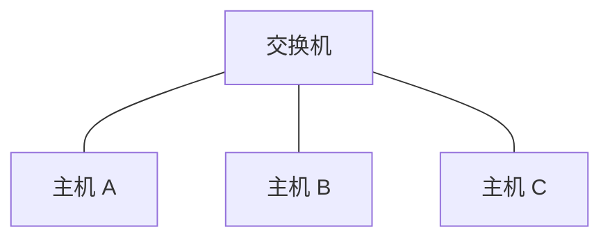

# 交换机：收到一个以太网帧以后，为什么不用发给所有人

> [!summary] 快速复习卡片
> **先记结论**：普通二层交换机主要看以太网帧的 **MAC 地址**，根据自己的 MAC 地址表决定帧从哪个端口出去。目的已知时可以定向转发；目的暂时未知时才需要泛洪。
> **题干怎么认**：二层帧、MAC、端口转发、未知单播、冲突域 → 交换机。
> **最容易错**：交换机能把普通单播尽量定向发送，但**不会自动隔离同一 VLAN 内的广播**；广播域要到 VLAN 再解决。

## 先接着上一站的场景

上一站 [[以太网技术]] 已经把电脑 A 要发送的数据装成了以太网帧。

现在假设 A、B、C 都接在同一台交换机上：

A 要把一个帧发给 B，帧里已经写好了：

- 源 MAC = A；
- 目的 MAC = B。

现在真正的问题来了：

> 交换机从 A 的端口收到这个帧后，应该只发给 B，还是把它复制给 B、C 所有端口？

这就是交换机存在的核心价值之一：

> **它不是只会复制信号，而是会读二层帧里的 MAC 信息，再决定应该从哪个端口转发。**

## 先想一个“笨办法”：所有端口都发

更早期的集线器主要工作在物理层，可以先把它理解成：收到一个端口的信号后，把信号复制到其他端口。

如果 A 明明只想给 B 发数据，C 也会收到一份。

设备少时还能工作，但设备一多，这种办法就有明显问题：

- 很多无关设备都收到不属于自己的流量；
- 大家更像在共享同一片通信环境；
- 没有利用帧里已经写好的“目的 MAC”来定向送达。

交换机比这个“笨办法”多做了一件关键的事：

> **它会记住某些 MAC 大致位于哪个端口后面。**

于是帧到来后就有可能只发给真正需要的那个端口。

## 交换机收到帧以后，大致经历什么

现在继续 A → B。

交换机收到帧后，可以先按这个最小模型理解：

这一篇先理解“交换机为什么能定向转发”；**MAC 表到底怎样自己学出来**，下一篇再完整跟一遍。

### 情况一：交换机已经知道 B 在哪个端口

假设交换机的表里已经有：

| MAC | 端口 |
| --- | --- |
| B | 3 |

A 的帧到来后，交换机查到“B 在端口 3”，于是只需要把帧从端口 3 发出去。

C 所在的其他端口就不用收到这次普通单播。

这就是所谓的**定向转发**。

### 情况二：交换机暂时不知道 B 在哪里

如果交换机刚启动，或者 B 的表项已经老化，表里可能根本没有 B。

那交换机现在无法凭空猜出 B 在哪个端口。

这时它会把这个未知单播帧向除入端口之外的相关端口发送，让真正的 B 有机会收到。

这叫**泛洪**。

所以不要记成：

> 交换机永远只发一个端口。

更准确的是：

> **目的已知 → 定向转发；目的未知 → 需要泛洪。**

## 广播帧为什么还是会发给很多端口

还有一种帧本来就不是“只找 B”，而是希望同一广播范围里的设备都收到，这就是**广播帧**。

交换机看到这种帧时，通常也会在当前 VLAN 内向除入端口外的其他相关端口泛洪。

于是你会发现一个非常关键的边界：

> **交换机解决了普通单播“没必要人人都收”的问题，但它没有把二层广播天然消灭。**

这就是为什么后面还要学习 VLAN。

## 为什么交换机还能减少经典碰撞

上一站学 CSMA/CD 时，多个主机共用一段介质，会互相争抢并可能碰撞。

现代交换式以太网里，每台主机通常通过独立链路连接交换机端口，而且常工作在全双工方式。

因此不同端口不再像早期共享介质那样共处一个碰撞环境。

考试里可以这样理解：

> **交换机的普通端口通常形成独立冲突域。**

但别顺手把这句话扩大成“交换机也把广播域都隔开了”。

- 冲突域：普通交换端口可以隔开；
- 广播域：同一 VLAN 内广播仍会扩散。

广播域的边界下一阶段由 VLAN 来处理。

## 交换机到底属于哪一层

这里讨论的是**普通二层交换机**。

因为它主要查看和处理以太网帧中的 MAC 地址，所以考试中通常把它定位在：

> **OSI 数据链路层。**

现实中还有三层交换机等设备，但那是额外能力，不能拿它来否定“普通二层交换机按 MAC 转发”这个基础模型。

## 这一篇解决了什么，还剩什么没解决

现在已经知道：

- 交换机能读取帧中的 MAC 信息；
- 目的已知时可以只发对应端口；
- 目的未知和广播时仍可能泛洪；
- 普通交换端口可以把经典碰撞环境隔开。

但这里其实偷偷留下了最关键的一个问题：

> **交换机为什么会知道“B 在端口 3”？这张 MAC 地址表是谁配置进去的？**

答案不是管理员把所有电脑手工登记进去。

交换机可以根据收到的帧**自己学习**。

下一站 [[MAC地址与交换机转发表]] 就用 A、B 第一次通信的完整过程，看这张表怎样从空白一步一步长出来。

## 一句话总结

**交换机的核心不是“把帧复制出去”，而是读取二层 MAC 信息并按端口转发：知道目的就定向发，不知道才泛洪。**

## 下一站

**上一站：[[以太网技术]]**  
**主下一站：[[MAC地址与交换机转发表]]**

为什么继续：现在只知道交换机“会查 MAC 表”，但还不知道**这张表从哪里来、收到每一个帧时到底先做什么后做什么**。下一站把这个动作链补完整。
