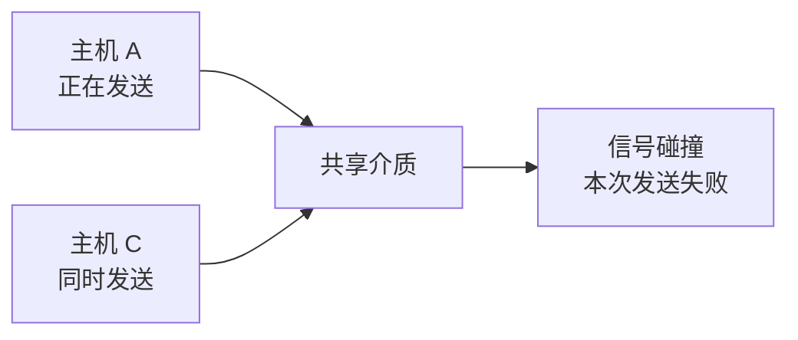

# 以太网技术：电脑真正往局域网里发数据时，线上传的到底是什么

> [!summary] 快速复习卡片
> **先记结论**：以太网解决的是有线局域网这一跳怎样把数据装成**帧**并送出去。帧里最关键的是源 MAC、目的 MAC、上层数据和 FCS。传统共享式以太网为了处理多台设备同时发送造成的碰撞，使用 CSMA/CD；现代交换式全双工以太网通常不再依赖 CSMA/CD。
> **题干怎么认**：以太网帧、MAC、FCS → 数据链路层；共享式有线、先听再发、碰撞检测、随机退避 → CSMA/CD。
> **易错点**：无线 802.11 主要是 CSMA/CA，不要和以太网的经典 CSMA/CD 混；经典以太网最小帧长 64B 与“发送过程中必须来得及发现远端碰撞”有关。

## 这里不是“网络性能推导出了以太网”，而是换了一个新问题

上一站 [[网络性能指标]] 结束的是前一个阶段：

- 已经知道数据怎样经过信道；
- 已经知道多人怎样共享通信资源；
- 已经知道报文为什么要拆成分组；
- 也已经知道怎样评价传输快不快、等多久。

**到这里，“通信原理和性能”这一阶段已经收口。**

现在开始换一个更具体的问题：

> 一台电脑真的要把数据交给同一个局域网里的另一台电脑时，网卡到底往网线上发什么？

这才是现在进入**以太网**的原因。

以太网不是“网络性能的下一种指标”，而是我们从“通信原理”切换到了“真实局域网怎样交付数据”。

## 先建立一个贯穿本篇的场景

假设电脑 A 和电脑 B 在同一个有线局域网里。

A 上的程序已经产生了一份需要发送的数据。上层会把要传输的内容交给网卡，但网卡不能只把“裸数据”直接扔到线上，因为局域网至少还要知道：

- 这一份数据是谁发的；
- 当前这一跳要交给谁；
- 数据有没有在传输过程中损坏。

所以以太网会给这份上层数据再包一层，形成一个**以太网帧**。

可以先把动作理解成：

这就是“帧”在这里出现的原因：

> **帧是数据链路层在当前链路上传输和交付数据的基本封装单位。**

以后你会看到帧里面经常承载 IP 分组，但这一篇先不用展开 IP，只要知道：**上层数据被装进以太网帧，帧负责当前局域网这一跳的交付。**

## 一个以太网帧为什么需要 MAC 地址

回到 A → B。

如果局域网里不只有 B，还有 C、D、E，那么 A 发出的帧必须带上“当前这一跳想交给谁”的信息。

于是以太网帧里有：

- **源 MAC**：这一帧从哪个网卡接口来；
- **目的 MAC**：这一帧在当前二层链路上要交给哪个接口。

所以你现在可以先形成一个非常重要的直觉：

> **MAC 地址不是在回答“整个 Internet 最终去哪”，而是在帮助二层完成当前这一跳的帧交付。**

IP 地址和跨网络路由后面会单独学，现在不要把两套地址混在一起。

## 以太网帧只先认识真正有用的字段

| 字段 | 在 A → B 这个场景里干什么 |
| --- | --- |
| 目的 MAC | 告诉当前局域网：这一帧要交给谁 |
| 源 MAC | 告诉当前局域网：这一帧从哪个接口来 |
| 类型/长度 | 帮助接收方判断里面承载的内容或长度语境 |
| 数据 | 真正要交给上层的数据，例如以后会学到的 IP 分组 |
| FCS | 用 CRC 检查帧在链路传输中是否出现差错 |

这里的 FCS 只要知道“**用于检错**”即可；CRC 怎么计算已经有独立知识卡，不在这里重复。

## 但早期以太网还有一个麻烦：大家可能共用一段线

现在把场景稍微扩大：A、B、C 都连接到一段**共享介质**。

这意味着同一时刻如果 A 和 C 都往这段介质里发送信号，两股信号可能互相干扰，这就是经典共享式以太网里的**碰撞**。

于是问题变成：

> 大家共用一条“路”，谁什么时候可以发？如果两个人还是撞在一起怎么办？

这才自然引出 **CSMA/CD**。

## CSMA/CD 不要背缩写，先跟着动作走

假设 A 现在有一个帧要发。

### 第一步：先听

A 先判断共享介质现在有没有别人正在发送。

- 忙：先等；
- 空闲：开始发送。

这就是“载波监听”的直觉。

### 第二步：发的时候继续听

即使 A 开始发了，也不能认为一定安全。

原因是：远处的 C 可能几乎同时判断“线路空闲”并开始发送。由于信号传播需要时间，A 和 C 在最开始都可能还不知道对方已经发了。

所以 A 在发送过程中还要继续检测有没有发生碰撞。

### 第三步：发现碰撞就停止

一旦检测到碰撞，这一帧已经不能算成功发送，所以停止本次发送。

### 第四步：随机等一会儿再重试

如果 A 和 C 碰撞后都立刻同时重发，很可能再次碰撞。

因此各自随机等待一段时间，再重新尝试。

最后才把这套动作压缩成考试术语：

> **CSMA/CD：先听，空闲再发；边发边检测，碰撞后停止并随机退避。**

## 为什么经典以太网还规定最小帧长 64B

这个规定也不是凭空背出来的。

还是 A 和远处的 C 共用介质。

如果 A 发的帧特别短，可能出现：

1. A 很快就把整个帧发完了；
2. 远处 C 造成的碰撞还在传播回来；
3. 等碰撞影响到 A 时，A 已经以为“这帧发送结束”。

这样 A 就无法在**发送期间**发现碰撞。

所以经典以太网规定了最小帧长度，使发送端在最坏传播条件下仍有机会在自己还没发完时检测到碰撞。考试里重点记：

> **经典以太网最小帧长 64B，它和 CSMA/CD 的碰撞检测时机有关。**

这一轮不需要继续推导时隙、网络直径等工程细节。

## 那为什么现在几乎感觉不到“碰撞”了

因为现代以太网通常不是很多主机共用同一段介质，而是每台设备通过独立链路接到**交换机**，而且常采用全双工通信。

这样就不再是早期那种“大家抢同一根线”的共享碰撞模型。

因此：

- **CSMA/CD 很重要，因为它解释经典共享式以太网，也是考试识别点；**
- **但现代交换式全双工以太网通常不再靠 CSMA/CD 处理碰撞。**

不要把教材里的经典机制误认为今天每个交换端口仍在不断“先听再发”。

## 这一篇解决了什么，还剩什么没解决

到这里，我们已经知道：

- 局域网上的数据会被装成以太网帧；
- 帧里有源 MAC、目的 MAC 和检错信息；
- 传统共享介质为什么会碰撞，以及 CSMA/CD 怎么处理。

但新的问题马上出现了：

> 现代局域网里一台交换机接了很多设备。它收到一个目的 MAC 为 B 的帧以后，怎么知道 B 接在哪个端口？难道还是把帧复制给所有端口吗？

这个问题不是以太网帧本身解决的，而是下一站 **[[交换机]]** 要解决的。

## 一句话总结

**以太网先把上层数据装成带 MAC 地址和 FCS 的帧，让它能在当前局域网链路上传输；经典共享式以太网再用 CSMA/CD 解决“多人抢同一介质会碰撞”的问题。**

## 下一站

**上一站：[[网络性能指标]]**  
**主下一站：[[交换机]]**

为什么继续：现在已经知道“帧长什么样、目的 MAC 写在哪里”，但还不知道现代局域网里的设备收到帧后，**怎样把它定向送到正确端口**。下一站就解决这个问题。

### 相关知识（先不用跳）
- 分层定位：[[OSI与TCP-IP协议体系对比]]
- 设备与层次总览：[[网络互联设备]]
- 无线介质访问对比：[[无线局域网802.11]]
