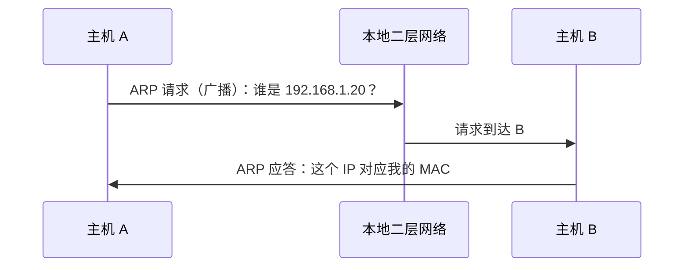

# ARP 地址解析：已经知道目标 IP，为什么发以太网帧时还卡在“目的 MAC 不知道”

> [!summary] 快速复习卡片
> **先记核心**：ARP 解决 IPv4 局域网里“当前这一跳的 IP 已知，但对应 MAC 不知道”的问题。
> **同网段**：ARP 找目标主机的 MAC。
> **跨网段**：主机不是去找远程服务器的 MAC，而是 ARP 找**默认网关的 MAC**；IP 目的地址仍指向远程服务器。
> **动作**：先查 ARP 缓存；没有时发送 ARP 请求，目标设备应答；结果可暂时缓存。
> **易错点**：DNS 是域名 → IP；ARP 是当前 IPv4 链路的 IP → MAC。

## 继续上一站：A 已经知道 B 在本地，但帧还是发不出去

上一站 [[子网划分与地址范围计算]] 让主机 A 学会判断：

> 目标 IP 和自己是不是同一个子网？

先看最简单的情况。

假设：

- A 的 IP：`192.168.1.10`；
- B 的 IP：`192.168.1.20`；
- 两者在同一个本地子网。

A 已经知道 B 的 IP，也知道“B 就在本地”。

可是到了真正发送以太网帧这一步，帧头需要写：

> **目的 MAC = ?**

A 不知道 B 的 MAC，帧就还不能正确完成当前二层交付。

这就是 ARP 出现的原因。

## ARP 不是“查互联网地址”，而是在当前局域网问：这个 IP 是谁

A 想知道 `192.168.1.20` 对应哪个 MAC。

第一步不是立刻到处喊，而是先看自己有没有以前记住的结果，也就是 **ARP 缓存**。

如果缓存里已经有：

| IP | MAC |
| --- | --- |
| `192.168.1.20` | B 的 MAC |

A 就可以直接用。

如果没有，A 才需要发起 ARP 请求。

## ARP 请求为什么通常要广播

现在 A 的问题恰恰是：

> 我知道 B 的 IP，但不知道 B 的 MAC。

如果连 MAC 都不知道，就无法先精确地把二层帧只送给 B。

于是 A 在本地广播范围里发出 ARP 请求，意思可以理解成：

> **“谁的 IP 是 `192.168.1.20`？请把你的 MAC 告诉我。”**

同一广播域里的多台设备都可能看到这个请求，但只有拥有该 IP 的 B 应该作出对应应答。

A 得到 B 的 MAC 后，就能把真正的数据封装成目的 MAC 为 B 的以太网帧。

同时，A 通常会把这个 IP→MAC 映射暂时放入 ARP 缓存，避免每发一个帧都重新广播询问。

## 同网段时，IP 和 MAC 都指向 B，但职责还是不同

A → B 同网段通信时：

- IP 目的地址 = B 的 IP；
- 以太网目的 MAC = B 的 MAC。

看起来两个地址都“指向 B”，很容易让人觉得重复。

但它们的职责仍然不同：

- IP 在网络层表示逻辑目的；
- MAC 在当前以太网链路上负责这一次帧交付。

真正到了跨网段场景，你马上就能看到两者为什么不能合并。

## 跨网段时：为什么不能去 ARP 远程服务器的 MAC

现在 A 要访问互联网另一端的服务器 S。

A 根据自己的前缀判断：

> S 不在本地子网。

那当前第一跳就不是“把帧直接交给 S”，而是：

> **先交给本地默认网关。**

因此 A 此时需要的 MAC 是：

> **默认网关本地接口的 MAC。**

不是远程服务器 S 的 MAC。

这里是整个网络章节非常重要的一层关系：

> **IP 目的地址描述最终逻辑目的；MAC 地址描述当前这一跳的二层交付对象。**

所以跨路由器以后，链路层帧会被重新封装，下一跳 MAC 会变化；IP 分组继续按目的 IP 被路由。（NAT 等特殊机制另论，不在这张卡展开。）

## 路由器每一跳也会遇到类似问题

默认网关收到 A 的帧以后：

1. 拆掉当前链路的以太网帧；
2. 读取里面 IP 分组的目的 IP；
3. 查路由表决定下一步往哪里走；
4. 在下一条需要二层交付的链路上，再获得相应下一跳的链路层地址并重新封装帧。

所以可以把跨网络通信理解成：

> **IP 在较大范围里指方向，二层 MAC 每一跳负责把这一小段真的送过去。**

## ARP、交换机学习、DNS 为什么容易混

它们都像在“找东西”，但找的映射完全不同：

| 机制 | 解决什么 |
| --- | --- |
| 交换机 MAC 表 | `MAC → 交换机端口` |
| ARP | 当前 IPv4 链路 `IP → MAC` |
| DNS | `域名 → IP` |

尤其要注意：

> **交换机的未知单播泛洪 ≠ ARP 请求本身。**

ARP 是主机发起的地址解析协议；交换机泛洪是交换机在不知道目的 MAC 出口时的一种二层转发行为。

## 这一篇解决了什么，还剩什么没解决

现在 A 已经知道：

- 同网段时，用 ARP 找目标主机 MAC；
- 跨网段时，用 ARP 找默认网关 MAC。

于是 A 能把 IP 分组送到默认网关。

但网关收到以后又遇到一个新问题：

> **我知道最终目的 IP，可我有多个出口、多条路由，到底下一步走哪一条？**

这就进入下一站 [[路由表与最长前缀匹配]]。

## 一句话总结

**ARP 是 IP 和以太网之间的桥：同网段解析目标主机 MAC，跨网段先解析默认网关 MAC；最终 IP 指向远程目标，而当前 MAC 只负责这一跳。**

## 下一站

**上一站：[[子网划分与地址范围计算]]**  
**主下一站：[[路由表与最长前缀匹配]]**

为什么继续：ARP 已经把分组送到网关，但网关还必须回答 **“目的 IP 应该从哪个出口继续走”**。下一站开始看路由表。

### 相关知识（后面再回看）
- 二层端口学习：[[MAC地址与交换机转发表]]
