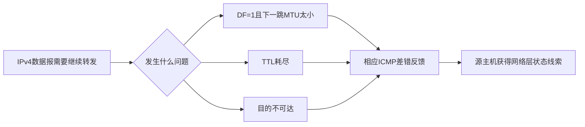
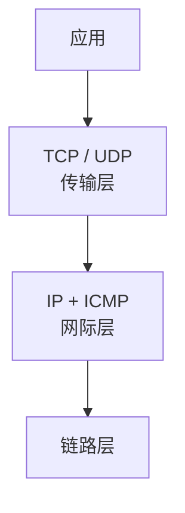
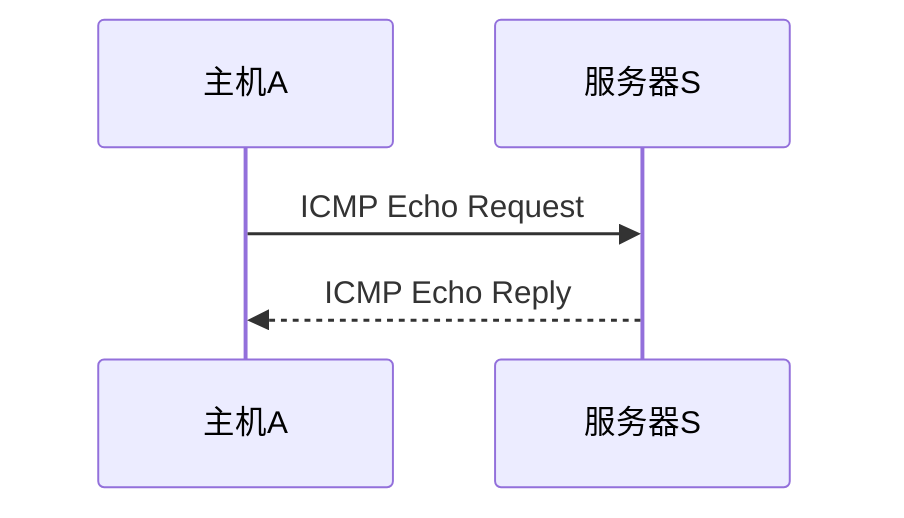

# ICMP 与 Ping：IPv4 尽力转发失败以后，发送方怎么知道发生了什么

> [!summary] 快速复习卡片
> **作用/定位**：ICMP 配合 IP 报告部分网络层状态和提供诊断能力。**大白话：IP 负责尽量往前送，ICMP 像是网络层回来告诉你“刚才哪里出了问题”。**
> **三个关键失败入口**：DF=1 又遇到更小 MTU、TTL 在途中耗尽、目的不可达，都可能触发相应 ICMP 差错信息。**大白话：包太大又不准切、在路上绕太久、根本找不到目的地，都可能有人回来报错。**
> **Ping 的动作**：发送 ICMP Echo Request，目标正常处理并允许响应时返回 Echo Reply。**大白话：Ping 就是在问“你能听到我吗”，对方再回一句“能”。**
> **RTT**：Ping 显示的时间通常是一次请求出去再收到应答的往返时间。**大白话：30 ms 是一来一回，不等于单程正好 30 ms。**
> **Ping 通的边界**：只能说明这次 ICMP 回显链路基本可达，不代表 TCP、端口、TLS、HTTP 或应用一定正常。**大白话：能敲开楼下大门，不代表你要找的办公室一定在营业。**
> **Ping 不通的边界**：也不能直接证明主机宕机，因为 ICMP Echo 可能被防火墙或策略过滤。**大白话：没人回答敲门，不一定代表屋里没人，也可能只是规定不应门。**

## 唯一主问题

> **当 IPv4 尽力转发失败或需要诊断时，ICMP 怎样反馈网络层状态，而 Ping 又能证明什么、不能证明什么？**

直接回答：

> **ICMP 是 IP 网络层体系中的控制和差错报告机制。它能把部分转发失败状态反馈给相关主机，也提供 Echo 这类诊断报文；Ping 正是利用 Echo Request/Reply 测试一次基本网络层往返是否成立。ICMP 不负责可靠交付，而 Ping 也不能证明整个应用服务正常。**

要理解这句话，先从上一站真的发生过的三个失败开始。

## 上一站已经留下三个问题：IPv4 把包丢了以后怎么办

上一站 [[IPv4报文与分片]] 中，主机 A 正在向服务器 S 发送 IPv4 数据报。

正常情况下，路由器会：

1. 查看目的 IPv4 地址；
2. 查转发表；
3. 处理 TTL；
4. 根据下一跳链路继续转发。

但我们已经遇到三个无法正常继续的情况。

### 情况一：下一跳装不下，而且 DF=1

假设：

- 数据报比下一跳 MTU 大；
- IPv4 首部又设置了 DF=1，也就是禁止分片。

路由器既不能原样发送，也不能把它切小。

于是这个数据报只能被丢弃。

但只丢掉还不够，因为发送方 A 需要知道：

> **不是服务器业务拒绝了我，而是这条路径上的网络层尺寸出了问题。**

这时可以返回相应的 ICMP Destination Unreachable 信息，其中有“需要分片但 DF 已设置”这一情况。

这也是路径 MTU 发现能够工作的基础之一。

### 情况二：TTL 在途中耗尽

再假设路由配置异常，数据报不断在几个路由器之间兜圈。

IPv4 的 TTL 会随着路由转发不断减少。

当某个路由器处理后发现 TTL 已经耗尽，就会丢弃这个数据报。

同时，它可以通过：

> **ICMP Time Exceeded**

告诉源主机：

> **这个数据报没有到达目的地，而是在途中把生存计数耗光了。**

### 情况三：目的不可达

还有一种更直接：

路由器根据当前网络状态根本无法继续把数据报送向目标，或者目的端出现相应的网络层不可达情况。

这时可能产生：

> **ICMP Destination Unreachable。**

因此你可以先把这三件事连起来：

这里最重要的不是背三个英文名字，而是理解：

> **ICMP 是在 IP 尽力转发遇到部分异常时，补上一条“网络层状态反馈通道”。**

## ICMP 到底属于哪一层

这里很容易产生一个疑问：

> ICMP 自己也要装进 IP 数据报里发送，那它是不是就和 TCP、UDP 一样属于传输层？

不是。

在 TCP/IP 的体系中，ICMP 与 IP 都属于**网际层/网络层相关协议**。

主教材的 TCP/IP 协议分层表也是把：

- IP；
- ICMP；
- ARP；
- RARP

放在网际层，而 TCP、UDP 放在传输层。

可以把关系理解成：

但还要注意一个协议实现上的细节：

> **ICMP 报文本身借助 IP 进行传送。**

这并不意味着 ICMP 变成了传输层协议。

就像“网络层自己的反馈信息，也要利用网络层的数据报送回去”。

所以考试里不要把：

- ICMP 与 TCP/UDP

当成同层协议。

## ICMP 不是“把 IP 变成可靠协议”

这是本卡最重要的边界之一。

看到 ICMP 会报告错误，很容易产生一种误解：

> 既然出问题会通知源主机，那 IP 不就有可靠性了吗？

不是。

ICMP 的目的只是：

> **反馈一部分通信环境中的问题。**

它不能保证：

- 每个丢失的数据报都会产生 ICMP；
- 每个产生的 ICMP 都一定能送回源主机；
- 收到 ICMP 后，原始业务数据就会自动重传成功；
- 数据一定按顺序、无重复地到达。

也就是说：

> **ICMP 是“尽力反馈”，不是“可靠交付机制”。**

如果应用需要可靠字节流、确认、重传、顺序控制等，那是后续传输层协议要解决的问题，例如 TCP。

可以把边界压缩成：

| 机制 | 负责什么 |
| --- | --- |
| IP | 尽力把数据报跨网络送向目的地 |
| ICMP | 反馈部分网络层异常与控制状态 |
| TCP | 在 IP 之上提供可靠传输等能力 |
| UDP | 在 IP 之上提供较轻量的无连接传输 |

所以：

> **“ICMP 会报错”绝对不等于“IP 保证送达”。**

## 那为什么平时一提 ICMP，大家首先想到 Ping

因为 Ping 使用了 ICMP 中非常适合诊断的一对报文：

- **Echo Request：回显请求**
- **Echo Reply：回显应答**

现在仍然沿用刚才的主机 A 和服务器 S。

A 想知道：

> **在当前网络和策略条件下，我发出的网络层测试报文能不能到 S，再从 S 回到我这里？**

于是进行下面的过程。

动作顺序是：

1. A 构造 ICMP Echo Request；
2. ICMP 报文通过 IP 数据报发送；
3. 数据报经过正常的路由和链路转发；
4. S 收到 Echo Request；
5. 如果 S 正常处理该请求且策略允许响应，就发送 Echo Reply；
6. Reply 再通过 IP 网络返回 A；
7. A 收到 Reply，将它与之前的请求对应起来。

所以 Ping 并不是一种“独立于 IP 的特殊探测线路”。

它仍然经历：

> **IP 路由 → 当前链路交付 → 路由器逐跳转发 → 目标处理 → 返回路径。**

## Ping 显示的时间是什么：为什么不是单程时间

假设 A 在：

> `10:00:00.000`

发出 Echo Request。

又在：

> `10:00:00.030`

收到 Echo Reply。

那么 Ping 观察到的约 30 ms，是：

> **请求从 A 到 S，再由 S 返回 A 的整个往返时间。**

也就是 RTT（Round-Trip Time，往返时间）。

所以：

> **Ping 的 30 ms ≠ A 到 S 单程必定 15 ms。**

因为：

- 去程和回程可能不是同一路径；
- 两边排队情况可能不同；
- 设备处理时间也可能变化。

因此在基础题里只需要记：

> **Ping 的时间通常看 RTT，不直接当作单程时延。**

这也和前面 [[网络性能指标]] 中学习的 RTT 对应起来。

## Ping 通到底证明了什么

现在 A 成功收到了 S 的 Echo Reply。

能够确认的事情是：

> **在这次测试、这个时间点和当前网络策略下，A 发出的 ICMP Echo Request 能到达 S，而相应 Echo Reply 也能返回 A。**

为了复习方便，可以压缩成：

> **基本网络层往返可达。**

但是这句话不能继续无限扩大。

假设：

- A 能 ping 通 S；
- 浏览器却打不开 `https://S`。

完全可能。

因为 HTTPS 访问还要继续经过很多条件：

1. TCP 是否能建立连接；
2. 目标端口是否开放；
3. TLS 是否正常；
4. HTTP 服务是否正常；
5. 应用程序是否正常；
6. 针对 TCP/443 的防火墙策略是否允许。

所以：

> **Ping 通 ≠ Web 服务正常。**

同样也不能推出：

> **Ping 通 ≠ 数据库一定正常。**

甚至不能推出：

> **Ping 通 ≠ 所有 TCP/UDP 端口都可达。**

### 用同一台服务器看层次差异

服务器 S 当前可能是这样：

| 状态 | Ping | HTTPS |
| --- | --- | --- |
| 主机和网络正常，Web 服务正常 | 通 | 通 |
| 主机和网络正常，但 Web 服务进程停止 | 通 | 不通 |
| ICMP Echo 被允许，但 443 被防火墙拦截 | 通 | 不通 |
| ICMP Echo 被过滤，但 443 正常开放 | 不通 | 可能通 |
| 主机确实宕机 | 不通 | 不通 |

因此排障时：

> **Ping 是一个网络诊断信号，不是整个业务系统的健康证明。**

## Ping 不通为什么也不能直接宣布“服务器挂了”

现在把情况反过来。

A 发出了 Echo Request，但是一直没有收到 Echo Reply。

可能原因很多，例如：

- 请求在网络途中丢失；
- 返回报文丢失；
- 目标确实不可达；
- 目标主机没有正常工作；
- 防火墙不允许 ICMP Echo；
- 中间网络策略过滤 ICMP；
- 出现其他路径或网络故障。

所以仅凭：

> `Request timed out`

不能唯一定位根因。

最需要记住的边界是：

> **Ping 不通 ≠ 一定物理断网，也 ≠ 一定服务器宕机。**

这也是为什么网络排障不能只做一次 Ping 就结束。

## 差错报告和 Echo 是两类不同用途

到这里还要防止另一个混淆：

> Destination Unreachable、Time Exceeded 和 Echo Request 是不是都是“报错”？

不是。

ICMP 的用途不仅是错误报告，也包括查询和诊断类能力。

本卡最低要分成两组：

### 出现网络层异常后反馈

例如：

- Destination Unreachable；
- Time Exceeded；
- DF=1 又需要分片所对应的不可达反馈。

它们的共同特点是：

> **原先有一个 IPv4 数据报在处理时遇到了问题。**

### 主动发起诊断

Echo Request / Echo Reply 则不同。

用户执行 Ping 时，是主动发起一个诊断过程：

> **我先发送 Echo Request，请目标正常情况下回一个 Echo Reply。**

因此：

> **Ping 不是等网络先出错才自动产生的差错报文。**

## traceroute 为什么也和 TTL、ICMP 有关系

这里只保留理解下一层所需的最小深度。

上一站已经知道：

> **IPv4 TTL 每经过路由转发会减少。**

如果主动发送一个 TTL 很小的数据报：

- TTL 很快会在某个中间路由器耗尽；
- 该路由器丢弃数据报；
- 并可能返回 ICMP Time Exceeded。

于是诊断工具可以逐步改变 TTL，让不同位置的路由器依次暴露出来。

直觉上：

这就是 traceroute/tracert 能利用 TTL 和相关响应观察路径的核心依据。

当前只记这条主线：

> **通过控制 TTL，让探测报文故意在不同跳耗尽，再利用返回的状态信息识别路径。**

不同操作系统具体使用哪一种探测报文、怎样显示超时，不在本卡展开。

## 把 IPv4、ICMP 和 Ping 串成一次完整过程

现在重新看最开始主机 A → 服务器 S 的通信。

### 正常转发

1. A 构造 IPv4 数据报；
2. 路由器逐跳查表并转发；
3. TTL 正常递减；
4. 数据报最终到达 S。

这主要是 IP 的工作。

### 中途发生问题

如果某个路由器发现：

- DF=1 且数据报大于下一跳 MTU；
- TTL 已耗尽；
- 目的无法继续到达；

它可能：

1. 丢弃原始 IPv4 数据报；
2. 产生相应 ICMP 信息；
3. 通过 IP 把 ICMP 报文送回相关源主机；
4. A 获得一条关于网络层故障的线索。

### 主动诊断

如果用户主动运行 Ping：

1. A 发送 Echo Request；
2. S 正常收到并允许响应；
3. S 返回 Echo Reply；
4. A 判断这一次 ICMP 往返成立；
5. A 还能观察 RTT 等诊断信息。

这三段必须分清：

> **IP 是正常送；ICMP 差错信息是失败后的网络层反馈；Ping 是主动利用 ICMP Echo 做诊断。**

## 考试看到题干以后怎么判断

### 看到“目的不可达”

先想到：

> **ICMP Destination Unreachable。**

不要回答 TCP 超时机制。

### 看到“TTL 耗尽”

先想到：

> **丢弃 + ICMP Time Exceeded。**

如果进一步问为什么 traceroute 能逐跳探测，再想到 TTL 递增/变化和中间路由器的超时反馈。

### 看到“Ping”

第一反应：

> **ICMP Echo Request / Echo Reply。**

如果问时间：

> **通常观察 RTT。**

### 看到“Ping 通，为什么网页仍打不开”

第一反应：

> **Ping 只验证 ICMP 基本往返；应用还依赖 TCP/端口/TLS/HTTP/服务进程等。**

### 看到“Ping 不通，所以主机一定宕机”

这是过度推断。

因为：

> **ICMP 可能被策略过滤。**

### 看到“ICMP 提供可靠传输”

错误。

> **ICMP 只反馈部分网络层状态，不能保证错误一定报告，更不能提供 TCP 那样的可靠交付。**

## 最容易混淆的边界

| 容易误解 | 正确理解 |
| --- | --- |
| ICMP 是传输层协议 | ICMP 属于 IP 网络层体系；TCP/UDP 才是传输层 |
| ICMP 报错，所以 IP 是可靠协议 | ICMP 只是反馈，不能保证数据或错误报告一定到达 |
| Ping 就是测试 TCP | Ping 的基础机制是 ICMP Echo |
| Ping 通 = 网站正常 | 只能说明本次 ICMP 基本往返成立 |
| Ping 不通 = 服务器一定挂了 | ICMP 可能被过滤，也可能存在其他网络故障 |
| Ping 的时间 = 单程时延 | 通常是 RTT，一来一回 |
| Time Exceeded = 目的主机主动拒绝 | 常见情形是 TTL 在途中耗尽 |
| DF+超MTU后一定自动解决 | ICMP 只是反馈线索，发送端还需要据此调整；不能把反馈本身等同于可靠恢复 |

## 自测

### 1. IPv4 数据报 DF=1，下一跳 MTU 又比数据报小，路由器会直接把它分片吗？

不会。

DF=1 表示禁止 IPv4 分片。路由器无法继续转发时需要丢弃该数据报，并可通过相应 ICMP 不可达信息向源主机反馈“需要分片但 DF 已设置”的情况。

---

### 2. 一个数据报因为路由环路导致 TTL 耗尽，最直接对应哪类 ICMP 状态？

ICMP Time Exceeded。

TTL 的作用就是限制数据报在网络中的生存范围，耗尽后不能继续无限转发。

---

### 3. 主机 A ping 通服务器 S，能否得出“S 的 HTTPS 服务一定正常”？

不能。

Ping 只说明本次 ICMP Echo 请求和应答能够完成，HTTPS 还依赖 TCP、端口、TLS、HTTP 和应用进程。

---

### 4. A ping 不通 S，能否立即断定 S 已经关机？

不能。

Echo Request/Reply 可能被防火墙或其他网络策略过滤，因此 Ping 不通只能说明这次 ICMP 测试没有完成。

---

### 5. ICMP 既然能报告错误，为什么还不能说 IP 已经可靠？

因为 ICMP 本身也不保证一定产生、一定送达，而且它不提供完整的确认、重传、按序交付等可靠传输能力。

---

### 6. Ping 显示 `time=20 ms`，能否直接说单程时延是 10 ms？

不能直接这样推断。

20 ms 通常表示往返时间 RTT，去程和回程可能经过不同路径、承担不同排队和处理时延。

## 一句话总结

**IP 负责尽力把数据报送向目标；出现 DF+超 MTU、TTL 耗尽、目的不可达等情况时，ICMP 可以反馈部分网络层状态，但它不保证可靠交付；Ping 则主动使用 ICMP Echo Request/Reply 测试一次基本网络层往返，并观察 RTT，既不能证明应用一定正常，也不能在无响应时直接证明主机宕机。**

## 下一站

**上一站：[[IPv4报文与分片]]**  
**主下一站：[[IPv6与IPv4过渡]]**

为什么继续：

到这里，IPv4 主线已经完成了：

> **正常转发 → 遇到 MTU/TTL/不可达问题 → ICMP 反馈与诊断。**

这说明 IPv4 本身已经能形成完整的网络层工作链。

接下来切换到另一个问题，而不是继续研究“失败怎么反馈”：

> **IPv4 的地址只有 32 位，地址空间长期有限；但已经部署的大量 IPv4 网络又不可能瞬间全部替换。怎样扩大地址空间，并让新旧网络长期共存？**

这就是下一站 [[IPv6与IPv4过渡]]。
