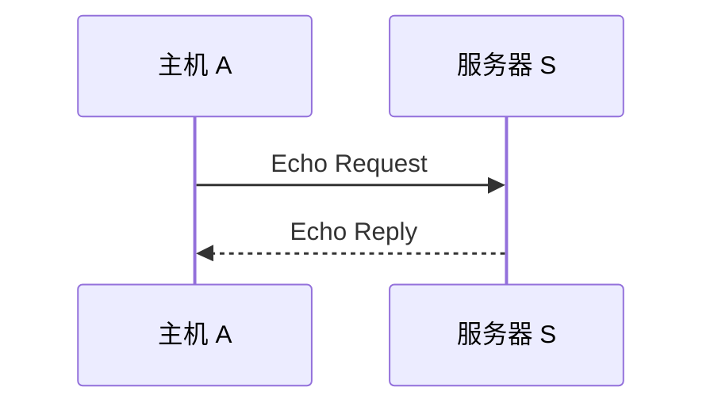

# ICMP 与 Ping：IP 把包丢了，发送方怎么知道发生了什么

> [!summary] 快速复习卡片
> **作用/定位**：IP 负责尽力转发；ICMP 负责反馈部分网络层状态和错误。
> **常见题眼**：目的不可达 → Destination Unreachable；TTL 耗尽 → Time Exceeded。
> **Ping**：使用 ICMP Echo Request / Echo Reply 测试一次基本网络层往返是否成立。
> **边界**：Ping 通 ≠ Web/数据库等应用一定正常；Ping 不通 ≠ 主机一定宕机，ICMP 可能被策略过滤。
> **RTT**：Ping 显示的时间通常是请求出去再收到应答的往返时间，不直接等于单程时延。

## 先看问题：路由器把包丢了，源主机不能永远蒙在鼓里

上一站 [[IPv4报文与分片]] 留下了两个失败场景：

- 数据报超过下一跳 MTU，而且 `DF=1`，不能分片；
- 数据报因为路由异常不断绕圈，TTL 最终耗尽。

路由器只能丢包，但源主机最好能得到一点线索：

> **到底是目标不可达，还是包在路上活得太久，还是尺寸出了问题？**

这类网络层控制和差错反馈，就是 **ICMP（Internet Control Message Protocol）** 的主要作用。

它和 IP 一样属于 TCP/IP 的**网际层/网络层体系**，不是 TCP、UDP 那样的传输层协议。

## ICMP 不负责“把丢掉的包补回来”

这一点最容易误会。

ICMP 可以告诉源主机“发生了某类网络层问题”，但它并不会因此把 IP 变成可靠协议。

当前只需要认两个典型反馈：

| 发生什么 | 常见 ICMP 信息 | 大白话 |
| --- | --- | --- |
| 路由/主机等原因导致目的不可达 | Destination Unreachable | “这条路现在送不到” |
| TTL 在途中耗尽 | Time Exceeded | “包在半路把寿命用完了” |

上一站提到的“DF=1 又遇到更小 MTU”，也属于不可达类反馈中的典型场景。

所以关系是：

> **IP 尽力送；送不动时，ICMP 可能回来报告原因。**

“可能报告”不等于“每一次丢包都保证收到 ICMP”。

## Ping 只是把 ICMP 的回显能力拿来做连通性测试

当主机 A 想检查服务器 S 是否能进行一次基本网络层往返时，可以发送 ICMP Echo Request。

如果 A 收到 Echo Reply，说明在这次测试和当前策略下：

- 请求能到 S；
- 应答也能回到 A；
- 基本的网络层往返链路成立。

这就是“Ping 通”真正能证明的范围。

## 为什么 Ping 通了，网页仍然可能打不开

因为 Ping 只测试 ICMP 回显。

网页访问还要继续满足：

- TCP 能否建立通信；
- 目标端口是否开放；
- TLS 是否正常；
- HTTP 服务和应用是否正常。

所以：

> **Ping 通只能证明一部分网络层连通性，不能证明上层业务正常。**

反过来，Ping 不通也不能直接宣布“主机宕机”，因为防火墙或安全策略可能专门禁止 ICMP Echo。

## 一句话收口

**ICMP 是 IP 的网络层反馈助手；Ping 利用 Echo Request/Reply 测基本往返可达，但它既不提供可靠传输，也不能代表应用服务一定正常。**

## 上一站

[[IPv4报文与分片]]：已经知道 IPv4 什么时候会因为 MTU、DF 或 TTL 而无法继续，本篇解释这些网络层失败怎样得到反馈。

## 下一站

[[IPv6与IPv4过渡]]：IPv4 的基本转发和诊断机制到这里已经够用了，接下来换一个更大的问题：**IPv4 地址空间有限，而全球网络又不可能一夜之间全部换协议，怎么办？**
