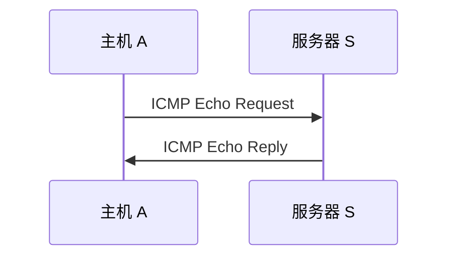

# ICMP 与 Ping：IP 说“我只负责尽力送”，那送不到时谁告诉发送方出了什么事

> [!summary] 快速复习卡片
> **先记关系**：IP 主要负责寻址和尽力转发；ICMP 在网络层相关位置补充控制、差错和诊断信息。
> **Ping**：通常发送 ICMP Echo Request，收到 Echo Reply 后判断基本网络层可达性，并测得一次往返时间 RTT。
> **题眼**：Echo、ping、目的不可达、TTL 超时 → ICMP；TCP/UDP 属于传输层。
> **易错点**：ping 通 ≠ Web/数据库等应用一定正常；ping 不通也不一定等于目标主机物理关机，ICMP 可能被策略过滤。

## 继续上一站：分组被丢了，发送方不能永远只靠猜

上一站 [[IPv4报文与分片]] 已经看到：

- 数据报可能因为 MTU 受到限制；
- TTL 减到 0 后会被路由器丢弃；
- IP 的工作方式本来就是**尽力而为**，不是保证送达。

现在假设主机 A 给服务器 S 发一个 IP 分组，中间的路由器发现：

> 我根本没有到这个目标网络的有效路径。

如果路由器只是把分组静默丢掉，A 就只会发现“怎么一直没结果”，却不知道网络层发生了什么。

因此 TCP/IP 协议族需要一种配合 IP 的控制/差错报告机制：

> **ICMP（Internet Control Message Protocol）。**

可以先形成直觉：

> **IP 负责往前送，ICMP 负责在一些情况下回报网络层状态。**

它不是用来替代 IP 传业务数据，也不是 TCP 那种可靠传输协议。

## 最熟悉的 ICMP 使用场景：Ping

你平时执行：

`ping 目标IP`

可以把最小过程理解成：

1. A 向 S 发送 **ICMP Echo Request（回显请求）**；
2. 请求能够到达 S，而且 S/中间策略允许响应；
3. S 返回 **ICMP Echo Reply（回显应答）**；
4. A 收到应答后，知道网络层路径至少在这次测试里基本可达。

这里的“过去再回来”正好对应你前面学过的 [[网络性能指标]]：

> ping 输出里的时间通常观察的是 **RTT（往返时间）**，不是单程时延。

所以 `time=30 ms` 不能直接理解成“A → S 单程正好 30 ms”。

## Ping 通到底证明了什么

假设：

- A 能 ping 通 S；
- 但浏览器访问 S 的 HTTPS 失败。

这完全可能。

因为 ping 主要说明：

> **ICMP 的这次请求/应答能够完成，网络层基本可达。**

但 Web 服务还涉及：

- TCP 是否能建立连接；
- 443 端口是否监听；
- TLS、HTTP、应用程序是否正常；
- 防火墙是否允许相应业务流量。

所以：

> **ping 通只是网络排障链的一层，不是“整套应用正常”的证明。**

## Ping 不通又为什么不能直接说“服务器死了”

反过来也一样。

某些主机或防火墙可能明确过滤 ICMP Echo，但仍允许 TCP/443 等业务通信。

这时可能出现：

- ping 没响应；
- 但 Web 服务正常访问。

因此工程上 ping 是诊断信号，不是绝对结论。

考试里若没有额外安全策略背景，一般按基础协议作用判断即可。

## ICMP 还能报告哪些网络层问题

当前只认最稳定的几类含义：

### 目的不可达

路由器或目标侧发现某类目的无法到达时，可以产生相应 ICMP 差错信息。

### TTL 超时

IPv4 分组每过路由器 TTL 通常递减。

如果某一路由器把 TTL 减到 0，会丢弃该分组，并可用 ICMP 超时报文反馈。

这也是 `traceroute/tracert` 类工具能够利用 TTL 与 ICMP/相关响应逐跳探测路径的基础之一；当前只理解联系，不展开不同系统实现差异。

## ICMP、TCP、UDP 为什么必须分层记

| 协议 | 主要解决什么 |
| --- | --- |
| IP | 网络层逻辑寻址、跨网络转发 |
| ICMP | 网络层控制、差错与诊断反馈 |
| TCP/UDP | 传输层把通信进一步交给具体应用进程 |

所以考试看到：

- `ping`、Echo、TTL 超时、目的不可达 → ICMP；
- 端口号、可靠传输、无连接数据报 → TCP/UDP。

## 这一篇解决了什么，还剩什么没解决

到这里，IPv4 这一条链已经基本完整：

> 地址和子网 → ARP 当前一跳 → 路由 → MTU/TTL → ICMP 反馈。

现在换一个新的网络层问题：

> IPv4 只有 32 位地址，联网设备越来越多，地址空间长期不够用怎么办？而旧 IPv4 网络又不可能一天全部消失。

于是下一站进入 [[IPv6与IPv4过渡]]。

## 一句话总结

**IP 负责尽力转发，ICMP 负责补充网络层控制和差错反馈；Ping 用 ICMP 回显测试基本可达性，看到的时间通常是 RTT，而不是应用服务健康度。**

## 下一站

**上一站：[[IPv4报文与分片]]**  
**主下一站：[[IPv6与IPv4过渡]]**

为什么继续：IPv4 的基本转发链已经闭环，下一步解决的是**地址空间扩展，以及 IPv4 与 IPv6 不可能瞬间切换时怎么共存**。
