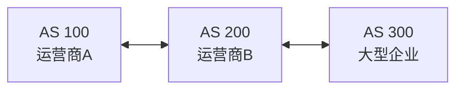

# 自治系统与 IGP-BGP：路由器会查表了，但整个 Internet 的路由信息谁来统一管理

> [!summary] 快速复习卡片
> **先记定位**：Internet 不是一个管理员控制的一张巨型内网，所以先按管理/路由策略边界划成自治系统 AS。
> **AS 内部**：使用 IGP 类协议，例如 OSPF、RIP 等；**AS 之间**：核心域间路由协议是 BGP。
> **易错点**：IGP 是一类协议的总称，不是一个具体协议；当前只学“域内 vs 域间”的定位，不展开 OSPF 状态机或 BGP 属性选路。

## 继续上一站：路由表能查，但表里的动态路由从哪来

上一站 [[路由表与最长前缀匹配]] 已经知道，路由器拿到一个目的 IP 后会查路由表，选择最具体的匹配前缀。

问题是：

> **这些路由表项是谁告诉路由器的？**

小网络里可以手工配静态路由，但 Internet 有海量网络，而且链路和拓扑会变化，不可能靠一个管理员给全世界路由器逐条配置。

动态路由协议因此要让路由器交换路径信息。

但新的问题马上出现：

> **整个 Internet 能不能就当成一家公司的内部网络，让所有路由器一起跑同一套内部协议？**

现实中不行。

## Internet 不是“一家公司的一张大网”

Internet 由很多彼此独立的组织组成：

- 不同运营商；
- 大型企业；
- 云服务商；
- 学校和科研机构等。

这些组织：

- 有自己的网络设备；
- 有自己的内部拓扑；
- 有自己的路由策略；
- 不希望每一个内部变化都扩散给全世界。

所以需要先划一个管理边界：

> **哪些网络由同一套管理和路由策略控制？**

这样的一组网络就可以看成一个**自治系统（AS，Autonomous System）**。

## 为什么有了 AS 以后，路由协议自然分成两类

假设 Internet 简化成三个自治系统：

现在有两种完全不同的问题。

### 问题一：一个 AS 自己内部怎么找路

例如 AS 100 里面有很多路由器。

这些设备属于同一个管理范围，可以更充分地交换内部拓扑和路径信息。

这类**自治系统内部**使用的动态路由协议统称为：

> **IGP（Interior Gateway Protocol，内部网关协议）。**

OSPF、RIP 等是典型 IGP 名称。

所以不要把“IGP”误认为某一个单独协议。

### 问题二：两个不同 AS 之间怎么交换“哪些网络能到”

当 AS 100 要告诉 AS 200：

> “这些目标网络可以通过我到达。”

这已经不是单个组织内部的最短路问题，而涉及不同管理域之间的路由可达性和策略。

Internet 中核心的域间路由协议就是：

> **BGP（Border Gateway Protocol，边界网关协议）。**

所以第一轮最重要的不是背 BGP 属性，而是牢牢记住边界：

| 范围 | 协议定位 |
| --- | --- |
| 一个 AS 内部 | IGP 类协议 |
| 不同 AS 之间 | BGP |

## 为什么不把所有内部细节都告诉外部

假设一个运营商内部某条链路调整了。

它只要在自己 AS 内部重新收敛，然后对外继续告诉其他 AS：

> “某些网络仍然可以通过我到达。”

外部不需要知道它内部每台路由器的全部细节。

这就是分层管理的价值：

> **内部自己管细节，外部只交换必要的域间可达信息和策略。**

你可以把它类比成公司：外部合作方只需要知道“这个业务找哪个公司”，不需要知道公司内部每个工位怎么走。

## 当前深度到这里就停

系统架构设计师这一轮只掌握：

- AS 是管理/路由策略边界；
- AS 内 → IGP；
- AS 间 → BGP；
- OSPF、RIP 能识别为 IGP 代表即可。

暂不展开：

- OSPF 邻居状态机；
- LSA 类型；
- BGP LOCAL_PREF、MED 等属性；
- 复杂选路顺序和设备命令。

这些会显著增加学习成本，却不是当前卡的主问题。

## 这一篇解决了什么，还剩什么没解决

到这里，跨网络“走哪条路”的逻辑已经比较完整：

- 路由器知道怎么查表；
- 动态路由知道按 AS 管理边界组织。

但即使方向完全正确，一份 IP 数据报真正进入下一条链路时仍可能遇到现实限制：

> **这个 IP 数据报有 4000B，可下一条链路最多只允许 1500B，怎么办？**

另外，如果路由配置异常形成环路，分组是不是会永远转下去？

这两个问题引出下一站 [[IPv4报文与分片]] 里的 MTU、分片和 TTL。

## 一句话总结

**Internet 不是一个管理员的一张大网，所以先按管理策略划 AS；AS 内部用 IGP 类协议，AS 之间主要用 BGP。**

## 下一站

**上一站：[[路由表与最长前缀匹配]]**  
**主下一站：[[IPv4报文与分片]]**

为什么继续：现在“往哪里走”已经解决，下一步处理的是**分组真的走上不同链路后，大小不合适或发生路由环路怎么办**。
