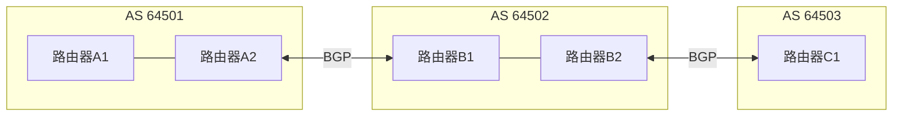
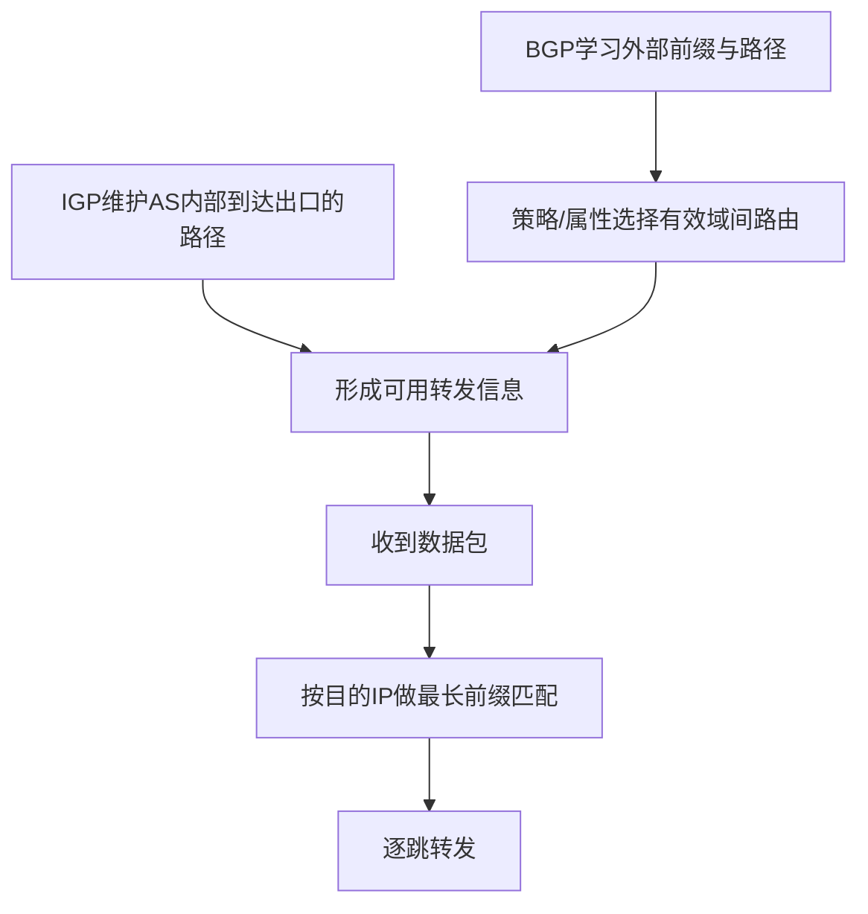

# 自治系统与 IGP/BGP：为什么 Internet 的动态路由必须分“域内”和“域间”

> [!summary] 快速复习卡片
> - **AS（Autonomous System）**：可先理解为受共同管理、对外呈现一致路由策略的一组 IP 网络/路由器；它是路由管理边界，不能死记成“一个公司就一定等于一个 AS”。
> - **IGP**：自治系统**内部**使用的一类路由协议总称，典型有 OSPF、RIP。
> - **BGP**：Internet 域间路由的核心协议，用来在 AS 之间交换网络可达性及相关路径属性。
> - **不要混淆**：IGP/EGP 是按作用范围划分的类别；BGP、OSPF、RIP 才是具体协议名。
> - **BGP 不等于全球最短路算法**：它允许基于路径属性和策略选择、传播路由；`AS_PATH` 能记录经过的 AS 序列，并帮助识别 AS 级环路。
> - **与上一站关系**：IGP/BGP 属于控制平面，负责形成可用路由；真正转发一个包时仍回到 [[路由表与最长前缀匹配]] 的查表/LPM。

## 唯一主问题

> **为什么 Internet 不能让所有路由器运行同一种“全网最短路”协议，而要用 AS 划出管理边界，再区分 IGP 和 BGP？**

## 先看矛盾：一张全球统一的内部路由表为什么不现实

如果全 Internet 都像一个小型企业内网：

- 每个内部链路变化都可能影响全球；
- 不同运营商、企业、云厂商无法共享一套内部管理策略；
- 有些路由并不是“数学最短就一定想走”，还涉及商业、出口和传播策略；
- 全部内部拓扑都向全球暴露也没有必要。

因此先把复杂问题拆成两个层次：

> **一个管理域内部怎么找到路；不同管理域之间怎么交换“哪些前缀可以经由谁到达”。**

## AS 到底是什么

自治系统（AS）是路由体系中的**管理和策略边界**。

零基础可以先把它理解为：

> **一组由共同管理控制、对外呈现一套协调路由策略的网络。**

要避免两个绝对化：

- 一个组织**可能**管理一个或多个 AS；
- AS 的定义关键不在公司名称，而在路由管理/策略边界。

实际 Internet 中 AS 使用 ASN（Autonomous System Number）标识，但当前卡只需要知道它是“域间路径里的自治系统编号”。

## AS 一划开，路由自然出现两类问题

### 1. AS 内：IGP

在一个 AS 内，管理员可以统一决定内部路由机制。

这类协议统称 **IGP（Interior Gateway Protocol）**，典型：

- OSPF；
- RIP。

这里的重点是：

> **IGP 是类别名，不是一种叫“IGP”的协议。**

不同 IGP 的算法和度量方式不同。本卡不展开 OSPF LSDB/SPF、RIP 距离向量等内部机制。

### 2. AS 间：BGP

AS 之间只需要交换必要的可达性和策略信息，而不需要把各自每一条内部链路都公开。

BGP（Border Gateway Protocol）承担 Internet 中主要的域间路由交换。

它告诉邻居的不只是：

> “这个前缀可达。”

还可以随路由携带各种路径属性，用于策略和选路。

## BGP 为什么不能理解成“Internet 的最短路协议”

假设 AS 64503 的一个前缀可以从两条路径到达：

- `64501 → 64502 → 64503`
- `64501 → 64504 → 64505 → 64503`

看到 AS 数量不同，很容易说“BGP 永远选 AS 最少的路径”。

这不严谨。

BGP 的路径选择受一组属性和本地策略影响；`AS_PATH` 是其中重要属性之一，但并不是唯一因素。因此当前阶段应该记：

> **BGP 是策略驱动的域间路径向量协议体系，不是简单的全球最短路计算。**

### AS_PATH 的两个直观作用

1. **说明域间路径经过哪些 AS**；
2. 如果一个 AS 收到的路径中已经包含自己的 ASN，就能识别出 AS 级环路并拒绝这类路径。

这样就能理解为什么“自治系统边界”不是一个纯组织概念，而真正进入了域间路由机制。

## “EGP”和“BGP”为什么不要写成完全等号

教材或题目可能用：

- IGP：内部网关协议类别；
- EGP：外部网关协议类别。

BGP 属于外部/域间路由协议，因此在现代 Internet 语境中提到 AS 间动态路由，核心就是 BGP。

但概念层面最好写成：

> **EGP 是类别/历史术语，BGP 是具体协议；不要把两个词当成严格同义词。**

## 一次完整的“学路由 → 用路由”

假设 AS 64501 的主机要访问 AS 64503 的某个前缀：

1. AS 64503 对外通过 BGP 宣告可达前缀；
2. 中间 AS 通过 BGP 传播域间可达信息和路径属性；
3. AS 64501 的边界设备根据策略形成有效域间路由；
4. AS 内部还要通过 IGP/内部机制保证“怎样走到正确出口”；
5. 数据包真正到达路由器时，仍根据目的 IP 查有效转发表并做 LPM。

所以：

- **路由协议**解决“路从哪里学、哪条成为有效路由”；
- **LPM**解决“这个具体目的 IP 用表中哪条前缀”。

## 易错边界

| 容易混淆 | 正确边界 |
| --- | --- |
| AS = 公司 | AS 是路由管理/策略边界；组织与 AS 不必一一对应 |
| IGP 是具体协议 | IGP 是类别；OSPF/RIP 是具体 IGP |
| EGP = BGP | EGP 是类别/历史术语；BGP 是具体域间协议 |
| BGP = 全球最短路 | BGP 受属性和策略影响，不只看“最短” |
| BGP 决定每个数据包怎么匹配 | BGP 属于控制平面；数据平面仍按转发表/LPM转发 |
| 外部 AS 需要知道内部全部拓扑 | 域间主要交换必要的可达性和路径/策略信息 |

## 考试识别

看到这些题眼：

- “自治系统内部” → IGP；
- “OSPF、RIP 属于哪类” → IGP；
- “不同 AS 之间/边界网关” → BGP；
- “路径中记录经过的 AS” → `AS_PATH`；
- “最短路径一定优先” → 警惕绝对化，BGP 存在策略属性。

本卡只学定位和关键边界，不扩展到完整 BGP Best Path 顺序、OSPF 状态机、LSA 类型或设备命令。

## 自测

1. 为什么不把整个 Internet 设计成一个 OSPF 区域？
2. IGP 和 OSPF 是什么关系？
3. BGP 为什么不能等价为“按 AS_PATH 最短选路”？
4. AS_PATH 中已经出现本地 ASN，最直接说明什么风险？

### 答案

1. Internet 跨多个独立管理和策略域，规模、管理边界和路由政策都不适合统一成一个内部路由域。
2. IGP 是自治系统内部协议类别，OSPF 是其中一个具体协议。
3. AS_PATH 只是 BGP 路径属性之一，BGP 还受其他属性和本地策略影响。
4. 可能形成 AS 级路由环路，应拒绝相应路径。

## 一句话总结

**AS 把 Internet 按路由管理/策略边界分层：AS 内由 IGP 类协议维护内部路径，AS 间主要用 BGP 交换可达性和路径属性；它们先形成有效路由，数据包转发时再做 LPM。**

## 下一站

**上一站：[[路由表与最长前缀匹配]]**
**主下一站：[[IPv4报文与分片]]**

为什么继续：已经知道“路由信息怎样按管理边界形成”，下一步看一份 IPv4 数据报真正逐跳转发时，首部、MTU、分片和 TTL 怎样共同约束它。
