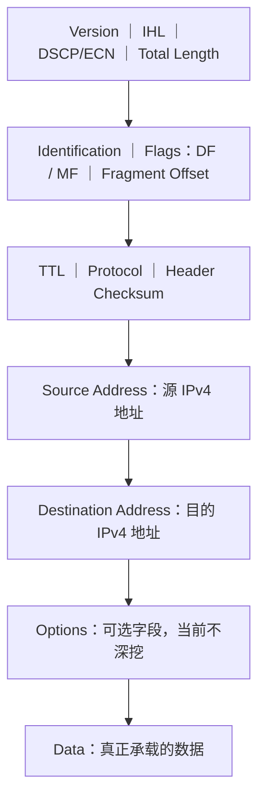

# IPv4 报文与分片：一个 IP 包为什么还要带一堆“说明信息”

> [!summary] 快速复习卡片
> **IPv4 数据报 = IPv4 首部 + 数据。**
> 首部就是这个包随身携带的“说明信息”，告诉设备：包从哪来、到哪去、多大、能不能分片、分片怎么拼、还能走多久、到达后交给哪个上层协议。
> **重点字段**：Version、IHL、Total Length、Identification、DF/MF、Fragment Offset、TTL、Protocol、Header Checksum、Source/Destination。
> **分片核心**：超过下一跳 MTU 且允许分片时可以拆；Fragment Offset 单位是 **8B**；MF=0 表示最后一片。
> **减负边界**：要看懂报文结构和关键字段作用，但不用默写完整 32 位首部位图。

## 唯一主问题

> **一个 IPv4 数据报到底长什么样？首部里的关键字段分别解决什么问题？**

## 先看整体：IPv4 数据报就是“首部 + 数据”

上一站 [[自治系统与IGP-BGP]] 已经解决了路由信息从哪里来。

现在主机真正把数据交给 IP 层以后，会在数据前面加上 IPv4 首部：

所以这里先建立一个最重要的概念：

> **IPv4 首部不是业务数据，而是路由器和目的主机处理这个包时要读取的控制信息。**

## IPv4 报文结构：关键字段到底放在哪里

下面这张图按 IPv4 首部中的**先后顺序**排列字段，但为了阅读方便，**没有按真实 bit 宽度比例绘制**。

把它分成两部分看就很简单：

- **上面这些字段 = IPv4 首部**；
- **最后的 Data = 真正的数据**。

其中 `DSCP/ECN`、`Options` 当前只需要知道它们存在，不作为本轮重点。

真正需要理解的是下面这些字段。

## 关键字段：不要先背英文，先看它在解决什么问题

| 设备处理这个包时会问什么 | 字段 | 作用 |
| --- | --- | --- |
| 这到底是不是 IPv4？ | **Version** | IPv4 的值为 **4**，告诉设备按 IPv4 格式解析首部。 |
| 首部到哪里结束？ | **IHL** | 说明 IPv4 首部长度。单位是 **4B**；无选项时通常 `5 × 4B = 20B`。 |
| 整个 IPv4 数据报有多大？ | **Total Length** | 记录**首部 + 数据**的总长度。 |
| 分片以后，哪些片原来属于同一个包？ | **Identification** | 给同一原始数据报的分片提供共同标识，方便目的端归组。 |
| 能不能分？后面还有没有分片？ | **Flags** | 重点认 **DF、MF**：DF=1 表示禁止分片；MF=1 表示后面还有分片。 |
| 这一片原来在什么位置？ | **Fragment Offset** | 说明这片数据在原始数据区中的起始位置，单位是 **8B**。 |
| 这个包还能在网络里走多久？ | **TTL** | 每经过路由转发都会减少，耗尽就丢弃，防止无限绕圈。 |
| 到达主机后把数据交给谁？ | **Protocol** | 标识上层协议，如 TCP、UDP、ICMP。 |
| IPv4 首部有没有损坏？ | **Header Checksum** | 只检查 **IPv4 首部**，不保护整个数据区。 |
| 从哪来、最终到哪去？ | **Source / Destination Address** | 源 IPv4 地址和目的 IPv4 地址；路由器主要根据目的地址转发。 |

这张表的目标不是让你背十个字段，而是让你看到：

> **每一个字段都对应一个真实的处理问题。**

## 用一个包走一次，把字段串起来

假设 A 给 B 发送一个 IPv4 数据报，路由器 R 收到后可以这样理解：

1. 看 **Version**：确认这是 IPv4；
2. 看 **IHL**：知道首部在哪里结束、数据从哪里开始；
3. 看 **Destination Address**：查路由表，决定下一跳；
4. 处理 **TTL**：不能让包无限绕圈；
5. 看 **Total Length**：整个包有多大；
6. 如果下一条链路装不下，就结合 **DF、Identification、MF、Fragment Offset** 处理分片；
7. 最终到达 B 后，再看 **Protocol**，把数据交给 TCP、UDP、ICMP 等对应协议。

所以首部字段不是互不相关的一堆名词，而是在支撑**同一个 IPv4 数据报从源主机走到目的主机**。

## IHL：为什么必须告诉设备“首部有多长”

IPv4 数据报是：

> **首部 + 数据**

但 IPv4 首部可能包含 Options，所以首部并不永远固定长度。

设备必须知道：

> **前面多少字节属于 IPv4 首部，后面才是真正的数据。**

这就是 **IHL（Internet Header Length）**。

IHL 的单位是 4B。

最常见的无选项首部：

> `IHL = 5` → `5 × 4B = 20B`

因此 IHL 的本质就是：

> **找到首部与数据的分界线。**

## Total Length：为什么要知道整个包有多大

假设：

- IPv4 首部 = 20B；
- 数据 = 3980B。

那么：

> **Total Length = 4000B。**

它记录的是：

> **整个 IPv4 数据报长度 = 首部 + 数据。**

如果下一条链路的 MTU 只有 1500B，那么这个 4000B 的数据报就装不下。

**MTU** 可以理解为：

> **这一条链路一次允许承载的最大网络层数据报大小。**

这时才会进入分片问题。

## 分片：四个字段其实是在一起解决“拆了以后怎么拼”

### DF：能不能拆

**DF = Don't Fragment**。

- `DF=0`：允许分片；
- `DF=1`：禁止分片。

如果数据报超过 MTU，同时 `DF=1`，路由器不能擅自拆，只能丢弃，并可通过 ICMP 反馈问题。

### Identification：这些碎片是不是一家人

一个原始数据报可能被拆成很多片。

目的主机首先要知道：

> **哪些分片原来属于同一个 IPv4 数据报？**

Identification 就相当于原始数据报的共同编号。

### Fragment Offset：每一片原来放哪里

知道“是一家人”还不够，还得知道每片原来的位置。

例如第二片数据原来从第 1480B 开始：

> `Fragment Offset = 1480 ÷ 8 = 185`

所以：

> **Fragment Offset 不是“第几片”，而是这片数据原来从哪里开始；单位是 8B。**

### MF：后面还有没有

**MF = More Fragments**。

- `MF=1`：后面还有分片；
- `MF=0`：这是最后一片。

于是目的主机可以结合：

- Identification：哪些片是一家人；
- Fragment Offset：每片放回哪里；
- MF：哪里是最后一片；

完成重组。

## 分片计算只抓这一条主线

考试如果给分片计算：

1. `MTU - IP首部长度` → 一片最多能装的数据；
2. 非最后一片数据长度取 **8B 的整数倍**；
3. `片偏移 = 本片数据在原始数据区的起点 ÷ 8`；
4. 最后一片 `MF=0`。

> [!example] 最小例子
> MTU = 1500B，IPv4 首部 = 20B。
> 一片最多装 `1500 - 20 = 1480B` 数据。
> 第二片从原始数据区第 1480B 开始，所以片偏移为 `1480 ÷ 8 = 185`。

## TTL：为什么包不能一直在网络里绕

如果错误路由形成：

`R1 → R2 → R3 → R1 → ...`

数据报就可能不停循环。

因此 IPv4 首部有 **TTL（Time To Live）**。

当前学习时把它理解成：

> **这个包还剩多少路由转发寿命。**

路由器转发时 TTL 会减少；TTL 耗尽就丢弃数据报。

它解决的是：

> **出现路由环时，不能让数据报永远存在。**

## Protocol：IP 把包送到主机后，还得知道交给谁

目的 IP 地址只是把数据报送到目标主机。

但主机内部还有 TCP、UDP、ICMP 等不同协议，所以 IPv4 首部还需要 **Protocol** 字段告诉目的主机：

> **IPv4 数据区里装的是哪一种上层协议的数据。**

因此可以记成：

> **Destination Address 负责找到目标主机；Protocol 负责告诉 IP 层到达后交给哪个上层协议。**

当前先理解作用，不要求死背所有协议号。

## Header Checksum：只检查首部

IPv4 的 **Header Checksum** 用来检查 IPv4 首部是否发生错误。

注意：

> **它只保护 IPv4 首部，不保护整个数据区。**

## 一句话收口

**IPv4 数据报 = 首部 + 数据。首部就是设备处理这个包需要的控制信息：告诉它包从哪来、到哪去、有多大、能不能分片、分片怎么拼、还能走多久，以及到达以后把数据交给谁。**

## 上一站

[[自治系统与IGP-BGP]]：已经知道路由信息怎样形成；本篇继续看**路由器拿到一个真实 IPv4 数据报后，靠哪些首部信息处理和转发它**。

## 下一站

[[ICMP与Ping]]：本篇已经出现“DF=1 装不下”和“TTL 耗尽”这两种丢包情况，下一篇正好回答：**路由器把包丢了以后，发送方怎么知道发生了什么？**
