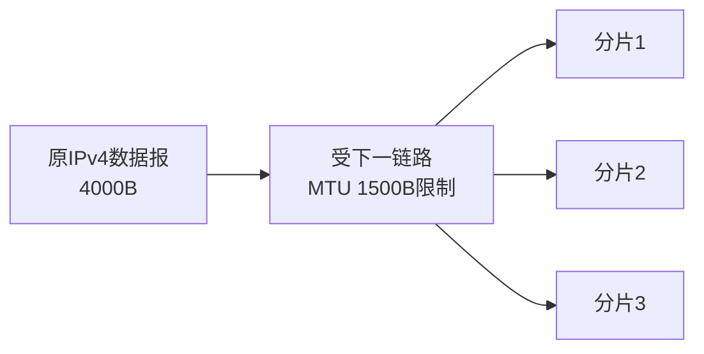

# IPv4 报文与分片：路由选对了，但下一条链路“装不下”这个数据报怎么办

> [!summary] 快速复习卡片
> **先记场景**：IPv4 数据报可能经过很多不同链路，而每条链路允许承载的最大 IP 报文大小可能不同，这就是 MTU 约束。
> **允许分片时**：大数据报可拆成多个分片；同一原报文分片的 Identification 相同；DF=1 表示不能分；MF=1 表示后面还有片；片偏移以 **8B** 为单位。
> **计算顺序**：MTU 先减 IP 首部 → 得到每片最多能放的数据 → 非末片数据按 8B 对齐 → 片偏移 = 本片数据在原数据中的起点 ÷ 8。
> **TTL**：每经过路由器通常递减，减到 0 就丢弃，用来限制分组在异常路由中无限循环。

## 继续上一站：路已经知道怎么走，不代表每条路都“装得下一样大的包”

上一站 [[自治系统与IGP-BGP]] 已经解决跨网络方向问题：路由器知道怎样获得和使用路由信息。

现在假设主机 A 发出一个 IPv4 数据报，总长度 **4000B**。

它经过 R1 后，下一条链路最多只允许承载 **1500B** 的 IP 数据报。

这个“这一条链路最多能承载多大的网络层报文”就是 **MTU（Maximum Transmission Unit，最大传输单元）** 语境。

于是出现一个非常具体的问题：

> **4000B 的东西，要通过一个最多只能装 1500B 的入口，怎么办？**

经典 IPv4 的一种处理办法就是：**分片**。

## 分片不是“随便切三块”，而是每一片都要能独立作为 IPv4 分片被转发

原来的大数据报可以被拆成几个较小的 IPv4 分片。

每个分片都要带自己的 IP 首部，因为中间路由器要能够把每个分片当成网络层报文继续转发。

最终目的主机再根据分片信息把它们重组回原来的数据报。

所以做题时第一件事不是直接拿 4000 ÷ 1500，而是先问：

> **1500B 里面还要给 IP 首部留位置，真正能装多少原始数据？**

## 先用同一个例子把计算走完

条件：

- 原 IPv4 数据报总长度：4000B；
- IP 首部：20B；
- 下一链路 MTU：1500B；
- 允许分片。

### 第一步：原报文真正的数据有多少

4000B 里面已经包含 20B IP 首部。

所以原数据区是：

> `4000 - 20 = 3980B`

### 第二步：每一个分片最多能装多少数据

每片总长度不能超过 1500B，但每片自己也要带 20B IP 首部。

所以每片最多放：

> `1500 - 20 = 1480B` 数据

1480 恰好能被 8 整除，因此适合作为非末片的数据长度。

### 第三步：把 3980B 数据依次装进去

- 第 1 片：1480B 数据；
- 第 2 片：1480B 数据；
- 已经装了 2960B；
- 最后一片剩 `3980 - 2960 = 1020B` 数据。

加回每片自己的 20B 首部：

| 分片 | 数据长度 | 分片总长度 |
| --- | ---: | ---: |
| 1 | 1480B | 1500B |
| 2 | 1480B | 1500B |
| 3 | 1020B | 1040B |

到这里“每片多大”就解决了。

## 片偏移为什么不是“第 1 片、第 2 片、第 3 片”

目的主机重组时真正关心的是：

> **这一片的数据，在原始数据里从哪个位置开始？**

三片在原数据区里的起点分别是：

- 第 1 片：从 0B 开始；
- 第 2 片：前面已有 1480B，所以从 1480B 开始；
- 第 3 片：前面已有 2960B，所以从 2960B 开始。

但 IPv4 首部里的片偏移字段不是直接按 1B 为单位，而是按 **8B** 为单位记录。

所以：

- 0 ÷ 8 = 0；
- 1480 ÷ 8 = 185；
- 2960 ÷ 8 = 370。

最终：

| 分片 | 数据长度 | 总长度 | 片偏移 | MF |
| --- | ---: | ---: | ---: | ---: |
| 1 | 1480B | 1500B | 0 | 1 |
| 2 | 1480B | 1500B | 185 | 1 |
| 3 | 1020B | 1040B | 370 | 0 |

所以片偏移最应该记成：

> **不是“这是第几片”，而是“这一片的数据在原数据里的起点 ÷ 8”。**

## Identification、DF、MF 分别是在解决什么

### Identification：这些碎片原来是不是一家人

网络里同时可能有很多数据报被分片。

目的主机需要知道哪些片属于同一个原始数据报，因此同一原始报文的分片会带有相同的标识信息。

### DF：到底允不允许切

DF（Don't Fragment）= 1 时表示禁止分片。

如果报文超过下一链路 MTU 又不能分，就不能简单靠“切小块”通过。

当前只记这个判断，不展开路径 MTU 发现细节。

### MF：后面还有没有

MF（More Fragments）：

- MF=1：后面还有分片；
- 最后一片 MF=0。

它帮助目的端判断是否已经到了最后一个分片。

## TTL 为什么和“分片”放在同一篇里

TTL 解决的不是报文大小，而是另一个 IPv4 转发中的现实风险：

> **如果路由配置错误形成环，分组会不会一直 R1 → R2 → R3 → R1 地转下去？**

IPv4 报文带 TTL。

每经过路由器时 TTL 通常会减少；减到 0 后，路由器丢弃该分组。

因此它给分组的网络生存范围加了上限，避免异常时无限循环。

## 这一篇解决了什么，还剩什么没解决

现在我们知道：

- 路由能决定方向；
- MTU 不够时，经典 IPv4 在允许情况下可以分片；
- TTL 防止无限转发。

但如果真的出现：

- TTL 到 0；
- 目标不可达；
- 网络层想告诉发送方“出了问题”；

发送方怎样得到反馈？

IP 本身是尽力而为的转发机制，所以还需要一种网络层控制/差错反馈机制。

这就是下一站 [[ICMP与Ping]]。

## 一句话总结

**IPv4 分片解决“下一链路 MTU 太小”的适配问题：先扣每片首部，再切数据；片偏移表示原数据起点且单位是 8B；TTL 则限制异常路由下的分组寿命。**

## 下一站

**上一站：[[自治系统与IGP-BGP]]**  
**主下一站：[[ICMP与Ping]]**

为什么继续：IPv4 已经会“尽力送”，但失败时发送方还需要知道**不可达、超时等网络层状态**，下一站看 ICMP 怎样反馈。
