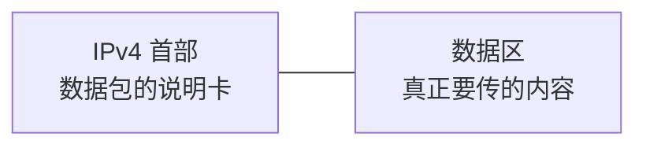

# IPv4 报文与分片：一个 IP 包为什么还要带一堆“说明信息”

> [!summary] 快速复习卡片
> **先理解首部**：IPv4 数据报不是只有业务数据，前面还有一个**首部**，可以把它理解成数据包随身携带的“说明卡”。路由器和目的主机靠这张说明卡知道：它是谁、要去哪、整包多长、能不能拆、拆开后怎么拼、还能走多久、最后交给 TCP 还是 UDP。
> **做题要会的字段**：Version、IHL、Total Length、Identification、DF/MF、Fragment Offset、TTL、Protocol、Header Checksum、Source/Destination。
> **不用死背位图**：重点是“字段解决什么问题”，不是把整张 IPv4 首部每一位的位置默写出来。
> **分片核心**：MTU 不够时，IPv4 在允许的情况下可以拆成多个分片；片偏移单位是 **8B**，MF=0 表示最后一片。
> **TTL**：每经过一次路由转发都会减少，耗尽就丢弃，防止数据报在路由环里无限循环。

## 唯一主问题

> **一个 IPv4 数据报经过很多路由器时，设备到底靠什么信息知道“怎么处理这个包”？**

## 先不要背字段：把 IPv4 数据报看成“数据 + 一张说明卡”

上一站 [[自治系统与IGP-BGP]] 已经解决了：

> **路由器的路由信息从哪里来。**

现在假设主机 A 要把一份数据发送给主机 B。

真正交给 IP 层以后，并不是只把业务数据裸着扔出去，而是变成：

为什么一定要有这张“说明卡”？

因为一个包到了路由器或目的主机以后，设备马上会遇到很多问题：

- 这是 IPv4 还是别的版本？
- 首部到哪里结束，真正的数据从哪里开始？
- 这个包一共有多大？
- 如果下一条链路装不下，能不能拆？
- 如果已经拆开，这一片原来放在哪？
- 这个包是不是已经在网络里绕太久了？
- 最终到达主机后，数据应该交给 TCP、UDP 还是 ICMP？
- 这个首部在传输中有没有损坏？
- 它从哪里来，又最终要去哪里？

**IPv4 首部字段，本质上就是在回答这些问题。**

## 关键字段不要按英文背，要按“它解决什么问题”理解

| 设备处理这个包时会问什么 | 对应字段 | 这个字段到底干什么 |
| --- | --- | --- |
| “这是什么版本的 IP？” | **Version** | 告诉设备按 IPv4 的格式解释这个首部。IPv4 的值就是 **4**。 |
| “首部到哪里结束？数据从哪里开始？” | **IHL** | 告诉设备 IPv4 首部有多长。没有选项时通常是 **20B**。 |
| “这个完整 IP 数据报到底有多大？” | **Total Length** | 记录**首部 + 数据**的总长度。路由器判断是否超过下一跳 MTU 时会用到“包有多大”这个信息。 |
| “这个包被拆开了，这几片是不是原来同一个包？” | **Identification** | 相当于原始数据报的“编号”。同一个原始数据报拆出来的分片用它来帮助目的端归组。 |
| “这个包到底允不允许拆？后面还有没有分片？” | **Flags** | 重点只认 **DF** 和 **MF**：DF=1 表示不要分片；MF=1 表示后面还有分片。 |
| “这一片原来应该放回哪个位置？” | **Fragment Offset** | 告诉目的主机：这片数据在原始数据区的什么位置，单位是 **8B**。 |
| “这个包是不是已经在网络里绕太久？” | **TTL** | 每经过路由转发都会减少；耗尽就丢弃，防止无限绕圈。 |
| “终于到目标主机了，里面的数据交给谁？” | **Protocol** | 告诉 IP 层把数据交给哪个上层协议，例如 TCP、UDP、ICMP。 |
| “首部在路上有没有出错？” | **Header Checksum** | 检查 **IPv4 首部**是否发生错误。注意：它只保护首部，不保护整个数据区。 |
| “从哪来、最终到哪去？” | **Source / Destination Address** | 保存源 IPv4 地址和目的 IPv4 地址。路由器转发时最关心的是**目的地址**。 |

先把这张表真正看懂，比背“某字段占几 bit”重要得多。

## 用一个包走一次路，把这些字段串起来

假设 A 要给 B 发送一个 IPv4 数据报。

路由器 R 收到以后，可以把它的处理理解成下面几个问题：

1. **Version**：这是 IPv4，我知道按哪种格式读首部；
2. **IHL**：我知道首部读到哪里结束；
3. **Destination Address**：我要送到 B，所以查路由表决定下一跳；
4. **TTL**：先把它的“剩余寿命”减掉一份，不能让它无限绕圈；
5. **Total Length**：这个数据报有多大？下一条链路装得下吗？
6. 如果装不下，就再看 **DF / MF / Fragment Offset / Identification** 这些和分片有关的字段；
7. 最终到达 B 后，B 再看 **Protocol**，把里面的数据交给 TCP、UDP 或其他相应协议。

所以这些字段并不是十几个互不相关的名词，而是在支撑**一个 IPv4 数据报从源主机走到目的主机的整个处理过程**。

## 为什么要有 IHL：设备必须知道“头在哪里结束”

IPv4 数据报可以简单理解成：

> **首部 + 数据**

但 IPv4 首部不一定永远固定长度，所以设备需要一个字段告诉它：

> **前面多少字节属于 IPv4 首部，后面才是真正的数据。**

这就是 **IHL（Internet Header Length）**。

IHL 的单位是 4B。

最常见的无选项 IPv4 首部：

> `IHL = 5` → `5 × 4B = 20B`

你现在不需要背 IHL 在首部的第几位，只要知道：

> **IHL 是用来找到“首部和数据的分界线”。**

## 为什么要有 Total Length：路由器得先知道“这个包有多大”

假设一个 IPv4 数据报：

- 首部 20B；
- 数据 3980B。

那么：

> **Total Length = 4000B。**

也就是：

> **整个 IPv4 数据报的长度 = 首部 + 数据。**

现在路由器准备把这个 4000B 的数据报交给下一条链路，但下一条链路只允许最大 1500B。

于是问题出现了：

> **包太大，装不下。**

这个“一条链路允许承载的最大网络层数据报大小”就是 **MTU**。

## 包太大怎么办：这时才真正需要分片字段

如果：

- IPv4 数据报 = 4000B；
- 下一跳 MTU = 1500B；

路由器就要判断：

> **能不能把它拆小？**

这时才轮到下面几个字段一起工作。

### DF：允许不允许拆

**DF = Don't Fragment**。

大白话就是：

> **“这个包不许拆。”**

- `DF=0`：允许 IPv4 分片；
- `DF=1`：禁止分片。

如果包超过 MTU，同时 `DF=1`，路由器就不能硬拆，只能丢弃，并可通过 ICMP 反馈这个问题。

### Identification：拆成三片以后，怎么知道它们是一家人

假设一个原始数据报被拆成：

- 分片 1；
- 分片 2；
- 分片 3。

网络里同时可能还有很多别的数据报的分片。

目的主机必须知道：

> **哪几片原来属于同一个 IPv4 数据报？**

**Identification** 就像原始数据报的“包裹编号”。

同一原始数据报拆出来的分片带有相同的 Identification，帮助目的主机把它们归到一起。

### Fragment Offset：知道是一家人还不够，还得知道谁排前谁排后

只知道“这三片属于同一个包”还不能直接拼，因为目的主机还需要知道：

> **每一片原来在完整数据中的哪个位置。**

这就是 **Fragment Offset（片偏移）**。

例如第二片的数据原本从原始数据区第 1480B 开始：

> `Fragment Offset = 1480 ÷ 8 = 185`

所以一定记住：

> **片偏移不是“第几片”，而是“这片数据原来从哪里开始”，单位是 8B。**

### MF：怎么知道已经收到最后一片

**MF = More Fragments**。

大白话：

- `MF=1`：**后面还有分片**；
- `MF=0`：**后面没有了，这是最后一片**。

于是目的主机就可以结合：

- Identification：哪些片属于同一个原始数据报；
- Fragment Offset：每片放回哪里；
- MF：哪一片是最后一片；

来完成重组。

## 分片计算只保留这一条做题主线

考试如果真的给分片计算，只按下面做：

1. `MTU - 每片IP首部长度` → 一片最多能放多少数据；
2. 非最后一片的数据长度取 **8B 的整数倍**；
3. `片偏移 = 本片数据在原始数据区的起点 ÷ 8`；
4. 最后一片 `MF=0`。

> [!example] 最小例子
> MTU = 1500B，IP 首部 = 20B。
> 一片最多装 `1500 - 20 = 1480B` 数据。
> 第二片从原始数据区第 1480B 开始，所以片偏移为 `1480 ÷ 8 = 185`。

## TTL：包大小没问题，也不能让它在错误路由里无限绕圈

再换一个场景。

如果路由配置错误，形成：

`R1 → R2 → R3 → R1 → ...`

这个包可能一直循环。

所以 IPv4 首部里还有 **TTL（Time To Live）**。

你可以直接把它理解成：

> **这个包还剩多少“路由转发寿命”。**

路由器每转发一次，TTL 都会减少。

TTL 耗尽以后：

> **丢弃这个数据报。**

这样即使路由出现环路，数据报也不会永远留在网络里。

## Protocol：IP 已经把数据送到主机，但主机里还有 TCP、UDP 等很多协议

假设数据终于到达目的主机 B。

IP 层还会面对最后一个问题：

> **IPv4 数据区里的东西，到底应该交给谁处理？**

如果里面装的是 TCP 数据，就交给 TCP；如果装的是 UDP 数据，就交给 UDP。

**Protocol 字段**就是用来告诉目的主机：

> **“我这个 IPv4 数据报里面装的是哪一种上层协议的数据。”**

所以可以把它和前面学过的分层联系起来：

> **目的 IP 找到主机，Protocol 再告诉 IP 层把数据交给 TCP / UDP / ICMP 等对应协议。**

当前先理解作用，不要求死背所有协议号。

## Header Checksum：只检查“说明卡”有没有坏

IPv4 的 **Header Checksum** 用来检查 IPv4 **首部**在传输过程中是否发生错误。

注意它的边界：

> **只检查 IPv4 首部，不检查整个数据区。**

所以不要把它理解成“整个 IPv4 数据报的数据完整性校验”。

## 最后把所有字段重新压成一句人话

一个 IPv4 数据报随身带着一张说明卡：

- **Version**：我是什么版本；
- **IHL**：我的说明卡有多长；
- **Total Length**：我整个包有多大；
- **Source / Destination**：我从哪来、要到哪去；
- **TTL**：我还能在网络里走多久；
- **Protocol**：到达以后把我的数据交给谁；
- **Identification + DF/MF + Fragment Offset**：如果我被拆开，怎么拆、怎么认、怎么拼；
- **Header Checksum**：我的 IPv4 首部有没有损坏。

这就是当前阶段真正要理解的 IPv4 报文字段。

## 一句话收口

**IPv4 首部不是为了让你背字段，而是给路由器和目的主机一张“数据包说明卡”：告诉它从哪来、到哪去、有多大、能不能拆、拆后怎么拼、还能走多久，以及最后把数据交给谁。**

## 上一站

[[自治系统与IGP-BGP]]：已经知道路由信息怎样形成；本篇继续看**路由器拿到一个真实 IPv4 数据报后，靠哪些首部信息处理和转发它**。

## 下一站

[[ICMP与Ping]]：本篇已经出现“DF=1 装不下”和“TTL 耗尽”这两种丢包情况，下一篇正好回答：**路由器把包丢了以后，发送方怎么知道发生了什么？**
