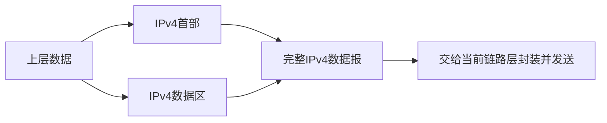
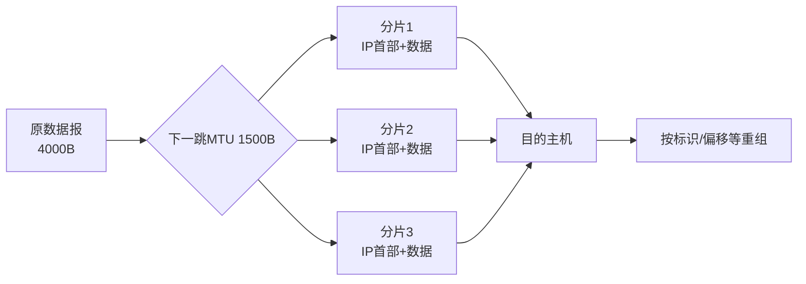
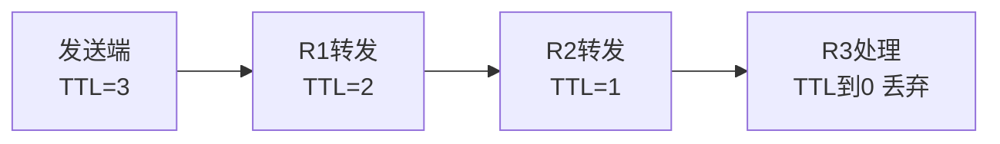

# IPv4 报文、MTU、分片与 TTL：路选对以后，数据报怎样真正穿过不同链路

> [!summary] 快速复习卡片
> - **IPv4 基本首部**：无选项时 20B；IHL 以 32 bit（4B）为单位，最小值 5。
> - **Total Length**：整个 IPv4 数据报长度 = 首部 + 数据，字段 16 bit，最大 65535B。
> - **MTU**：某条链路/接口一次可承载的网络层分组大小存在上限；数据报大于下一跳 MTU 时会产生“装不下”的问题。
> - **允许 IPv4 分片时**：同一原始数据报的各分片共享 Identification；DF=1 表示禁止分片；MF=1 表示后面还有分片；Fragment Offset 以 **8B** 为单位。
> - **计算口诀**：`MTU - 本片IP首部` → 本片最多数据；非末片数据长度取 8B 整数倍；片偏移 = 本片数据在原始数据区的起点 ÷ 8。
> - **重组位置**：IPv4 分片通常由**最终目的主机**重组，中间路由器不会为了继续转发而把所有片重新拼回去。
> - **TTL**：每经过路由转发都会减少；到 0 时丢弃，防止路由环导致无限转发。现代理解应记“跳数寿命”，不要按真实秒数做题。
> - **首部校验和**：只校验 IPv4 首部；TTL 被修改后，转发设备必须相应更新首部校验和。
> - **DF=1 又超过 MTU**：不能分片，路由器丢弃，并通常用 ICMP“需要分片但 DF 已设置”反馈，这正是路径 MTU 发现的基础机制之一。

## 唯一主问题

> **IPv4 数据报逐跳转发时，首部里的哪些字段共同决定“能不能继续走、需要怎样分片、分片怎样重组，以及为什么不会在路由环里无限转发”？**

## 先建立位置：IP 数据报不是裸数据

上一站 [[自治系统与IGP-BGP]] 解决的是“路由信息怎样形成”。

真正发送时，网络层把上层数据封装为 IPv4 数据报：

每一跳链路都可能不同，因此网络层不能假设“所有链路都能装下一样大的 IP 数据报”。

## 先认识做题真正会用到的 IPv4 首部字段

本卡不要求把首部位图逐位默写，但这些字段必须知道作用：

| 字段 | 当前要会什么 |
| --- | --- |
| Version | IPv4 的版本值为 4 |
| IHL | IPv4 首部长度，单位是 4B；无选项时 `5 × 4 = 20B` |
| Total Length | 整个 IPv4 数据报长度，包含首部与数据 |
| Identification | 标识原始数据报，帮助目的端判断哪些分片属于同一数据报 |
| Flags | 重点认 DF、MF |
| Fragment Offset | 本片数据在原始数据区中的位置，单位 8B |
| TTL | 限制数据报在网络中的生存范围 |
| Protocol | 标识上层协议，如 TCP、UDP、ICMP |
| Header Checksum | 只保护 IPv4 首部 |
| Source/Destination | 源 IPv4 地址和目的 IPv4 地址 |

### IHL 为什么不是“20”

IHL 不是直接保存“20 字节”，而是保存 **32 bit 字的数量**。

无选项首部：

> IHL = 5 → `5 × 4B = 20B`

所以如果题目给 IHL=6：

> 首部长度 = `6 × 4B = 24B`

这是首部计算的基础。

## MTU：为什么一个合法 IPv4 数据报还可能在下一跳过不去

IPv4 的 Total Length 最大可以到 65535B，但某条具体链路的 MTU 往往远小于这个数。

假设：

- 原 IPv4 数据报总长 4000B；
- 首部 20B；
- 下一跳链路 MTU 1500B。

4000B 数据报不能原样放进“最多承载 1500B IP 数据报”的下一跳链路。

经典 IPv4 在 **DF=0（允许分片）** 时可以把它拆成多个 IPv4 分片。

> **MTU 是链路约束；Total Length 是某个 IPv4 数据报自身的总长度。两者不是同一个字段。**

## 分片为什么每一片都要有自己的 IP 首部

分片之后，每片都可能独立经过后续路由器，因此每一片本身都必须是可转发的 IPv4 数据报。

因此不能直接算 `4000 ÷ 1500`，要先为每片的 IP 首部留空间。

## 完整计算：4000B 数据报经过 MTU 1500B 链路

条件：

- 原数据报总长度：4000B；
- 原首部：20B；
- 原数据区：`4000 - 20 = 3980B`；
- 下一跳 MTU：1500B；
- DF=0，允许分片；
- 假设每片首部仍为 20B。

### 第一步：一片最多放多少数据

每片总长度不能超过 1500B：

`1500 - 20 = 1480B`

非最后一片的数据长度必须让后续片偏移能用 8B 单位准确表示，因此取不超过 1480 的 8B 整数倍。

1480 恰好可被 8 整除，所以：

- 第 1 片数据：1480B；
- 第 2 片数据：1480B；
- 第 3 片数据：`3980 - 2960 = 1020B`。

### 第二步：加回每片自己的 IP 首部

| 分片 | 数据长度 | 分片总长度 |
| --- | ---: | ---: |
| 1 | 1480B | 1500B |
| 2 | 1480B | 1500B |
| 3 | 1020B | 1040B |

### 第三步：算片偏移

片偏移不是“第几片”，而是：

> **本片数据在原始数据区中的起点 ÷ 8**

数据起点：

- 第 1 片：0B → Offset=0；
- 第 2 片：1480B → `1480/8=185`；
- 第 3 片：2960B → `2960/8=370`。

### 第四步：看 MF

前两片后面还有数据，因此 MF=1；最后一片 MF=0。

| 分片 | 数据长度 | 总长度 | Fragment Offset | MF |
| --- | ---: | ---: | ---: | ---: |
| 1 | 1480B | 1500B | 0 | 1 |
| 2 | 1480B | 1500B | 185 | 1 |
| 3 | 1020B | 1040B | 370 | 0 |

三片属于同一个原始数据报，因此 Identification 保持一致。

## 为什么“非末片 8B 对齐”，末片却可以不是

Fragment Offset 字段只能表达“8B 的整数倍”。

只要后面还有下一片，本片末尾必须正好让下一片起点落在 8B 边界上。因此**非末片数据长度**需要是 8B 整数倍。

最后一片后面已经没有新分片，不再需要给下一片制造可表示的起点，所以最后一片的数据长度可以不是 8B 整数倍。

## DF=1 时发生什么

DF = Don't Fragment。

如果：

- 数据报大于下一跳 MTU；
- DF=1；

路由器不能擅自切片，只能丢弃该数据报，并通常通过 ICMP 返回“需要分片但 DF 已设置”的不可达信息。

这和路径 MTU 发现（PMTUD）的思路有关：

> 发送端逐步知道路径上不能超过的报文大小，从源头发送更合适的尺寸，而不是依赖中间路由器反复分片。

当前只理解机制，不扩展 PMTUD 的完整实现细节。

## 谁负责重组：为什么不是每个路由器“拆了又拼”

IPv4 分片最终通常由**目的主机**重组。

中间路由器如果收到已经分片的数据报，通常把各片继续独立转发，不先收齐重组。

这意味着：

- 分片可能走到目的端的顺序不同；
- 任意一个必要分片丢失，都可能导致原始数据报无法完整重组；
- 分片本身会增加首部开销和丢失影响，因此现代网络更倾向尽量避免中途分片。

## TTL：如果大小没问题，但路由形成环怎么办

假设错误路由形成：

`R1 → R2 → R3 → R1 → ...`

如果没有寿命上限，数据报可能一直占用网络资源。

IPv4 的 TTL（Time To Live）提供上限。历史名字里有 “Time”，但在现代 IP 转发中考试应把它理解为**逐跳递减的生存计数**。

例如发送端 TTL=3：

TTL 到 0 时路由器丢弃数据报，并通常产生 ICMP Time Exceeded。

因此 TTL 解决的是：

> **路由异常时，数据报不能永久循环。**

## 为什么 TTL 一变，IPv4 首部校验和也要变

IPv4 Header Checksum 只校验**首部**。

路由器每跳都会修改 TTL，所以原来的首部校验和不再对应新的首部内容。转发时必须相应更新首部校验和。

这也能帮你区分：

- IPv4 首部校验和不是 TCP/UDP 的端到端数据校验；
- 它不覆盖 IPv4 数据区。

## 一张表把三个相近概念分开

| 概念 | 回答的问题 |
| --- | --- |
| MTU | 当前链路最多能承载多大的网络层分组 |
| Total Length | 当前这个 IPv4 数据报本身有多长 |
| Fragment Offset | 当前分片的数据在原始数据区从哪里开始 |
| TTL | 这个数据报还能被路由转发多久/多少跳 |
| DF | 是否禁止 IPv4 分片 |
| MF | 后面是否还有分片 |

## 考试识别与易错点

1. **“首部长度”**：先看 IHL，记得单位是 4B。
2. **“分片计算”**：MTU 先减每片 IP 首部，再对非末片数据做 8B 对齐。
3. **“片偏移”**：是原数据区起点 ÷ 8，不是分片编号，也不是字节数原值。
4. **“DF=1 + 超 MTU”**：不能分，丢弃并通常 ICMP 反馈。
5. **“MF=0”**：表示这是最后一片；未分片数据报的 MF 也可以是 0，所以 MF=0 本身不等于“曾经被分片”。
6. **“TTL”**：不要按真实经过秒数计算，网络考试通常按路由跳转递减。
7. **“重组”**：目的端重组，不是每经过一个路由器都重组。
8. **“帧 vs 分片”**：IPv4 分片是网络层数据报分片；以太网帧是链路层封装，不是一回事。

## 自测

1. IHL=7 时 IPv4 首部多少字节？
2. 为什么 1500B MTU 下不能简单说“每片放 1500B 原数据”？
3. 片偏移 185 表示该片数据从原数据区第多少字节开始？
4. DF=1 的 2000B IPv4 数据报遇到 MTU=1500B 的下一跳会怎样？
5. TTL 的主要目的是什么？它与 MTU 有关系吗？

### 答案

1. `7 × 4 = 28B`。
2. 每个分片自己还要有 IPv4 首部，且非末片数据还要满足 8B 偏移单位约束。
3. `185 × 8 = 1480B`。
4. 不能分片，路由器丢弃，并通常返回相应 ICMP 不可达/需要分片信息。
5. 限制异常路由中的生存范围、防止无限循环；与 MTU 是两个独立问题。

## 一句话总结

**IPv4 用首部描述长度、分片位置和寿命：MTU 太小时在允许条件下按 Identification/DF/MF/Offset 分片，目的端重组；TTL 则逐跳递减，避免数据报在环路中无限存活。**

## 下一站

**上一站：[[自治系统与IGP-BGP]]**
**主下一站：[[ICMP与Ping]]**

为什么继续：DF 禁止分片、TTL 到 0、目标不可达时，网络层需要把失败信息反馈回来；下一站看 ICMP 怎样承接这些状态，并理解 Ping。
