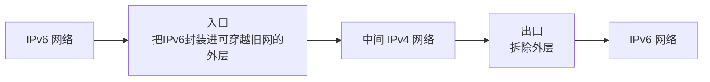

# IPv6 与 IPv4 过渡：IPv4 地址不够了，为什么不能直接宣布“明天全部换 IPv6”

> [!summary] 快速复习卡片
> **先记原因**：IPv4 地址 32 位，地址空间有限；IPv6 扩展到 128 位。
> **地址类型最低识别**：单播 = 一个接口；组播 = 一组接口；任播 = 一组接口中的一个合适成员。IPv6 不沿用 IPv4 的广播方式。
> **三类过渡思路**：设备两种都懂 → 双协议栈；两端懂 IPv6、中间旧网只懂 IPv4 → 隧道；两端分别只懂不同版本 → 协议转换。
> **易错点**：任播不是“发给所有成员”；双栈、隧道、转换解决的是不同场景，不能只背三个名字。

## 先把 IPv4 主线收口：它能工作，但地址空间是有限的

上一站 [[ICMP与Ping]] 已经把 IPv4 的基本网络层能力补完整：

- 有 IP 地址；
- 能划子网；
- 能逐跳路由；
- 能处理 MTU/TTL；
- 还能通过 ICMP 反馈网络层状态。

所以 IPv6 并不是因为“IPv4 完全不能通信”才出现。

一个非常现实的长期压力是：

> **IPv4 地址只有 32 位，全球联网设备和网络规模持续增长，可用地址空间有限。**

因此需要更大的地址体系。

IPv6 把地址长度扩展为：

> **128 位。**

这带来远大于 IPv4 的地址空间。

当前考试深度不要求你展开完整 IPv6 首部，只要抓住“地址更大 + 新旧网络如何共存”。

## 128 位地址为什么看起来不像 IPv4

IPv4 常写成：

`192.168.1.10`

IPv6 地址更长，常写成 8 组十六进制数。

为了避免一长串 0 太难看，IPv6 支持压缩表示。

例如连续的全 0 组可以用 `::` 省略。

但同一个地址里通常只能用一次 `::`，原因很直观：

> 如果写两次，就无法唯一判断每个 `::` 到底各省略了多少组 0。

这一轮只需要会识别，不做复杂地址还原题。

## 单播、组播、任播是在回答“这一份数据发给谁”

不要先背三个术语，先看三种需求。

### 只想发给一个明确接口

这就是**单播**。

### 想发给一组成员

这就是**组播**。

### 有一组都能提供同类服务，但只想交给其中一个合适成员

这就是**任播**。

所以：

| 类型 | 直觉 |
| --- | --- |
| 单播 | 一个目标 |
| 组播 | 一组目标 |
| 任播 | 一组候选里到一个合适目标 |

任播最容易错成“广播给一组所有人”，其实不是。

另外，IPv6 不沿用 IPv4 的广播机制，很多原本类似广播的场景会通过组播等机制处理。

## 真正难的不是“设计 IPv6”，而是旧 IPv4 网络已经到处都是

假设今天 IPv6 标准非常好，也不可能让全球所有：

- 路由器；
- 服务器；
- 企业网络；
- 应用系统；
- 运营商设备

在同一分钟全部从 IPv4 切成 IPv6。

所以现实必然有一个很长的过渡期：

> **有些地方只懂 IPv4，有些已经懂 IPv6，有些两种都懂。**

于是才出现三类过渡思路。

## 第一种：双协议栈——同一台设备自己两种都会

假设主机 A 同时支持：

- IPv4；
- IPv6。

它访问只支持 IPv4 的目标时可以使用 IPv4；访问 IPv6 网络时可以使用 IPv6。

所以最直观的记法是：

> **双协议栈 = 我自己会说两种“语言”。**

它适合设备和网络同时具备两种协议能力的场景。

## 第二种：隧道——两端懂新协议，中间旧网络暂时不懂

假设：

- 左边网络支持 IPv6；
- 右边网络也支持 IPv6；
- 但中间一大段基础设施暂时只支持 IPv4。

这时可以把 IPv6 数据包暂时封装进中间 IPv4 网络能够转发的外层报文，穿过旧网络后再拆出来。

所以：

> **隧道 = 两端懂，夹在中间的旧网络不懂，于是先“套壳穿过去”。**

## 第三种：协议转换——两端根本说的不是同一种协议

再换一种情况：

- 一端只支持 IPv4；
- 另一端只支持 IPv6。

这时“套壳”并不能让只懂 IPv4 的终端突然理解 IPv6。

需要中间设备做协议表示之间的转换。

可以把它理解为：

> **协议转换 = 两端语言不同，中间需要翻译。**

教材里的 NAT-PT 等术语按其教材语境识别即可，不把某个历史方案误记成现代所有 IPv4/IPv6 互通的唯一方法。

## 三类方式用同一问题快速判断

| 题目场景 | 第一反应 |
| --- | --- |
| 一台设备自己同时支持 IPv4 和 IPv6 | 双协议栈 |
| 两端支持 IPv6，中间网络只支持 IPv4 | 隧道 |
| 一端只 IPv4，另一端只 IPv6，需要互通 | 协议转换 |

这样比死背“IPv6 过渡三技术”稳得多。

## 到这里，网络层这一阶段结束

从 [[IPv4地址结构与特殊地址]] 开始，我们一直在解决：

> **目标不在当前局域网时，数据怎样跨网络到达目标主机？**

现在已经形成完整链：

- IP 地址标识逻辑目的；
- 前缀和子网确定网络范围；
- ARP 把当前一跳落到 MAC；
- 路由表选择下一跳；
- AS/IGP/BGP 组织动态路由边界；
- MTU/分片/TTL 处理实际转发约束；
- ICMP 反馈网络层状态；
- IPv6 扩展地址体系并处理新旧共存。

**到这里，“怎样送到目标主机”这个问题基本解决。**

接下来换一个新问题：

> 一台目标主机上同时跑着浏览器、Web 服务、DNS、邮件程序等很多进程。IP 只能把数据送到“这台主机”，那数据最终应该交给哪个程序？不同程序又需要可靠还是轻量的传输方式？

这就是传输层要解决的问题。

## 一句话总结

**IPv6 用 128 位扩大地址空间；IPv4 不可能瞬间消失，所以过渡期用双栈解决“两种都会”、隧道解决“中间旧网不懂”、协议转换解决“两端协议不同”。**

## 下一站

**上一站：[[ICMP与Ping]]**  
**主下一站：[[TCP与UDP对比]]**

为什么继续：网络层已经把数据送到目标主机，下一阶段开始解决**目标主机里的哪个应用来接，以及传输要不要可靠、要不要连接**。
