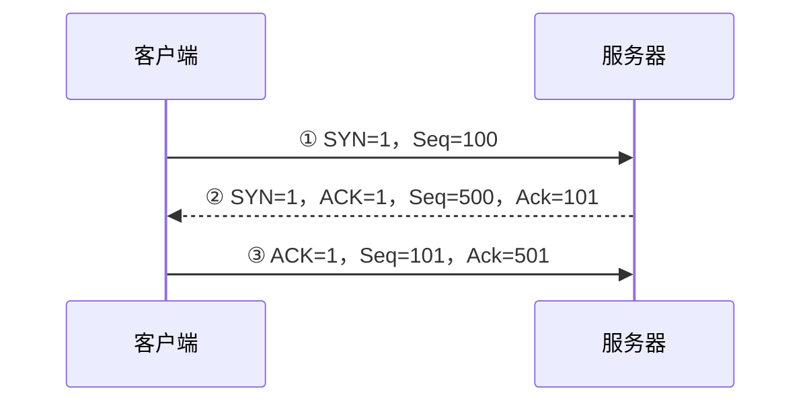

# TCP 三次握手：正式传数据前，双方为什么要确认三次

> [!summary]- 快速复习卡片（学完再看）
> **作用**：TCP 正式传数据前，先让双方确认连接建立所需的信息已经互相到达。
> **三步**：客户端 `SYN` → 服务端 `SYN + ACK` → 客户端 `ACK`。
> **序号题**：`SYN` 会占 1 个序号，所以收到 `Seq=x` 的 SYN 后，确认号通常是 `x+1`。
> **易错点**：`ACK=1` 是“确认号字段有效”的标志位；`Ack=101` 才是具体确认号。
> **边界**：本卡只理解三步和 Seq/Ack，不背 TCP 状态机。

上一站 [[TCP与UDP对比]] 已经知道：**TCP 是面向连接的可靠字节流协议**。

但“面向连接”不能只背四个字。TCP 在正式传业务数据前，需要先确认：

- 客户端发出的连接请求能到服务器；
- 服务器的回复也能回到客户端；
- 双方用于后续可靠传输的初始序号已经互相确认。

这个建立连接的过程，教材和题目里通常简称为 **三次握手**。

## 用一组序号走完三次握手

假设客户端准备建立连接，它选择初始序号 `100`；服务器选择初始序号 `500`。

### 第一次：客户端先说“我要建立连接”

客户端发送：

- `SYN=1`：请求建立连接；
- `Seq=100`：告诉服务器自己的初始序号从 100 开始。

服务器收到后，至少知道了一件事：**客户端发到服务器这条方向是通的。**

### 第二次：服务器既确认客户端，也提出自己的连接请求

服务器回复：

- `SYN=1`：服务器也要建立自己这一方向的连接状态；
- `ACK=1`：表示“确认号字段有效”；
- `Seq=500`：服务器自己的初始序号；
- `Ack=101`：表示客户端的 `Seq=100` 已收到，下一步期待 101。

这里最容易混的是：

> **`ACK=1` 和 `Ack=101` 不是一回事。**

`ACK=1` 只是一个开关；`Ack=101` 才是“我下一步希望收到哪个序号”。

为什么是 101？因为 **SYN 本身会占用 1 个序号**：

`100 + 1 = 101`

### 第三次：客户端再确认服务器的回复

客户端收到服务器的 `Seq=500` 后，再发：

- `ACK=1`；
- `Ack=501`。

因为服务器的 SYN 也占 1 个序号：

`500 + 1 = 501`

这一步到达服务器后，服务器才知道：**自己刚才发给客户端的 SYN 也确实被客户端收到了。**

于是双方都具备了开始正常传输数据的条件。

## 为什么两次不够

如果只做到第二次：

1. 服务器知道客户端的 SYN 到了；
2. 客户端收到服务器回复后，也知道服务器能收到、能回复；
3. **但服务器还不知道自己的回复是否真的到达客户端。**

第三次 ACK 就是在补这个最后的确认。

所以做题时不要只背“因为 TCP 规定三次”，而要理解成：

> **第三次让服务器确认：客户端确实收到了服务器的连接回复。**

## Seq 和 Ack 题怎么下手

先区分两类情况。

### SYN

如果题目给：

`SYN=1，Seq=100`

收到后确认：

`Ack=101`

因为 SYN 占 1 个序号。

### 普通数据

如果题目给：

- `Seq=1001`
- 数据长度 `500B`

并且这 500B 连续正确收到，那么下一步期待：

`1001 + 500 = 1501`

因此确认号是：

`Ack=1501`

也就是说：

> **Ack 通常表示“下一个希望收到的序号”。**

## 一句话收口

**三次握手不是为了机械打三次招呼，而是让双方在传数据前互相确认连接请求和初始序号已经到达；SYN 占 1 个序号，ACK 标志位和确认号一定要分开。**

## 自测

> [!question] 自测 1
> 客户端发送 `SYN=1，Seq=300`，服务器正确收到后，回复中的确认号应是多少？

> > [!answer]- 第 1 题答案与解析
> > **答案**：301。
> > **解析**：SYN 占 1 个序号，所以服务器下一步期待 301。

> > [!question] 自测 2
> > 报文中出现 `ACK=1，Ack=501`，两个字段分别表示什么？

> > [!answer]- 第 2 题答案与解析
> > **答案**：`ACK=1` 表示确认号字段有效；`Ack=501` 表示下一步期待收到序号 501。

## 上一站

[[TCP与UDP对比]]：已经知道 TCP 是面向连接的，本篇把“连接到底怎样建立”补成可理解的三步。

## 下一站

[[TCP四次挥手]]：连接建立后最终还要关闭；TCP 是双向通信，因此关闭时不能简单把三次握手倒放一遍。
