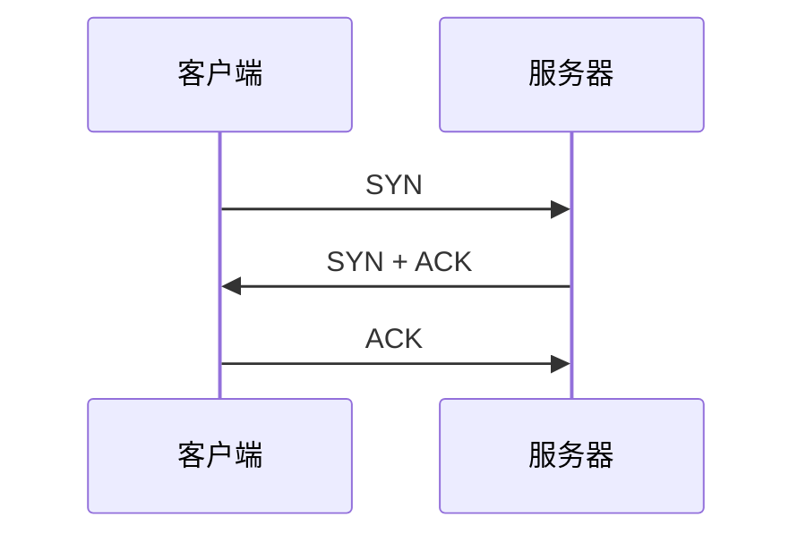

# TCP 三次握手：为什么建立连接需要三次

> [!summary] 快速复习卡片
> **作用/定位**：TCP 正式传数据前，双方确认连接请求和初始序号信息能够双向交换。
> **核心结论**：经典过程是 `SYN → SYN+ACK → ACK`。
> **经典题型怎么做 / 题干怎么认**：问“第三次为什么不能省”时，抓住：服务器只有收到最后 ACK，才确认自己发出的 SYN/序号信息确实被客户端收到。
> **易错点 / 考试重点**：三次不是礼貌问候；核心是双向信息与序号确认，不要第一轮扩展 SYN Flood、状态机等工程细节。

## 三次动作

1. 客户端发送 SYN，提出建连并发送自己的初始序号信息；
2. 服务器返回 SYN+ACK：既确认客户端，又发送自己的初始序号信息；
3. 客户端返回 ACK，服务器由此确认自己的信息也成功到达客户端。

如果只停在第二次，客户端已经知道服务器收到了请求，但服务器仍不知道自己的 SYN 是否到达客户端。

## 一句话总结

**三次握手不是背报文名，而是“双方都确认对方的建连信息已经到达”。**

## 下一站

- 上一站：[[TCP与UDP对比]]。
- 下一站：[[TCP可靠传输机制]]。
