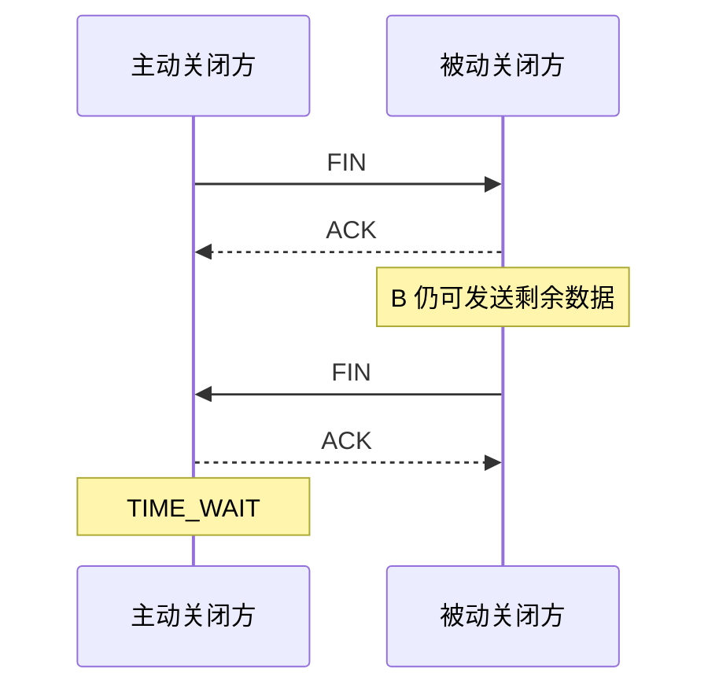

# TCP 四次挥手：为什么关闭通常比建立多一次

> [!summary] 快速复习卡片
> **作用/定位**：解释 TCP 全双工连接怎样分别关闭两个发送方向。
> **核心结论**：经典过程 `FIN → ACK → FIN → ACK`；收到对方 FIN 只代表对方不再发送，本方仍可能继续发送剩余数据。
> **经典题型怎么做 / 题干怎么认**：问“三次握手为什么能合、四次挥手为什么常分开” → 建连时 SYN+ACK 可合并；关闭时收到 FIN 后，本方可能还有数据，必须先 ACK，稍后再发自己的 FIN。
> **易错点 / 考试重点**：TIME_WAIT 通常在主动关闭方；它用于给最后 ACK 重传机会，并让旧连接延迟报文退出网络。2MSL 只做识别，不展开计时实现。

## 关闭的是两个方向

TCP 是全双工：A→B 和 B→A 可以独立发送。

所以 A 的 FIN 只表示“A 这个方向没有数据要发了”，并不强迫 B 立刻停止发送。

## TIME_WAIT 为什么存在

主动关闭方发出最后一个 ACK 后还要等待一段保护时间，主要为了：

1. 如果最后 ACK 丢了，还能收到对方重发的 FIN 并再次确认；
2. 让旧连接滞留在网络里的报文逐渐消失，避免干扰之后同标识的新连接。

## 一句话总结

**全双工要分方向关；ACK 和 FIN 常不能立即合并，所以经典过程是四次。**

## 下一站

- 上一站：[[TCP流量控制与拥塞控制]]。
- 下一站：[[应用层常用协议]]。
