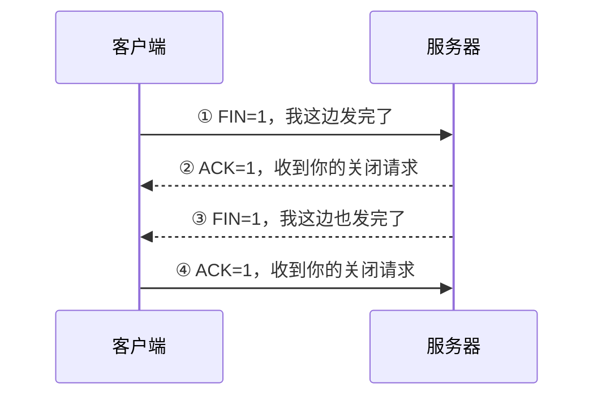

# TCP 四次挥手：为什么关闭连接通常要分成四步

> [!summary]- 快速复习卡片（学完再看）
> **核心原因**：TCP 是全双工通信，一方不再发送，不代表另一方也已经发完，因此两个方向要分别关闭。
> **典型四步**：`FIN` → `ACK` → `FIN` → `ACK`。
> **序号题**：`FIN` 也占 1 个序号，所以收到 `Seq=x` 的 FIN 后，确认号通常是 `x+1`。
> **易错点**：“四次挥手”是经典教学流程，不代表抓包时永远严格出现 4 个独立报文；中间 ACK 与 FIN 在条件满足时可能合并。
> **边界**：本卡不展开 TIME_WAIT 和 TCP 状态机。

上一站 [[TCP三次握手]] 已经解决了“连接怎样建立”。

连接用完后还要释放，但 TCP 不能简单把三次握手倒过来。原因是：

> **TCP 是全双工的，两个方向都能独立发送数据。**

客户端说“我发完了”，只代表**客户端 → 服务器**这个发送方向准备关闭；服务器可能还有数据没发完。

## 用一个场景走完典型四次挥手

假设客户端先结束发送。

### 第一次：客户端发送 FIN

客户端告诉服务器：

> **“我已经没有数据要继续发给你了。”**

这并不意味着服务器也必须马上停止发送。

### 第二次：服务器先确认 FIN

服务器回复 ACK，表示：

> **“我知道你不再发了。”**

但服务器此时可能还有剩余数据需要继续发给客户端，所以不会因为收到 FIN 就被迫立刻发送自己的 FIN。

### 第三次：服务器自己的数据也发完后，再发送 FIN

等服务器也完成发送，它再告诉客户端：

> **“我这一边也发完了。”**

这一步关闭的是另一个发送方向。

### 第四次：客户端确认服务器的 FIN

客户端最后回复 ACK，服务器确认自己的关闭请求也被收到。

因此经典流程看起来就是：

`FIN → ACK → FIN → ACK`

## 为什么建立连接三次，关闭却通常四次

建立连接时，服务器收到客户端 SYN 后，通常可以把：

- 对客户端 SYN 的 ACK；
- 自己的 SYN；

放在同一个报文里，所以形成三步。

但关闭时，服务器收到客户端 FIN 后，**可能还有数据没发完**。

因此通常要先：

1. ACK 客户端的 FIN；
2. 等自己发完；
3. 再单独发送 FIN。

这就把中间动作拆成了两步，所以形成经典的四次挥手。

## FIN 也会占一个序号

如果某一方发送：

`FIN=1，Seq=1000`

对方确认时通常是：

`Ack=1001`

和 SYN 一样，**FIN 本身也占 1 个序号**。

## “四次”不是现实抓包里的绝对数量

做基础题时可以记经典四步，但不要把它理解成：

> “任何 TCP 连接关闭时都必须看到四个彼此独立的数据包。”

如果服务器收到 FIN 时自己也已经准备好关闭，ACK 和自己的 FIN 可以在同一个 TCP 段中一起发送。

所以更稳的理解是：

> **两个方向都要完成“关闭请求 + 被确认”；经典情况下表现为四个步骤。**

## 一句话收口

**TCP 通信是双向的，一方停止发送不代表另一方也已经发完，因此连接释放通常需要双方分别发送 FIN、分别得到 ACK，这就是经典四次挥手。**

## 自测

> [!question] 自测 1
> 为什么客户端发送 FIN 后，服务器不能被理解为“也已经没有数据可发”？

> [!answer]- 第 1 题答案与解析
> **答案**：因为 TCP 是全双工通信，两个发送方向可以独立结束；客户端关闭自己的发送方向，不代表服务器方向也结束。

> [!question] 自测 2
> 收到 `FIN=1，Seq=800` 后，确认号通常是多少？

> [!answer]- 第 2 题答案与解析
> **答案**：801。
> **解析**：FIN 占 1 个序号，因此下一步期待 801。

## 上一站

[[TCP三次握手]]：先建立连接并同步初始序号，本篇继续看连接使用完后怎样分两个方向关闭。

## 下一站

[[端口与进程通信]]：握手和挥手只是 TCP 的连接机制；回到网络主线后，还要回答数据到达主机时怎样交给正确的应用服务。
